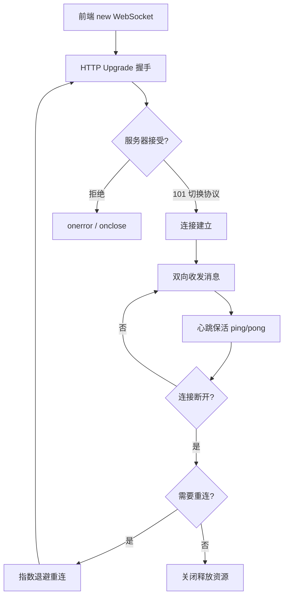

## SOP：使用 WebSocket 实现实时双向通信

> 从一次握手到一条可长期维持的双向通道——覆盖连接建立、消息收发、心跳保活、断线重连与优雅关闭的完整流程。

目标：建立一条可长期维持的双向实时通道，让服务器能主动推送、客户端能实时上行
实现：Node.js `ws`（后端）+ 浏览器原生 `WebSocket` API（前端）

---

### 适用场景

- 场景 1：即时通讯——聊天、客服、在线协作，需要毫秒级双向推送
- 场景 2：实时数据——股票行情、监控面板、游戏状态同步
- 场景 3：高频上行——光标位置、协同编辑、在线白板（SSE 无法上行）
- ⛔ 不适用：纯「服务器→客户端」的单向文本推送（如通知、日志流），优先考虑 [[SSE]]，成本更低且重连续传免费——见 [[WebSocket vs SSE vs Long Polling]]

---

### 流程图解



---

### 核心步骤

1. **后端建立 WebSocket 服务器**：用 `ws` 库创建 `WebSocketServer`，监听 `connection` 事件
	 - 注意：每个连接是一个独立 socket，需按连接保存状态（用户身份、订阅的频道）
2. **前端建立客户端连接**：`new WebSocket(url)`，在 `onopen` 之后才能 `send`
	 - 注意：`readyState` 为 `CONNECTING(0)` 时发送会抛异常，务必判断 `OPEN(1)`
3. **协议握手升级**：客户端发 `Upgrade: websocket` + `Sec-WebSocket-Key`，服务器回 `101` 完成从 HTTP 到 TCP 帧的切换
	 - 注意：鉴权信息可放在握手 URL 的 query 或 `Sec-WebSocket-Protocol`，WebSocket 原生 API 不支持自定义 Header
4. **消息收发**：`send()` / `onmessage`，支持文本与二进制（`binaryType`）
	 - 注意：默认传字符串，复杂对象需 `JSON.stringify`；二进制用 `binaryType = 'arraybuffer'` + 帧头区分
5. **心跳保活**：定期 ping/pong，剔除死连接，防止负载均衡器空闲超时（AWS ALB 默认 60s）
	 - 注意：客户端 `ws.ping()` 后服务端自动回 `pong`，或服务端主动 ping 用 `pong` 回调标记存活
6. **断线重连**：`onclose` 后按指数退避重连，重连后重新鉴权、重新订阅
	 - 注意：固定间隔重连会在服务端故障时造成「重连风暴」，需加退避上限与随机抖动
7. **优雅关闭**：主动调用 `close()`，清理定时器与监听器，服务端 `terminate()` 死连接
	 - 注意：组件卸载（React/Vue `onUnmounted`）必须关闭连接，否则内存泄漏

---

### 实践/示例

**后端：Node.js `ws` 服务器（含心跳与广播）**

```javascript
// server.js
import { WebSocketServer } from 'ws';

const wss = new WebSocketServer({ port: 8080 });
const HEARTBEAT_INTERVAL = 30000; // 30s

function heartbeat() {
  wss.clients.forEach((ws) => {
    if (ws.isAlive === false) return ws.terminate(); // 剔除死连接
    ws.isAlive = false;
    ws.ping(); // 服务端主动 ping，客户端自动回 pong
  });
}

wss.on('connection', (ws, req) => {
  ws.isAlive = true;
  ws.on('pong', () => { ws.isAlive = true; });

  ws.on('message', (data, isBinary) => {
    const text = isBinary ? data : data.toString();
    // 示例：广播给所有在线客户端
    wss.clients.forEach((client) => {
      if (client.readyState === 1) client.send(text);
    });
  });

  ws.on('error', console.error);
});

const timer = setInterval(heartbeat, HEARTBEAT_INTERVAL);
timer.unref(); // 避免阻止进程退出
```

**前端：浏览器客户端（含指数退避重连）**

```javascript
// client.js
class ReconnectingSocket {
  constructor(url, { initialDelay = 1000, maxDelay = 30000 } = {}) {
    this.url = url;
    this.initialDelay = initialDelay;
    this.maxDelay = maxDelay;
    this.attempts = 0;
    this.manualClose = false;
    this.connect();
  }

  connect() {
    this.ws = new WebSocket(this.url);
    this.ws.binaryType = 'arraybuffer';

    this.ws.onopen = () => {
      this.attempts = 0; // 连接成功，重置退避
      console.log('connected');
    };

    this.ws.onmessage = (e) => {
      const data = JSON.parse(e.data); // 约定 JSON 格式
      console.log('recv:', data);
    };

    this.ws.onclose = () => {
      if (!this.manualClose) this.scheduleReconnect();
    };
  }

  scheduleReconnect() {
    const wait = Math.min(this.initialDelay * 2 ** this.attempts, this.maxDelay);
    this.attempts++;
    console.log(`reconnect in ${wait}ms`);
    setTimeout(() => this.connect(), wait);
  }

  send(obj) {
    if (this.ws.readyState === WebSocket.OPEN) {
      this.ws.send(JSON.stringify(obj));
    }
  }

  close() {
    this.manualClose = true;
    this.ws.close();
  }
}

const socket = new ReconnectingSocket('wss://api.example.com/ws?token=xxx');
socket.send({ type: 'ping', ts: Date.now() });
```

---

### 常见坑点

- ⛔ **反模式**：`onopen` 之前就 `send`——`readyState` 还是 `CONNECTING`，会抛 `InvalidStateError`
- ⛔ **反模式**：固定间隔重连不加退避——服务端重启时所有客户端同时重连，形成「重连风暴」
- ⛔ **反模式**：只在 `onmessage` 里处理消息、不写 `onerror`/`onclose`——连接静默断开后 UI 假死
- 🔧 **排查**：连接频繁断开——检查是否缺心跳，负载均衡/网关的空闲超时（ALB 默认 60s，nginx `proxy_read_timeout`）
- 🔧 **排查**：跨域连不上——WebSocket 走 HTTP Upgrade，受同源策略影响，需服务端校验 `Origin` 白名单
- 🔧 **排查**：消息丢失——重连后需「从上次游标续传」或客户端幂等去重，单纯重连会漏掉断开期间的事件
- ⚠️ **上限**：HTTP/1.1 浏览器对同源连接有并发上限（HTTP/1.1 为 6），大量标签页共享连接时要考虑

---

### 知识图谱

- **相关概念**：
	- [[WebSocket]] — 本 SOP 所属的协议概念，握手与帧格式详见其运行机制
	- [[SSE]] — 单向推送的替代方案，选型对比见 [[WebSocket vs SSE vs Long Polling]]
	- [[HTTP]] — WebSocket 握手基于 HTTP Upgrade，鉴权与反向代理配置沿用 HTTP 体系
