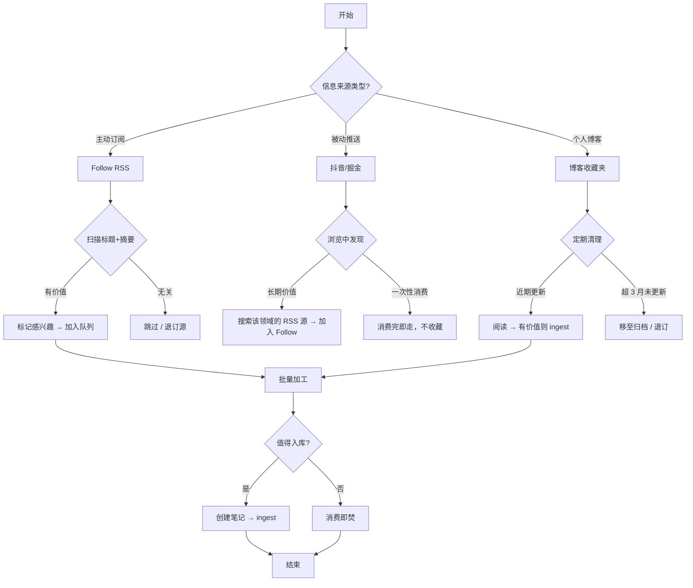

## SOP：信息收集工作流

> 通过三层信息管道（主动订阅层、被动推送层、博客收藏层）收集高信噪比信息，避免信息过载和收藏夹积灰。

目标：建立可持续的信息收集节奏，确保信息流不堵塞、不积压
实现：以 Follow（RSS）为主力，抖音/掘金为补充，个人博客做深度储备

---

### 适用场景

- 场景 1：日常信息摄入 — 每天有固定时间浏览 RSS 源，标记感兴趣的内容
- 场景 2：领域深耕 — 针对特定主题（如 Angular、视觉思维）主动订阅高密度信息源
- 场景 3：跨界探索 — 浏览被动推送平台时发现陌生领域的有价值内容，纳入 RSS 池

---

### 流程图解

---

### 核心步骤

#### 管道一：主动订阅（Follow RSS）— 主力层

1. **选源**：每个领域保留 3-5 个高信噪比源，优先选深度分析/周刊类，避免信息聚合站
	 - 注意：每新增一个源，审视是否可退订一个现有源（1-in-1-out）
2. **扫描**：固定时段（如午休/通勤）刷 Follow 的标题 + 摘要，判断是否值得读
3. **标记**：感兴趣的文章打标签或加入"待读"队列，不做全文精读
4. **批量加工**：每周集中一个时段，处理标记队列中的文章，决定 ingest 或消费即焚

#### 管道二：被动推送（抖音/掘金）— 补充层

1. **有目的浏览**：带着当前问题刷，遇到相关内容即判断是否与待解决问题相关
2. **发现高密度源**：如果某个创作者/作者连续产出有价值内容，搜索他是否有 RSS/Newsletter/博客，将其升级到管道一
3. **消费即走**：多数内容一次性消费完，不收藏、不笔记。只有经得起"一周后还记得"检验的才值得入库

#### 管道三：个人博客（可选） — 深度储备层

1. **定期清理**：每月检查一次博客收藏夹，筛选近 3 个月有更新的
2. **按需深读**：只对与当前活跃问题相关的博客做全文精读
3. **退订标准**：连续 3 个月无更新，或内容方向已偏离兴趣范围，移出收藏夹

**洞察**：个人博客可以整合到主力层，从而减少注意力的分散

#### 管道四：收敛层（可选）— 熵减策略

> [[收敛过程本质上是熵减过程]]：收敛是通过放弃可能性来换取有序结构。在信息收集中，收敛层就是主动减少信息源的"可能性空间"，以提升整体信噪比。

三条管道解决的是"如何收"，收敛层解决的是"如何砍"。建议每季度执行一次。

#### 收敛标准

| 管道 | 审查周期 | 保留标准 | 砍掉标准 |
|:---|:---:|:---|:---|
| Follow RSS | 每月 | 近 30 天产出 ≥ 1 条 ingest | 产出 0 条，或连续跳过多期 |
| 被动推送源（作者） | 每季 | 同一作者产出 ≥ 3 次高价值内容 | 只是偶尔刷到，无持续价值 |
| 个人博客 | 每季 | 近 3 个月有更新且产出过 ingest | 超 3 月未更新，或从未产出 ingest |

#### 执行步骤

1. **拉取数据**：回顾该管道近期消费记录，统计"真正入库"的内容
2. **对照标准**：未达保留标准的源标记为"待砍"
3. **红线确认**：再给待砍源一次机会——如果此刻想不起它最近一篇好文章是什么，砍
4. **执行退订**：退订/移除，在 wiki-log 记录"收敛事件"

---

### 实践/示例

以"跟进 Angular 最新动态"为例：
1. **Follow RSS**：订阅 Angular Blog、Angular Weekly、NgRx 官方博客，每日扫描摘要
2. **被动补充**：掘金刷到 Angular 18 新特性文章，发现作者有个人博客 → 纳入管道三
3. **博客深读**：作者博客更新频率高，且内容质量稳定 → 升级到 Follow RSS
4. **入库判断**：读到 Angular 18 的 `inject()` 新 API，确认与本库前端领域相关 → 创建笔记 [[C-Angular-inject函数]] 做 ingest
5. **收敛判断**：近3个月订阅源不再产生有价值内容，移除订阅源

---

### 常见坑点

- ⛔ **反模式**：在 Follow 中订阅过多源（超过 30 个）导致扫描阶段即过载，每天消费不完产生焦虑
- 🔧 **排查**：如果信息堆积，先暂停新增源，执行 1-in-1-out，直到扫描节奏恢复正常
- ⛔ **反模式**：刷抖音/掘金时看到好内容就收藏，收藏夹变成"数字垃圾场"
- 🔧 **排查**：强制"消费即走"，只有经过"一周后还记得"检验的才值得入库
- ⛔ **反模式**：个人博客收藏超过 50 个且从不回顾，纯粹安慰剂
- 🔧 **排查**：每月清理日集中处理，超 3 月无更新的直接退订

---

### 知识图谱

- **相关概念**：
	- [[如何在信息过载时代保持高信噪比]] — 信息收集的底层问题
	- [[知识获取工作流|SOP-知识获取工作流]] — 信息收集后的加工流程（剪藏 + AI 对话）
	- [[知识获取]] — 信息收集方法论的 MOC 入口
	- [[信噪比]] — 信噪比概念
	- [[收敛过程本质上是熵减过程]] — 收敛层的方法论基础（熵减逻辑）
- **母领域**：[[A-知识管理]]
