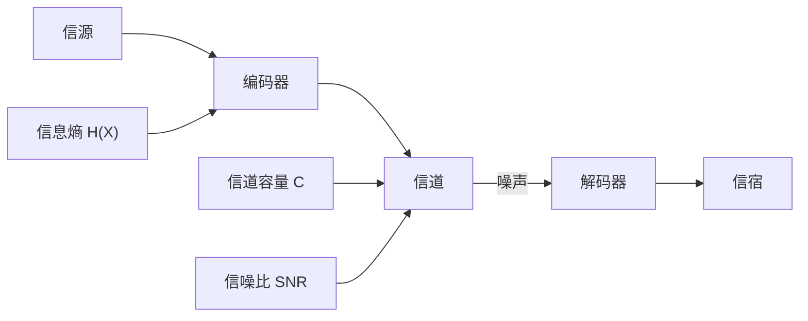

## 概念：信息论

> 由克劳德·香农于 1948 年创立的数学理论，研究信息的量化、存储和通信。它给出了"信息"可被度量的数学定义，是现代数字通信和知识管理理论的基石。

**解决的核心痛点**：在信息传递中，如何量化"信息量"、如何应对噪声、如何在有限信道中最大化传输效率。

---

### 核心命题

- [[信噪比决定了信息传递的有效性]]
	- **原理**：信号功率与噪声功率的比值直接决定了信道容量上限（香农公式）。噪声越大，能可靠传递的信息越少。
- [[熵减必然有信息代价]]
	- **原理**：信息熵度量系统的不确定性。降低熵（收敛、压缩）必然舍弃部分信息，不存在无代价的有序化。
- [[收敛过程本质上是熵减过程]]
	- **原理**：任何从高不确定性到低确定性的收敛——包括知识提炼——都在降低信息熵。

---

### 运行机制



**核心公式**（香农公式）：

```bash
C = B × log₂(1 + S/N)
```

C = 信道容量（最大传输速率），B = 带宽，S/N = 信噪比。

---

### 关键区别

| 维度 | 信息论中的"信息" | 日常语境中的"信息" |
|:--- |:--- |:--- |
| **定义** | 消除不确定性的量（熵减） | 有意义的陈述或数据 |
| **度量** | 比特（bit），可量化 | 主观判断，无法量化 |
| **噪声** | 数学上可建模的随机干扰 | 不相关、低质量的内容 |
| **价值** | 不区分"有用"和"无用" | 高度依赖上下文和接收者 |

这个区别解释了为什么知识管理不能直接套用信息论的数学公式——但可以用它的**思维模型**（信噪比、熵、信道容量）来设计信息处理策略。

---

### 应用场景

- ✅ **适用场景**
	- **信源管理**：用信噪比概念设计信息收集的收敛策略（[[信源质量审计标准]]）
	- **知识提炼**：用熵概念理解"提炼必然损失信息"（[[熵减必然有信息代价]]）
	- **认知管理**：把注意力视为有限信道容量，设计信息摄入节奏
- ⛔ **误用**
	- **套用公式**：试图用香农公式精确计算知识库的"信息量"
	- **忽略语义**：信息论不关心信息的"意义"，而知识管理恰恰依赖语义

---

### 知识图谱

- **父级概念**：[[通信工程]]、[[应用数学]]
- **子级概念**：
	- [[信噪比]] — 信号与噪声的比例，信息论在知识管理中最直接的映射
	- [[熵（信息论）]] — 信息量的度量单位
- **应用领域**：
	- [[知识获取]] — 信源选择和收敛策略的理论基础
	- [[A-知识管理]] — 信息论思维模型的应用场景
- **相关概念**：
	- [[收敛过程本质上是熵减过程]] — 熵概念在思维收敛中的映射
	- [[熵减必然有信息代价]] — 熵减守恒律
