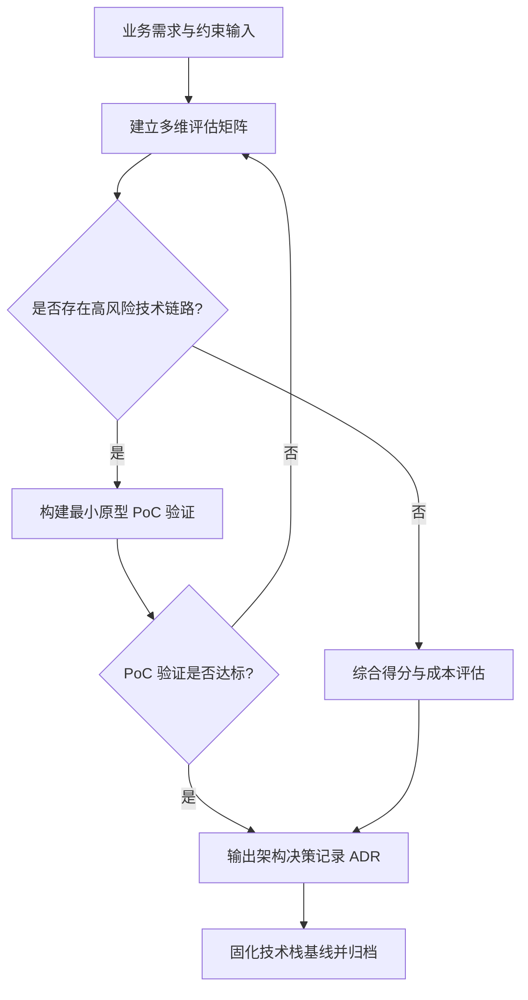

## SOP：评估与决策全栈项目技术选型

为全栈应用（尤其是集成 AI/LLM 的实时交互项目）建立标准化的技术选型评估与 PoC 验证流程，避免脱离业务场景盲目选型。

* **目标**：在架构初期完成客观、量化的多方案对比，通过低成本原型验证核心风险点，输出可落地的架构决策记录（ADR）。
* **实现**：以「AI 狼人杀全栈项目（React + Python FastAPI）」为标准实践落地。
* **问题溯源**：本 SOP 是 [[AI全栈项目如何科学选型前端与后端框架]] 的收敛成果——经过多方案对比和实践验证，固化为标准流程。

---

### 适用场景

* **场景 1**：新项目冷启动，面临前后端技术栈、通信协议（WebSocket/SSE/HTTP）及 AI 编排框架的选择。
* **场景 2**：现有系统面临重大架构重构，需要引入新的技术生态（如从单体服务重构成前后端分离并引入实时流式渲染）。

---

### 流程图解

---

### 核心步骤

#### 步骤 1：解构业务特征与边界约束

梳理核心功能对底层架构的硬性要求，明确并发模型、实时性、团队技术背景与交付周期。

> **注意**：重点识别"业务关键瓶颈点"（如 AI 狼人杀中的多 Agent 异步调度、并发流式 Token 广播、低延迟状态机流转）。

#### 步骤 2：建立加权评估矩阵进行量化打分

筛选 2–3 组主流候选方案，围绕 **AI 生态契合度 (40%)**、**实时通信/并发性能 (25%)**、**UI 状态管理与组件生态 (20%)**、**团队交付效率 (15%)** 建立矩阵打分。

#### 步骤 3：针对高风险链路实施 PoC（概念验证）

对评分最高的方案，仅编写最小闭环代码验证核心不确定性（例如：FastAPI WebSocket 是否支持 12 个 Agent 并发推送且 React 渲染不掉帧）。

#### 步骤 4：编写 ADR 并归档技术基线

将选型背景、被否决方案原因、采纳方案及后续风险应对策略固化为文档，归档至团队知识库。

---

### 实践/示例

#### 1. 评估矩阵量化打分（AI 狼人杀项目）

| 评估维度 | 权重 | 方案 A: React + FastAPI | 方案 B: Vue 3 + Go (Gin) | 方案 C: Next.js 全栈 (Node) |
| --- | --- | --- | --- | --- |
| **AI / LLM 生态集成** | 40% | **38** (LangChain/原生 SDK 最成熟) | 28 (LLM SDK 适配滞后) | 32 (JS 端 Agent 生态略逊) |
| **实时通信与并发** | 25% | **22** (Asyncio + WebSocket 支持优良) | 25 (Goroutine 高并发性能极强) | 22 (Node 事件循环支持良好) |
| **UI 状态与流式组件** | 20% | **19** (React 状态机与 Markdown 流生态丰富) | 18 (响应式优秀，但 Agent UI 库偏少) | 18 (同 React，但服务端组件增加复杂度) |
| **团队交付与全栈效率** | 15% | **14** (前后端分离清晰，类型可推导) | 10 (后端语言切换学习成本高) | 14 (全栈 TS 同构) |
| **综合加权得分** | 100% | **93** | 81 | 86 |

#### 2. 架构决策记录 (ADR 摘要)

* **决策结论**：采用 **React (TypeScript + Zustand + Tailwind CSS)** + **Python (FastAPI + Asyncio WebSocket)**。
* **核心理由**：Python 生态与 LLM/多 Agent 库无缝衔接；FastAPI 的异步 I/O 完美匹配 I/O 密集型的大模型调用；React 端便于维护复杂的游戏状态机与流式打字机渲染。

---

### 常见坑点

* ⛔ **反模式：脱离业务盲目追求新潮框架**。在 AI 逻辑高度依赖 Python 生态的场景下，强行采用纯 Node/Next.js 编写多 Agent 状态机，导致后续引入 LangGraph 等工具时产生大量封装成本。
* ⛔ **反模式：未做 PoC 直接全量编码**。忽视高并发流式推送到前端时的频繁 Re-render 性能问题，后期被迫重构前端状态管理架构。
* 🔧 **排查：如果流式推文字出现前端卡顿/掉帧**，检查是否在每次 WebSocket 收到单个 Token 时都触发了全量组件 State 更新；应改用 `useSyncExternalStore`、`Zustand` 局部订阅，或在前端引入 RAF（RequestAnimationFrame）做缓冲批处理更新。

---

### 知识图谱

**相关概念：**

* [[前端工程]]
* [[AI Agent 与 MCP协议实践]]
* [[FastAPI 异步架构与 WebSocket 实践]]
* [[React 复杂状态机与性能优化]]

**问题来源：**

* [[AI全栈项目如何科学选型前端与后端框架]] — 此 SOP 解决的问题来源
