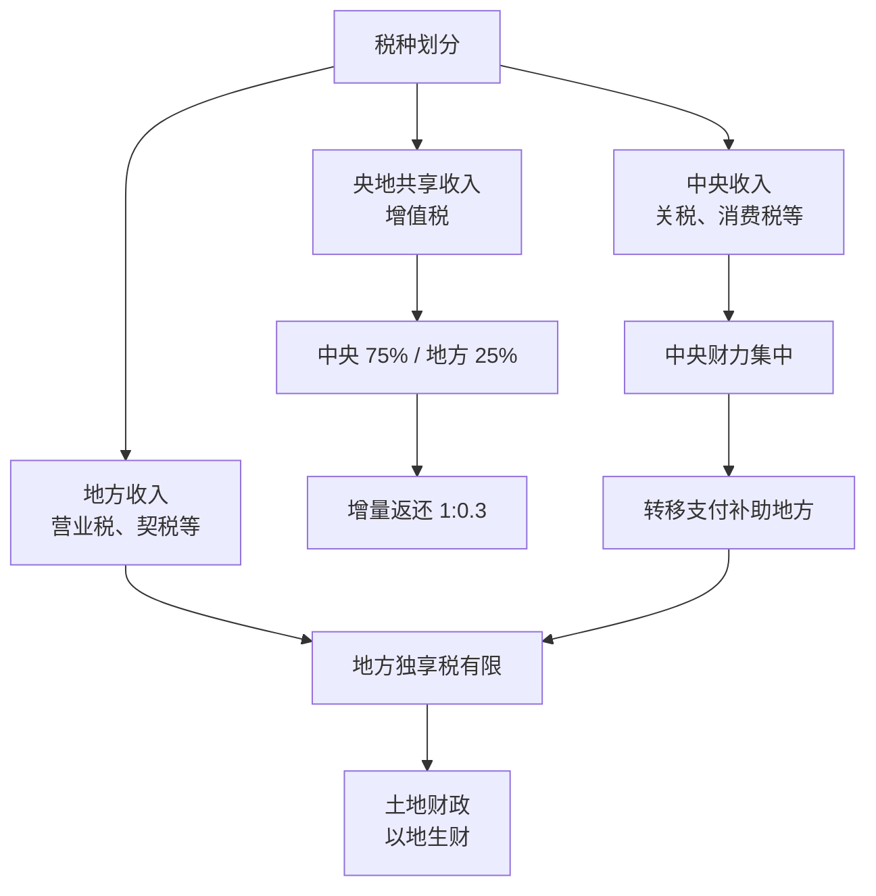

## 概念：分税制改革

> 分税制是一种按税种划分中央与地方政府财政收入范围的财政管理体制。1994 年分税制改革将此前中央财力薄弱的「财政包干制」重构为「中央集中财力、地方依赖转移支付」的新格局。

**解决的核心痛点**：改革前（1993 年）中央财政收入仅占全国 22%，地方占 78%，中央财政"难以为继"甚至依赖地方上解和借款。分税制通过税种划分重新集中中央财力，以恢复宏观调控能力。

---

### 核心命题

- 分税制改革的本质是「财力上收、事权下移」——中央通过税种划分集中财力，但地方的支出责任并未同步减少
	- **原理**：中央财政收入占比从 1993 年的 22% 升至 2004 年的 57.2%，但地方长期以约四成收入承担约七成支出责任，形成财权与事权的结构性错配
- 土地财政是分税制「财权事权错配」的制度性后果
	- **原理**：地方独享税种有限（营业税、契税等），遂转向"经营城市、以地生财"——土地出让收入从 1999 年约占 10% 升至 2009 年的 46%，成为地方"第二财政"

---

### 运行机制

1994 年分税制的核心是**按税种划分收入归属**：

- **税种划分**：收入分为中央收入、地方收入、央地共享收入三类
- **增值税分成**：增值税作为共享主体税种，按中央 75%、地方 25% 分成；对地方实行增量返还（中央增长部分按 1:0.3 返还地方）
- **两套征收系统**：建立国税、地税两套税务系统，税种从 37 个精简到 23 个，增值税取代产品税成为第一大税种
- **转移支付**：地方因改革减少的收入，通过中央转移支付弥补

---

### 关键区别

| 维度 | 分税制（1994 起） | 财政包干制（改革前） |
|:--- |:--- |:--- |
| **收入划分逻辑** | 按税种划分央地收入 | 地方按定额/比例向中央包干上缴 |
| **财力格局** | 中央集中（~57%） | 地方占优（地方 78%） |
| **地方激励** | 转向土地财政、招商引资 | 藏富于地方、发展本地经济 |
| **中央调控力** | 强 | 弱（依赖地方上解） |

---

### 适用范围

- ✅ **适用场景**
	- **理解央地财政关系**：中央与地方的财力分配、转移支付逻辑
	- **理解土地财政与地方债**：地方财政压力的制度根源
	- **理解 1990 年代以来经济体制转型**：市场化 + 财政集中的制度配套
- ⛔ **误用**
	- **单一归因**：把土地财政、高房价完全归因于分税制，忽视地方 GDP 竞争、投资冲动等因素
- **失效边界**
	- 分税制无法解释所有地方财政困境，也不能单独解释房地产市场的周期性波动

---

### 批判

- **外部批判**
	- **周天勇等学者**：分税制造成中央与地方财权事权严重不匹配，地方财政"事多钱少"，自给能力下降
	- **许善达等**：光靠转移支付给钱不够，需让地方拥有自己的税收来源
- **内在张力**
	- 中央集中财力的宏观调控目标 vs 地方发展激励的冲突——地方在"钱少责多"下被迫开辟土地财政等非正规财源

---

### FAQ

> 与本概念相关的开放性问题

- 分税制改革如何塑造了地方债务风险？
- 营改增后央地税收分成调整为五五分成，是否缓解了财权事权错配？

---

### 知识图谱

- **父级概念**：[[政治经济]] — 分税制是政治经济学中财政制度的核心案例
- **并列概念**：
	- [[制度 (Institutions)]] — 分税制是一种财政制度安排
	- [[市场 (Market)]] — 分税制通过财政手段调节政府与市场关系
- **相关人物**：
	- [[朱镕基]] — 1994 年分税制改革的主导者
- **参考文章**
	- 腾讯新闻《站在又一个历史起点上，分税制改革 30 年回眸》（2024）
	- 中新网《"土地财政"的根源是分税制不合理》（2007）
