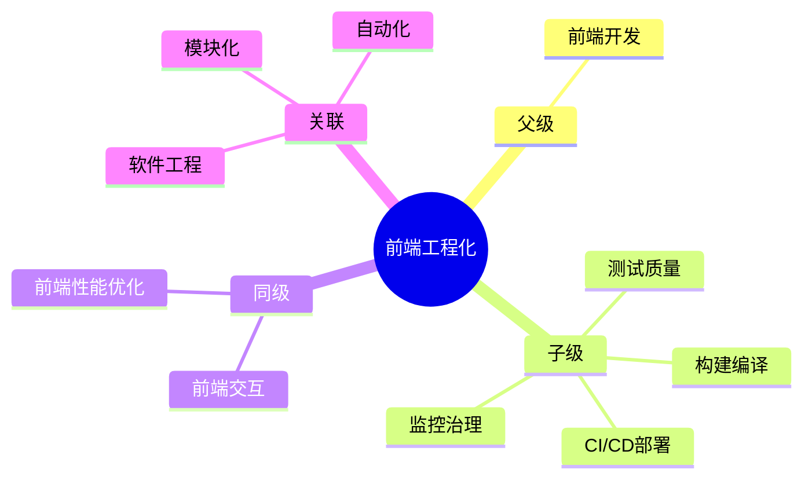

## 🗺️ MOC： 前端工程化

> 将软件工程方法论应用于前端开发，通过规范化、模块化、自动化解决规模化、协作化和性能优化挑战。

**核心目标**：提效、保质、监控。

---

### 知识图谱

---

### 定义

- **核心范畴**：开发体验优化、构建编译、质量保障、部署运维、监控治理
- **不包括**：具体业务代码实现、UI 设计
- **与相关领域的区别**：
	- [[前端工程]] 关注 " 如何高效、可控地开发 "
	- [[前端交互]] 关注 " 如何响应用户 "
	- [[前端性能优化]] 关注 " 如何让页面加载更快 "

---

### 关键领域

> 该领域的核心知识主题（链接 Concept 或子领域 Area）

- **概念演进**
	- [[前端工程演进]]
- **核心概念**
	- [[微前端]]
	- [[脚手架]]
	- [[Monorepo|Monorepo]]
	- [[GitHub Actions]]
	- [[模块化与组件化开发]]
	- [[第三方库]]
	- [[前端工程化与前端开发生命周期.excalidraw]] — 前端开发生命周期全景图
- **构建编译**
	- [[前端工程化工具]] — 工具索引
	- [[Vite]] — 下一代构建工具
	- [[Webpack]] — 模块打包器
	- [[Rspack]] — 高性能打包器
	- [[pnpm]] — 现代包管理器 — 
- **测试质量**（测试金字塔：[[单元测试]] → [[集成测试]] → E2E）
	- [[Vitest]] — 单元测试
	- [[Playwright]] / [[Cypress]] — E2E 测试
- **代码质量**
	- [[ESLint]] — 代码检查
	- [[Prettier]] — 代码格式化
	- [[Husky]] — Git Hooks
- **CI/CD**
	- [[GitHub Actions]] — 自动化工作流
	- [[Docker]] — 容器化
- **前端监控**
	- [[Sentry]] — 错误监控
	- [[前端监控与告警实践]] — 监控体系
- **版本控制与协作**
	- [[Git命令与工作流速查]] — Git 常用命令速查

---

### SOP

> 该领域的标准化操作流程（SOP）

- [[建立前端工程规范]]
- [[构建前端脚手架]]
- [[代码审查流程]]
- [[CI-CD流程|SOP-CI/CD流程]]
- [[版本控制与协作流程]]
- 发布流程 — 版本管理 → 构建产物 → 部署验证

---

### FAQ

> 该领域的常见问题（链接 Question 或 MOC）

- [[前端工程化相关面试题]] — 工程化面试题聚合索引
- [[Webpack vs Vite]]
- [[Q-如何选择构建工具]]
- [[为什么使用SSR（服务端渲染）？]]

---

### 探索前沿

- Serverless 如何改变前端边界
- AI 辅助编程如何整合进 Code Review
- 如何量化工程化 ROI

---

---
