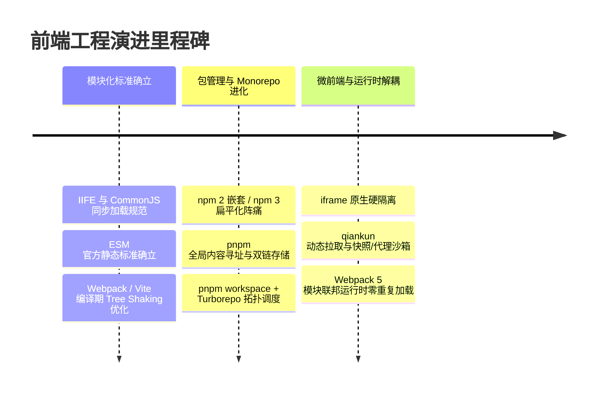

## 前端工程演进

> 模块化标准确立 → 包管理机制进化 → 微前端架构与运行时解耦

**时间跨度**：IIFE/CommonJS 早期规范 ➔ 现代 ESM 与分布式微前端时代
**演进动力**：随着 Web 应用规模的极速膨胀，传统的单体前端开发面临模块依赖混乱、构建效率低下、依赖安装冗余、代码重复率高，以及大型系统技术栈锁定和多团队协同割裂等系统性挑战，驱动着前端开发从"脚本拼凑"走向工业级的工程设计、统一依赖编排与运行时解耦。

---

### 演进概览

---

### 阶段详情

#### 阶段一：模块化标准确立与构建工具升级

- **时间**：早期 IIFE / CommonJS 到 ESM 官方标准确立
- **核心变化**：
	- 模块化规范从运行时的 **CommonJS**（同步加载、导出值的浅拷贝）过渡到官方的 **ES Module (ESM)** 标准。ESM 采用编译期静态分析/异步加载机制，导出的是值的动态只读引用（Live Binding）。
	- 构建工具也随着模块化标准的改变从生态繁荣但配置繁重的 **Webpack**，演进到基于原生 ESM 开发热更新与 Rollup/esbuild 生产打包的 **Vite**，直至如今基于 Rust 打造的次时代构建引擎 **Rspack / Turbopack**，实现了构建效能的指数级飞跃。
- **解决的关键问题**：
	- 彻底摆脱了早期全局变量污染与作用域冲突的困境。
	- CommonJS 模块由于 require 支持在 if 语句中动态执行，无法在静态编译期进行可靠的依赖推断。而 ESM 具有严格的静态结构，模块导入导出关系在 AST（抽象语法树）阶段即可确定，从而使构建工具能进行高效的 **Tree Shaking**，剔除死代码、大幅削减线上包体积。
- **相关概念**：[[ESModule]] [[CommonJS]] [[Tree Shaking]] [[Rspack]]

#### 阶段二：现代包管理机制进化与 Monorepo 多包协作

- **时间**：npm 2 ➜ npm 3 / yarn 1 ➜ pnpm 现代多仓协作时代
- **核心变化**：
	- **包管理工具演进**：摒弃了 **npm 2** 的依赖层层嵌套、导致依赖重复安装与路径超长的树形结构；也跨越了 **npm 3 / yarn 1** 引入的扁平化铺平方案；全面拥抱基于硬链接（Hard Link）与符号链接（Symlink）全局内容寻址存储（Global Store）的 **pnpm**。
	- **Monorepo 任务编排**：建立 **pnpm workspace + Turborepo** 最佳实践，通过拓扑图调度分析模块依赖关系，最大化并发执行无依赖任务，并基于文件哈希在本地与远程进行构建缓存。
	- **代码质量防护**：在 commit 拦截阶段建立由 **Husky** 配合 **lint-staged** 的 Pre-commit 静态拦截体系，并配合 Commitlint 进行规范化语义提交，最后接入自动化 CI/CD 流程进行静态检查、Vitest 单元测试、Playwright 跨端 E2E 校验以及构建体积审计。
- **解决的关键问题**：
	- 根除了 npm 3 / yarn 1 扁平化铺平带来的 **幽灵依赖**（即直接 import 未在 package.json 声明的间接依赖库）和 **分身依赖**（多版本实例重复构建）。
	- 解决了大型复杂业务中，多包管理分散、本地代码无法即时引用调试和跨包复用极低的痛点。通过 Turborepo 远程缓存调度，若模块未变更，二次构建（turbo build）耗时直接接近 0ms，大幅压缩 CI/CD 流水线排队时间。
- **相关概念**：[[pnpm]] [[Monorepo]] [[幽灵依赖]] [[Turborepo 缓存调度]] [[代码质量防护]]

#### 阶段三：微前端架构与运行时解耦

- **时间**：巨石单体单页应用 ➜ 运行时分布式微前端时代
- **核心变化**：
	- 架构从高耦合的单体巨石应用，走向技术栈无关、独立开发、独立部署的分布式系统。
	- 发展出了三种主流运行时集成路线：
			1. **iframe**：利用浏览器原生的硬核机制，提供天然彻底的 JS / CSS 双重物理级隔离。
			2. **qiankun (Single-SPA 进阶)**：基于 HTML Entry 动态拉取子应用并渲染到主应用指定的容器中。
			3. **Webpack 5 模块联邦 (Module Federation)**：允许应用在运行时，动态加载远程暴露出的模块。
- **解决的关键问题**：
	- 解决了由于项目规模过大导致的技术栈绑定锁死（如旧系统无法平滑升级框架）、多团队高频协同冲突与代码合流困难、构建与部署时间过长的瓶颈。
	- 克服了 iframe 致命的体验局限（URL 状态不同步、UI 弹窗无法穿透、通信开销高、DOM 重建闪烁开销大等）。
	- **qiankun** 利用 **快照沙箱 (SnapshotSandbox)** 或 **代理沙箱 (ProxySandbox)** 实现了运行时 JS 全局环境隔离，通过动态样式表添加前缀或 Shadow DOM 解决了 CSS 污染，带来了单页应用级的高流畅度体验。
- **相关概念**：[[qiankun]] [[模块联邦]] [[JS 沙箱]] [[CSS 隔离]] [[iframe在微前端中的应用与演进]]

---

### 关键转折点

> 演进中的重要里程碑或范式转换

|时间点|转折内容|影响|
|:--|:--|:--|
|ESM 规范确立|编译期静态分析模块导入导出|使静态推断依赖树、动态只读引用（Live Binding）以及精确的 **Tree Shaking** 代码瘦身技术成为可能。|
|pnpm 机制推出|基于硬链接与符号链接的全局内容寻址存储|彻底清除了扁平化架构引入的"幽灵依赖"和"分身依赖"两大业界顽疾，极大降低了本地 node_modules 磁盘占用。|
|模块联邦面世|Webpack 5 引入去中心化的 Module Federation 机制|允许项目在运行时，直接跨应用动态共享暴露模块（expose）与依赖（shareScope），实现了微前端从"基座式代理拉取"向"去中心化分布式依赖共享"的范式转变。|

---

### 未来展望

- **趋势**：
	- **构建引擎全面 Native 化**：Webpack 的主流打包地位正在向以 **Rspack**、Vite 为代表的高效编译工具过度，通过 Rust 等底层语言全面重构前端编译流。
	- **可观测性与稳定性融合**：工程化不再止步于构建部署，而是通过 Web Vitals（LCP $\le 2.5s$, INP $\le 200ms$, CLS $\le 0.1$） 原生 API 自动采集与私有化 Sentry 的 SourceMap 后台逆向还原定位，实现全链路的稳定性工程闭环。
- **待解决**：
	- 微前端沙箱代理机制在大体量数据下造成的微小性能损耗与特例兼容。
	- 多技术栈并存时的打包产物共享与基础运行库实例冲突问题。
- **值得关注**：
	- **Rspack/Turbopack** 生态的持续成熟与大规模生产落地。
	- 面向交互响应度的全新 Web Vitals 指标 **INP** 在全链路监控中的治理。
	- 模块联邦在非 Webpack 生态（如 Vite 模块联邦）中的异构打包器兼容与无沙箱协作。

---

### 关联概念

- **父级领域**：[[前端工程]]
- **相关概念**：
	- [[Monorepo]] — 多包统一管理机制，利用工作区即时本地引用和拓扑并发任务，是包管理进化中的核心产物。
	- [[聊聊前端模块化]]
	- [[JS 沙箱]] — 微前端框架的核心组成，通过代理 (Proxy) 或快照机制，在主子应用共存时，阻断全局 window 变量污染。
	- [[稳定性工程]] — 构建前端工程质量的最后一公里，利用 SourceMap 映射还原堆栈并跟踪 Web Vitals 核心指标。

---

### 参考来源

- [[聊聊前端模块化]] — 收敛来源：前端模块化演进历程与各方案对比（知乎，Lucas）
- 模块化 / 包管理 / 微前端三阶段的机制细节，另见各阶段「相关概念」链接页
