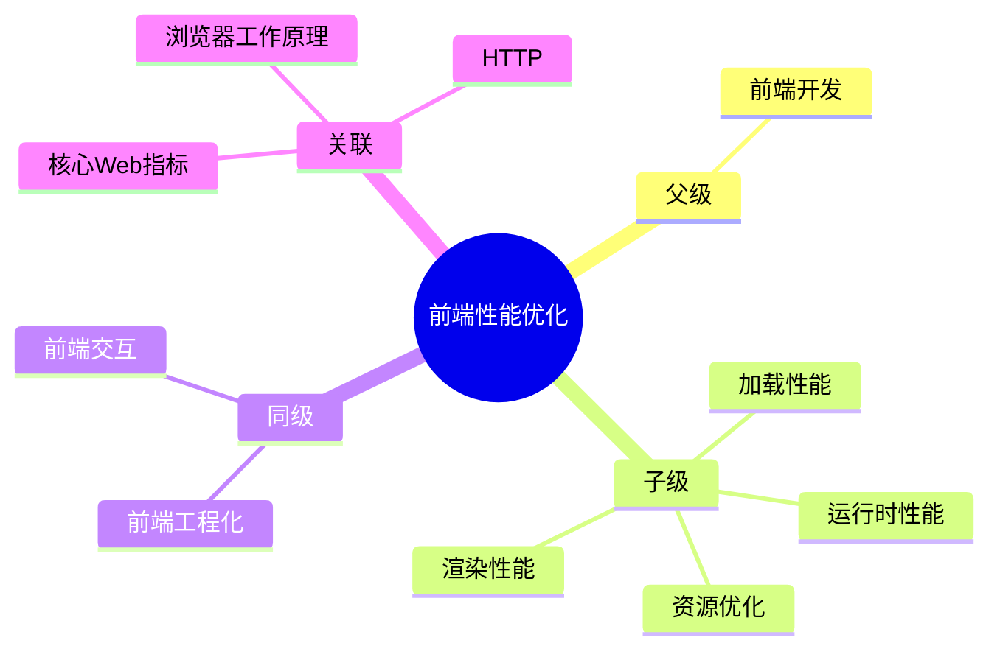

## 🗺️ MOC： 前端性能优化

> 通过各种技术手段和方法，提升 Web 应用的性能，从而改善用户体验。

**核心目标**：让页面加载更快、交互更流畅、资源更高效。

---

### 知识图谱

---

### 定义

- **核心范畴**：加载性能、渲染性能、运行时性能、资源优化
- **不包括**：后端性能优化、网络基础设施优化
- **与相关领域的区别**：
	- [[前端性能优化]] 关注 " 让页面更快 "
	- [[前端交互]] 关注 " 如何响应用户 "
	- [[前端工程]] 关注 " 如何高效开发 "

---

### 关键领域

> 该领域的核心知识主题（链接 Concept 或子领域 Area）

- **加载性能**
	- [[核心Web指标]] — LCP（最大内容绘制）
	- [[HTTP]] — 缓存策略、CDN
	- [[浏览器工作原理]] — 加载链路
- **渲染性能**
	- [[回流和重绘]] — 渲染性能核心概念
	- [[合成层]] — GPU 加速原理
	- [[will-change]] — 合成层触发
	- [[回流和重绘]] 优化 → [[怎样减少回流和重绘]]
- **运行时性能**
	- [[JavaScript]] 执行效率
	- [[事件委托]] — 高效事件处理
	- [[虚拟列表]] — 长列表优化
- **资源优化**
	- 图片优化（WebP、懒加载）
	- 代码分割（[[前端工程]]）
	- 字体优化
		- [[SOP-字体子集化]]
- **优化方法**
	- [[性能优化方法]] — 系统化的性能优化方法论
	- [[前端缓存方案]] — 缓存策略索引

---

### 标准流程

> 该领域的标准化操作流程（SOP）

- [[SOP-性能问题排查流程]] — 待创建
- [[SOP-首屏优化流程]] — 待创建

---

### FAQ

> 该领域的常见问题（链接 Question 或 MOC）

- [[Q-怎样减少回流和重绘]] — 渲染优化核心问题
- [[Q-如何提升首屏加载速度]] — 待创建
- [[Q-Web Vitals 如何优化]] — 待创建

---

### 探索前沿

- Core Web Vitals 未来变化趋势
- 用户体验指标的量化标准
- AI 在性能优化中的应用

---

---

### 参考资料

- [Google Web Dev - 渲染性能](https://web.dev/articles/rendering-performance)
- [Web Vitals](https://web.dev/vitals/)
- [CSS Triggers](https://csstriggers.com/)
