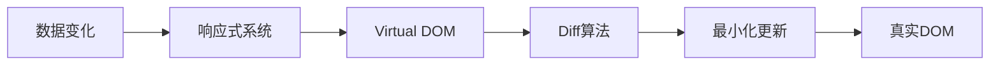

## MOC：前端框架

> 前端框架专题入口：聚合主流框架的原理、核心特性、对比与选型知识。中观层专题，研究边界为「构建用户界面的 JavaScript 库/框架」，攻关粒度 5~20 篇高价值资料。

**解决的问题**：提升开发效率、保证代码质量、降低维护成本

---

### 框架核心特性

- 组件化：封装 UI 和逻辑
- 响应式数据绑定：数据驱动视图
- 虚拟 DOM：高效更新
- 路由管理：单页应用
- 状态管理：全局数据

---

### 主流框架

| 框架 | 核心思想 | 学习曲线 | 适用场景 |
|:---|:---|:---|:---|
| [[Vue]] | 渐进式、约定优于配置 | 平缓 | 中小型项目 |
| [[React]] | 组件化、函数式编程 | 中等 | 大型项目 |
| [[Angular]] | 完整解决方案、依赖注入 | 陡峭 | 企业级应用 |
| [[Svelte]] | 编译时优化、无虚拟 DOM | 平缓 | 高性能应用 |
| [[ThreeJS]] | 3D 图形库（场景图、材质、光照） | 中等 | 3D 场景 |

---

### 框架对比

- [[Vue vs React]] — 渐进式框架 vs 声明式组件库，响应式系统、模板语法、生态策略差异
- [[Svelte vs React]] — 编译时优化 vs 运行时虚拟 DOM，体积、性能、开发体验差异
- [[Vue2 vs Vue3]] — Vue2 和 Vue3 核心差异
- [[Vue3 ref 和 reactive 的区别]] — 响应式系统对比、使用场景
- [[React 函数组件 vs 类组件]] — 函数式 vs 类组件、Hooks 迁移

---

### 通用运行链路

### 核心知识体系

| 知识 | 说明 |
|:--- |:--- |
| [[Virtual DOM]] | 性能优化的基础 |
| 组件化 | UI 封装与复用 |
| 路由管理 | SPA 路由 |
| 状态管理 | 全局状态 |
| 编译时优化（Svelte） | 无需运行时，编译阶段生成优化代码 |

> 注：[[Diff算法]]、[[响应式原理]] 尚未补齐，见待探索

---

### 知识网络

- **父级**：[[前端开发]] — 前端领域顶层 area
- **相关**：[[JavaScript]] — 框架语言基础；[[Web通信]] — 框架网络请求基础

---

### 待探索

- [ ] 深化 [[Diff算法(Vue3)]] — Vue3 虚拟 DOM 对比算法
- [ ] 深化 [[响应式原理(Vue3)]] — Vue3 数据驱动视图
- [ ] 收集 5~20 篇高价值框架源码分析 / 官方文档，对接 NotebookLM 专题研究
