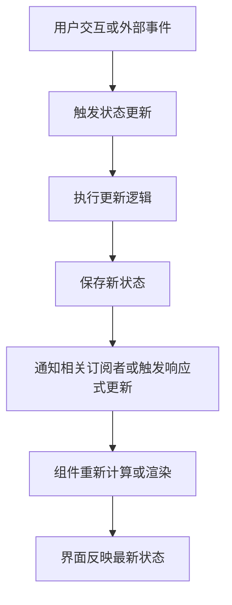

## 概念：前端状态管理（Frontend State Management）

> 前端状态管理是对应用运行过程中产生和变化的数据进行组织、存储、更新、共享与同步，使界面能够根据状态变化正确反映应用行为的一种工程实践。

**解决的核心痛点**：前端应用中的数据分散在组件、模块、浏览器存储和服务端之间。当应用复杂度增加时，状态可能出现重复存储、更新不一致、组件间通信困难、异步请求竞争以及状态生命周期不明确等问题。状态管理通过明确状态的归属、更新方式和同步规则，降低这些问题带来的复杂性。

---

### 核心命题

- 状态管理的核心是维护应用状态的一致性
	- **原理**：应用中的多个组件可能依赖同一份数据。如果各自维护独立副本，更新时就可能出现不一致。通过明确状态归属和共享机制，可以减少重复状态及同步问题。
- [[状态应该由最接近其使用边界的合适所有者持有]]
	- **原理**：只被单个组件使用的状态通常可以保留在组件内部；需要跨组件共享的状态则应提升到合适的共同所有者或共享存储中。状态所有权应根据生命周期、共享范围和更新需求确定，而不是一律放入全局 Store。
- [[派生状态应尽可能从源状态计算得到]]
	- **原理**：如果某个值能够通过现有状态确定性计算得到，通常不需要再单独存储。减少重复状态可以降低同步成本和不一致风险。
- 状态更新机制决定界面如何响应数据变化
	- **原理**：框架通过响应式系统、订阅机制或状态更新流程识别数据变化，并触发相关界面更新。状态管理不仅涉及数据存储，也涉及变化传播机制。
- [[服务端状态与客户端状态具有不同的生命周期]]
	- **原理**：服务端状态由远程系统维护，涉及请求、缓存、失效和重新验证；客户端状态通常由当前应用控制。两者的更新来源和一致性要求不同，适合采用不同的管理策略。
- 状态管理复杂度来自状态之间的依赖与同步
	- **原理**：状态数量本身并不直接决定复杂度。状态之间的依赖、共享范围、更新路径、异步操作和生命周期交织，才是许多状态管理问题的主要来源。

---

### 运行机制

前端状态管理通常涉及状态定义、状态更新、变化传播和界面渲染。

#### 基本流程



#### 核心组成

**1. 状态定义**

确定应用需要保存哪些数据，以及这些数据的类型、初始值和所有权。

例如：

```ts
interface UserState {
	id: string;
	name: string;
	isLoggedIn: boolean;
}
```

**2. 状态更新**

通过事件处理函数、Action、Mutation、Reducer 或框架提供的响应式机制改变状态。

状态更新应具有明确的语义和边界，避免多个模块以不可预测的方式修改共享数据。

**3. 状态传播**

当状态变化时，框架或状态管理库通过依赖追踪、订阅通知或其他机制，使依赖该状态的组件能够感知变化。

**4. 界面更新**

组件根据最新状态重新计算视图，框架再根据自身的渲染机制更新 DOM。

**5. 持久化与恢复**

对于需要跨页面刷新或会话保存的状态，可以使用浏览器存储或服务端持久化机制。

但持久化并非所有状态都需要具备的能力，应根据状态生命周期和安全要求决定。

---

### 关键区别

#### 前端状态管理与组件状态

|维度|前端状态管理|组件状态|
|---|---|---|
|**核心逻辑**|组织应用范围内的状态及其更新、共享和同步|管理单个组件或局部组件树所需的数据|
|**状态范围**|可以跨组件、模块或页面共享|通常局限于组件自身及其后代|
|**生命周期**|取决于 Store、应用实例或持久化策略|通常与组件实例生命周期相关|
|**典型场景**|用户会话、跨页面共享的数据|输入框内容、弹窗开关、局部交互状态|
|**实现方式**|Context、Store、状态管理库或共享响应式对象|React useState、Vue ref 等|

注意：组件状态本身也是状态管理的一部分。全局状态管理并不是独立于组件状态的另一种完全不同的机制。

#### 客户端状态与服务端状态

|维度|客户端状态|服务端状态|
|---|---|---|
|**数据所有权**|通常由当前前端应用控制|由远程服务或数据库控制|
|**主要来源**|用户交互、界面行为和本地计算|API、数据库及远程业务系统|
|**更新方式**|本地状态更新、事件处理或响应式变化|网络请求、订阅、重新验证或服务端推送|
|**主要挑战**|状态组织、组件通信和生命周期|缓存、过期、并发请求和数据一致性|
|**典型场景**|弹窗状态、表单编辑状态、选中项|用户资料、商品列表、订单详情|
|**常见方案**|useState、Context、Pinia、Redux 等|TanStack Query、SWR 等服务端数据管理工具|

客户端状态与服务端状态并非绝对互斥。例如，用户资料可以从服务端获取并缓存在客户端，但其权威数据来源仍然是服务端。

#### 全局状态与派生状态

|维度|全局状态|派生状态|
|---|---|---|
|**核心逻辑**|在较大范围内共享和维护的数据|根据已有状态计算得到的数据|
|**是否独立存储**|通常需要某种共享存储|通常可以通过计算获得|
|**典型场景**|当前用户、应用主题、跨页面共享的筛选条件|过滤后的列表、总价、统计数量|
|**主要风险**|共享范围过大、更新耦合和生命周期复杂|重复缓存、依赖遗漏或计算逻辑不一致|

---

### 适用范围

- ✅ **适用场景**
	- **局部交互状态**：使用组件状态管理输入框、折叠面板、弹窗和选中项，避免不必要的全局共享。
	- **跨组件共享状态**：当多个组件需要访问和更新同一份数据时，使用合适的共享机制明确状态所有权。
	- **跨页面应用状态**：对于用户会话、应用主题或需要在多个页面间保持的数据，使用适当的应用级状态管理方案。
	- **复杂交互流程**：对于多步骤表单、编辑器和复杂交互界面，通过明确状态转换和更新规则管理流程。
	- **服务端数据缓存**：使用专门的数据请求与缓存方案处理加载状态、缓存失效、重新请求和并发问题。
	- **状态持久化**：对于刷新后仍需保留的数据，依据安全性和生命周期要求选择 URL、浏览器存储或服务端持久化。
- ⛔ **误用**
	- **所有状态都放进全局 Store**：会扩大共享范围，增加模块耦合和维护成本。局部状态通常应优先保留在局部。
	- **重复存储可以计算得到的数据**：例如同时保存商品列表和列表长度，可能导致两者不一致。可以计算时应优先考虑派生状态。
	- **把服务端数据完全当作普通本地状态**：忽略缓存过期、请求竞争和重新验证，可能造成数据陈旧或覆盖新结果。
	- **在多个组件中无规则地维护同一份状态**：容易出现多个数据副本和相互覆盖的问题。
	- **为了使用状态管理库而引入状态管理库**：简单应用可能只需要组件状态和少量共享机制，额外引入复杂 Store 未必有收益。
	- **将状态管理等同于数据持久化**：状态管理可以包含持久化，但许多状态只在组件或应用运行期间存在。
- **失效边界**
	- 状态管理无法单独解决服务端业务逻辑错误或数据库一致性问题。
	- 状态管理无法保证网络请求返回的数据一定是最新的，仍需缓存和并发控制策略。
	- 状态管理无法替代权限校验。前端隐藏按钮或修改本地状态不能代替服务端授权。
	- 状态管理无法自动消除不合理的业务模型或组件设计。
	- 状态管理方案的效果依赖于状态所有权、生命周期和更新规则是否合理。
	- 不同框架的响应式机制和状态更新语义存在差异，不能将某个框架的实现细节直接视为通用规律。

---

### 批判

- **外部批判**
	- **函数式编程视角**：可变共享状态会增加推理难度。通过不可变数据、纯函数和明确的状态转换，可以减少隐式副作用。
	- **响应式编程视角**：显式管理状态更新虽然能够建立清晰的变更路径，但过度依赖手动同步可能增加样板代码。响应式依赖追踪可以减少部分手动协调工作，但也可能引入隐式依赖。
	- **组件化设计视角**：全局状态可能掩盖组件边界设计不合理的问题。如果组件之间存在大量非必要的共享状态，问题可能来自职责划分，而不只是缺少状态管理库。
	- **服务端数据管理视角**：传统全局 Store 并不一定适合管理所有远程数据。请求缓存、失效、重新验证和并发控制通常需要专门的服务端状态管理策略。
- **内在张力**
	- **共享与隔离的冲突**：共享能够减少重复数据，但过度共享会增加耦合和更新影响范围。
	- **集中管理与模块自治的冲突**：集中 Store 有利于统一观察和调试，但可能削弱模块独立性。
	- **响应式便利与隐式依赖的冲突**：自动追踪依赖可以减少样板代码，却可能让数据变化路径不够直观。
	- **缓存性能与数据新鲜度的冲突**：缓存能够减少网络请求，但缓存策略不当可能导致界面展示过期数据。
	- **不可变性与开发成本的冲突**：不可变更新有利于推理和变更检测，但复杂嵌套数据可能增加更新代码的复杂度。
	- **本地乐观更新与服务端权威性的冲突**：乐观更新能够改善交互体验，但服务端拒绝或数据冲突时需要回滚或重新协调。

---

### FAQ

> 以下问题用于探索状态管理中的设计选择，再通过实践形成稳定的工程流程。

- [[什么时候应该将组件状态提升到全局状态？]]
- [[React中应该如何选择useState、useReducer和Context？]]
- [[Vue 的响应式系统是如何追踪状态变化的？]]
- [[Redux、Zustand 和 Pinia 的设计思路有什么区别？]]
- [[为什么派生状态通常不应该重复存储？]]
- [[如何处理异步请求导致的状态竞争问题？]]
- [[客户端状态与服务端状态应该如何划分？]]
- [[前端状态应该如何持久化？]]
- [[如何设计复杂表单和多步骤流程的状态模型？]]

---

### SOP

> 以下流程是可以进一步实践和验证的标准操作流程候选。

- [[前端状态建模 SOP]] — 识别状态来源、所有者、生命周期、依赖关系和更新方式。
- [[前端状态归属判断 SOP]] — 根据组件范围、共享需求和生命周期决定状态应保留在局部还是提升到共享层。
- [[前端异步请求状态管理 SOP]] — 统一处理加载、成功、失败、取消、缓存及请求竞争。
- [[前端状态持久化 SOP]] — 根据数据生命周期、安全要求和恢复需求选择持久化策略。
- [[复杂交互状态机设计 SOP]] — 将多步骤交互建模为明确状态及允许的状态转换。
- [[前端状态调试与排错 SOP]] — 追踪状态来源、更新路径、订阅关系和最终界面表现。

---

### 知识图谱

> 通过术语、上下位概念和相关概念建立前端状态管理的知识网络。

- **父级概念**：
	- [[前端开发]] — 前端状态管理是构建复杂交互式应用的重要工程实践。
- **子级概念**：
	- [[组件状态]] — 由组件自身或局部组件树管理的状态。
	- [[全局状态]] — 在较大应用范围内共享的状态。
	- [[派生状态]] — 根据已有状态计算得到的数据。
	- [[服务端状态]] — 由远程服务维护并在客户端获取或缓存的数据。
	- [[状态持久化]] — 将状态保存到组件或应用生命周期之外，以便后续恢复。
	- [[状态机]] — 使用明确状态及状态转换规则描述系统行为。
	- [[响应式系统]] — 追踪数据依赖，并在数据变化时触发相关更新的机制。
- **并列概念**：
	- [[组件化开发]] — 通过组件划分组织界面结构和职责。
	- [[前端路由]] — 管理应用页面与导航状态。
	- [[数据获取]] — 从外部数据源获取应用所需的数据。
	- [[前端架构]] — 组织前端应用的模块、依赖和工程边界。
- **相关概念**：
	- [[单向数据流]] — 通过明确的数据传递和更新方向降低状态变化的复杂度。
	- [[不可变数据]] — 通过不直接修改已有数据的方式表达状态变化。
	- [[观察者模式]] — 通过订阅和通知机制传播状态变化。
	- [[函数式编程]] — 使用纯函数、不可变数据和显式数据转换组织程序逻辑。
	- [[缓存策略]] — 决定数据如何保存、复用、失效和重新获取。
	- [[并发控制]] — 协调多个异步操作之间的执行顺序和结果竞争。
	- [[数据一致性]] — 确保不同数据副本或观察者之间满足预期的一致性要求。
	- [[React Context]] — React 提供的共享状态
- **参考文章**：
	- [React 官方文档：Managing State](https://react.dev/learn/managing-state)
	- [Vue 官方文档：State Management](https://vuejs.org/guide/scaling-up/state-management.html)
	- [Redux 官方文档](https://redux.js.org/)
	- [Pinia 官方文档](https://pinia.vuejs.org/)
	- [TanStack Query 官方文档](https://tanstack.com/query/latest)

---

### 个人理解

前端状态管理的核心并不是选择某个状态管理库，而是建立清晰的状态模型。

在设计状态管理方案时，首先应该回答：

1. 这份状态由谁负责维护？
2. 哪些组件或模块需要访问它？
3. 它的生命周期是什么？
4. 它通过什么方式更新？
5. 哪些数据可以由现有状态计算得到？
6. 如果状态来自服务端，如何处理缓存、失效和并发？
7. 状态变化后，哪些界面或业务逻辑需要响应？

只有明确这些问题，才能判断是否需要引入全局 Store、状态机或专门的服务端数据管理工具。

对于 React 和 Vue 等现代前端框架，组件状态、响应式系统和共享状态机制是不同层次的工具。它们并非互相替代，而是可以根据应用复杂度组合使用。

**最终目标不是集中管理所有状态，而是让每份状态都有明确的所有者、合理的生命周期和可理解的更新路径。**
