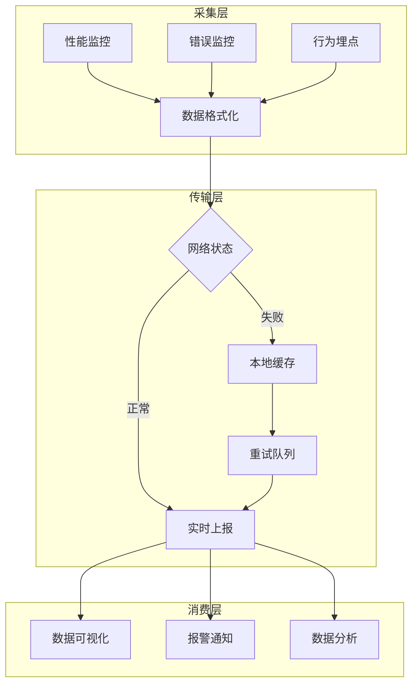

## 概念：前端监控

> 前端监控是采集性能、错误、行为数据以优化用户体验的技术体系

**解决的核心痛点**：线上问题难以复现、用户体验黑盒、迭代优化缺乏数据支撑

**实践目标**：及时发现问题、快速定位问题、减少用户影响、持续优化

---

### 核心命题

> 核心命题引用 atomic 笔记（陈述句观点），每个命题是一句话洞见

- [[埋点是最小粒度的用户行为数据]]
	- **原理**：用户每次点击、曝光、页面访问都是独立的埋点事件，汇总后形成用户行为画像
- [[核心Web指标是用户可感知的性能标准]]
	- **原理**：LCP/FID/CLS 直接对应用户对页面加载、交互性、稳定性的主观感受
- [[错误监控的核心是捕获未处理异常]]
	- **原理**：被 try-catch 吞掉的错误或 Promise reject 如果没有统一处理会逃逸

---

### 运行机制

前端监控体系由三大模块组成，通过数据上报服务统一输出到可视化平台。

---

### 关键区别

| 维度 | 前端监控 | 后端监控 |
|:--- |:--- |:--- |
| **核心逻辑** | 采集浏览器端数据 | 采集服务端指标 |
| **数据来源** | Client SDK | Server Agent |
| **适用场景** | 用户体验优化、前端性能 | 系统稳定性、后端性能 |

---

### 应用场景

- ✅ **适用场景**
	- **线上问题排查**：通过错误日志和用户操作轨迹定位 bug
	- **性能优化依据**：用 FP/FCP/LCP/CLS 等指标量化改版效果
	- **用户行为分析**：通过埋点数据了解用户路径和转化率
- ⛔ **误用**
	- **过度采集**：接入全部指标导致性能开销反而影响用户体验
	- **数据滥用**：将用户行为数据用于非预期的隐私用途

---

### 监控指标清单

> 按性能、错误、行为三维度细化的核心指标体系

- **性能指标**
	- 加载时间：页面加载时间、资源加载时间
	- 渲染时间：首次渲染时间、交互时间
	- 资源大小：页面大小、资源大小
	- FPS：页面帧率
- **错误指标**
	- JavaScript 错误：错误数量、错误类型、错误堆栈
	- HTTP 错误：错误数量、错误状态码、错误 URL
	- 资源加载错误：错误数量、错误 URL
- **用户行为指标**
	- PV：页面浏览量
	- UV：独立访客数
	- 用户停留时间：用户在页面上的停留时间
	- 点击率：页面元素的点击率

---

### 告警策略

- **设置合理的告警阈值**：根据应用实际情况设定，避免告警过于频繁或过于宽松
- **选择合适的告警方式**：邮件、短信、电话、IM 等，根据问题紧急程度选择
- **分级告警**：按问题严重程度分级处理，如 P0 级问题需立即处理，P1 级问题需在 24 小时内处理
- **告警抑制**：避免重复告警，如在一段时间内只告警一次

---

### 监控工具与可视化

- **Sentry**：流行的错误监控平台，提供详细的错误信息和用户上下文
- **Fundebug**：国内的错误监控平台，提供实时错误监控和用户行为分析
- **阿里云 ARMS**：阿里云提供的应用实时监控服务，涵盖性能监控、错误监控和用户行为分析
- **Google Analytics**：Google 提供的网站分析服务，提供用户行为分析和流量统计
- **Prometheus + Grafana**：开源监控系统，可自定义监控指标和告警规则
- **数据可视化**：使用 Grafana 等工具创建仪表盘展示关键指标，定期分析监控数据发现潜在问题

---

### 落地最佳实践

- **尽早开始监控**：在项目初期就引入监控系统，监控关键指标及时发现问题
- **自动化告警**：配置自动化告警规则，及时通知相关人员
- **持续优化**：根据监控数据分析持续优化应用程序的性能和稳定性
- **建立完善的监控体系**：覆盖应用程序的各个方面，包括性能、错误和用户行为
- **定期回顾和改进**：定期回顾监控体系的有效性并进行改进

---

### SOP

> 与本概念相关的标准操作流程，通过实践辅助理解

- [[前端监控指标采集]] — 标准化采集前端性能、错误、行为数据的完整流程

---

### FAQ

> 与本概念相关的开放性问题，待进一步探索

- [[如何选择前端监控方案]]
- [[Q-前端监控与埋点的关系是什么]]

---

### 知识图谱

> 知识图谱链接 term（术语定义）和相关 concept，建立概念关系网络

- **父级概念**：[[前端工程]] — 前端监控是前端工程化的重要组成部分
- **子级概念**：
	- [[埋点]] — 用户行为数据采集的基础技术
	- [[核心Web指标]] — 具体的性能度量标准（LCP、FID、CLS）
- **并列概念**：
	- [[前端性能优化]] — 关注加载速度和渲染性能
	- [[前端异常处理]] — 关注错误捕获和处理机制
- **相关概念**：
	- [[前端监控指标采集]] — 监控采集的具体 SOP
	- [[优惠券发放、领取、核销的前端实现逻辑|SOP-优惠券发放领取核销]] — 实际业务场景的监控应用

---

### 参考延伸

- MDN: [使用 Performance API](https://developer.mozilla.org/zh-CN/docs/Web/API/Performance_API)
- MDN: [ErrorEvent](https://developer.mozilla.org/zh-CN/docs/Web/API/ErrorEvent)
- Google: [Web Vitals](https://web.dev/articles/vitals)
- 业界方案：[Sentry 前端监控](https://sentry.io/features/) / [DataDog RUM](https://www.datadoghq.com/product/real-user-monitoring/)
