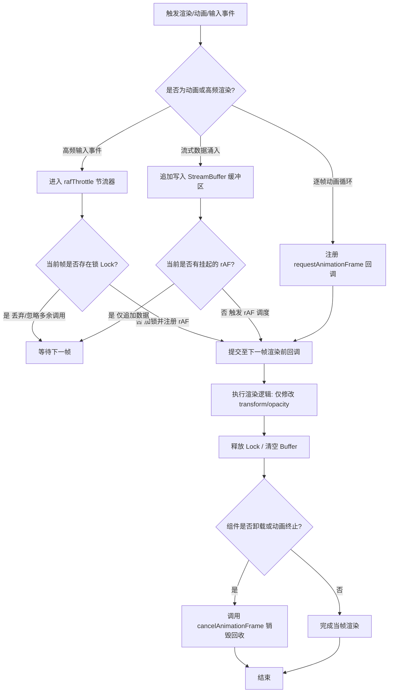

## SOP：实施前端高性能动画与渲染节流

> 规范基于 `requestAnimationFrame (rAF)` 的动画驱动、高频输入事件节流与流式数据批量渲染流程，彻底消除掉帧、卡顿与强制同步布局。

* **目标**：实现页面稳定在 60FPS / 120FPS 运行，无掉帧（Dropped Frames）、无布局抖动（Layout Thrashing），并在后台标签页自动休眠节能。
* **实现**：采用 VSync 信号对齐的 `rAF` 节流锁与批量缓冲队列，配合 Compositor 合成层属性修改与完整的生命周期回收机制。

> **问题溯源**：本 SOP 是 [[为什么用rAF做动画比setTimeout更好|Q-为什么rAF比setTimeout更好]] 的收敛成果——经过多方案对比和实践验证，固化为标准流程。

---

### 适用场景

* **场景 1（高性能 Web 动画）**：JS 驱动的平滑位移、旋转、缩放或 Canvas / WebGL 逐帧渲染循环。
* **场景 2（高频 DOM 事件节流）**：对 `scroll`、`resize`、`pointermove`、`touchmove` 等高频连续触发事件进行渲染对齐。
* **场景 3（流式高频数据批量更新）**：LLM / SSE（Server-Sent Events）或 WebSocket 大模型打字机流式输出的 DOM 批量渲染。

---

### 流程图解



---

### 核心步骤

1. **绑定硬件渲染时钟（VSync 对齐）**
* 使用 `window.requestAnimationFrame` 替代 `setTimeout` / `setInterval` 驱动渲染。
* 注意：`rAF` 回调必须接收高精度时间戳参数（`DOMHighResTimeStamp`），使用基于时间差（Delta Time）而非固定帧步长计算物理运动状态。

2. **限制渲染属性与避免强制同步布局（Layout Thrashing）**
* 动画与高频视觉变更优先使用 `transform` 与 `opacity`，促使浏览器走合成线程（Compositor）。
* 注意：绝对禁止在 `rAF` 回调中交替执行**读取 DOM 几何属性**（如 `offsetHeight`, `getBoundingClientRect`）与**写入样式**。遵循"先批量集中读，后批量集中写"原则。

3. **构建高频数据批量冲刷机制（Batch Flushing）**
* 针对 SSE/WebSocket 高频推流，不能收到一个 chunk 就修改一次 DOM；需维护一个内存级 `buffer`，由 `rAF` 在每帧渲染前统一合并冲刷（Flush）至 DOM。

4. **生命周期绑定与资源清理**
* 维护返回的 `rafId`，在组件卸载（如 Vue `onUnmounted` / React `useEffect cleanup`）或动画停止时显式执行 `cancelAnimationFrame(rafId)`。

---

### 实践/示例

#### 1. 基于 rAF 的通用事件节流器（rafThrottle）

```typescript
export function rafThrottle<T extends (…args: any[]) => void>(fn: T): (…args: Parameters<T>) => void {
  let isLocked = false;

  return function (this: any, …args: Parameters<T>) {
    if (isLocked) return;
    isLocked = true;

    window.requestAnimationFrame(() => {
      try {
        fn.apply(this, args);
      } finally {
        isLocked = false;
      }
    });
  };
}

```

#### 2. 大模型流式输出（SSE/WebSocket）批量渲染冲刷器

```typescript
export class StreamRenderBuffer {
  private buffer: string = '';
  private rafId: number | null = null;
  private renderCallback: (text: string) => void;

  constructor(renderCallback: (text: string) => void) {
    this.renderCallback = renderCallback;
  }

  public append(chunk: string): void {
    this.buffer += chunk;
    if (this.rafId === null) {
      this.rafId = window.requestAnimationFrame(() => {
        this.flush();
      });
    }
  }

  public flush(): void {
    if (this.buffer) {
      this.renderCallback(this.buffer);
      this.buffer = '';
    }
    this.rafId = null;
  }

  public destroy(): void {
    if (this.rafId !== null) {
      window.cancelAnimationFrame(this.rafId);
      this.rafId = null;
    }
    this.buffer = '';
  }
}

```

---

### 常见坑点

* ⛔ **反模式：使用 `setTimeout(fn, 16.7)` 模拟帧率**
	* 定时器属于普通宏任务，存在时间漂移（Timer Drift），且无法与硬件刷新率对齐，会导致帧丢失、高刷屏卡顿及撕裂。
* ⛔ **反模式：未注销 rAF 导致后台幽灵执行**
	* 虽然切后台时浏览器会暂停 `rAF`，但当组件已销毁而未调用 `cancelAnimationFrame` 时，切回前台可能再次触发已解绑组件的回调，引发内存泄漏与异常。
* ⛔ **反模式：在 rAF 回调内执行长任务（Long Task > 50ms）**
	* `rAF` 回调执行在重绘之前，若其内部执行重计算或大量同步循环，会直接推迟当帧渲染并导致严重掉帧（INP 指标劣化）。
* 🔧 **排查：页面出现卡顿或掉帧**
	* 打开 **Chrome DevTools -> Performance**，录制交互并检查 **Frames** 泳道：
	1. 观察是否存在红色掉帧标记（Dropped Frame）。
	2. 检查 **Main** 线程中是否有 *Forced Reflow / Layout* 警告。
	3. 查看 CPU 占用是否因高频写 DOM 导致渲染管线饱和。

---

### 知识图谱

* **相关概念**：
	* [[事件循环]]
	* [[浏览器渲染流水线与重排重绘]]
	* [[requestAnimationFrame与微任务宏任务执行时机]]
	* [[大模型流式打字机效果实现及渲染性能优化]]
* **问题来源**：
	* [[为什么用rAF做动画比setTimeout更好|Q-为什么rAF比setTimeout更好]] — 此 SOP 解决的问题来源
