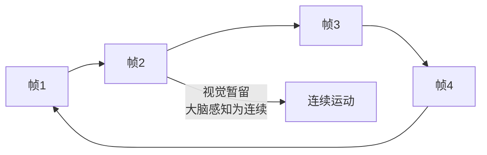

## 概念：动画原理

> 动画是通过快速连续播放静态图像，利用人眼的**视觉暂留**效应，使观看者感受到连续运动的技术。

**解决的核心痛点**：人眼无法分辨单独的静态图像，当图像以足够快的速度切换时，大脑会将它们感知为连续运动。

---

### 核心命题

- 动画的本质是「帧序列 + 时序控制」—— 静态图像按时间顺序快速切换
- 帧率决定了动画的流畅度——60fps 是人眼感知的最佳平衡点
- 动画的核心矛盾是「流畅度」与「性能」—— 高帧率需要更多计算资源

---

### 运行机制

#### 视觉暂留原理

| 概念 | 说明 |
|:---|:---|
| **帧（Frame）** | 动画中的单个静态画面 |
| **帧率（FPS）** | Frames Per Second，每秒显示的帧数 |
| **帧间隔** | 两帧之间的时间间隔 |

#### 帧率与流畅度

| 帧率 | 流畅度 | 适用场景 |
|:---|:---|:---|
| 24 fps | 电影标准 | 电影、电视 |
| 30 fps | 勉强流畅 | 早期视频、一般动画 |
| 60 fps | 流畅 | 游戏、高性能动画 |
| 120 fps | 丝滑 | 旗舰手机、高刷显示器 |

---

### 关键区别

| 维度 | 帧动画 | CSS 动画 | JS 动画 |
|:---|:---|:---|:---|
| **控制粒度** | 帧级 | 属性级 | 帧级（精确） |
| **性能** | 取决于实现 | GPU 加速 | 依赖主线程 |
| **复杂度** | 预定义帧 | 声明式 | 程序化 |
| **适用场景** | 固定序列 | 属性过渡 | 复杂交互 |

---

### 应用场景

- ✅ **适用场景**
	- **UI 过渡**：按钮点击、页面切换、表单状态
	- **数据可视化**：图表动画、数字滚动
	- **游戏**：精灵动画、角色动作
	- **终端效果**：ASCII 动画、加载指示器
- ⛔ **误用**
	- **过度动画**：无意义的动画分散用户注意力
	- **性能不顾**：在低端设备上运行复杂动画

---

### 知识图谱

- **父级概念**：前端交互 — 动画是前端交互的重要组成部分
- **子级概念**：
	- 帧率控制 — 动画节奏的管理
	- 缓动函数 — 动画加速度曲线
- **并列概念**：
	- [[CSS Animation]] — CSS 实现的动画
	- [[GSAP]] — JavaScript 动画库
- **相关概念**：
	- [[ASCII动画]] — 字符动画的特定实现
	- 视觉暂留 — 动画的生理学原理

---

### FAQ

- [[Q-为什么 60fps 是动画的理想帧率]]
- [[Q-JS 动画和 CSS 动画应该如何选择]]

---

### 参考延伸

- [MDN - CSS Animation](https://developer.mozilla.org/en-US/docs/Web/CSS/CSS_animations)
- [Google Web Fundamentals - Animations](https://web.dev/articles/animations-overview)
