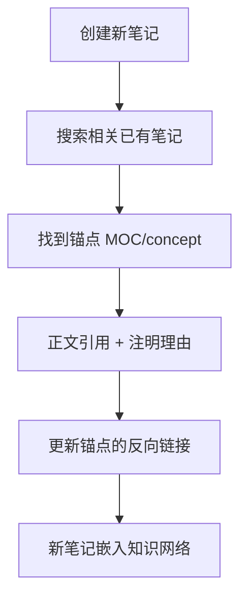

## SOP：卡片盒笔记链接法

> 每次创建新笔记时，通过系统化的链接操作，将新笔记嵌入已有知识网络，使链接从"引用"变成"思维脚手架"。

目标：新笔记创建时至少建立 2 条有意义的入链/出链
实现：反向检索 → 锚点定位 → 理由化链接 → 类型标注

---

### 适用场景

- 场景 1：创建 atomic — 写完新洞见后，寻找与之相关的已有笔记
- 场景 2：创建 concept/SOP — 新概念需要关联到已有的知识体系中
- 场景 3：定期审计 — 检查已有笔记的链接是否足够支撑知识网络

---

### 核心步骤

1. **反向检索**：在创建新笔记前，先搜索知识库中与当前主题相关的已有笔记
2. **锚点定位**：确定新笔记属于哪个 MOC 或 concept 的范畴（决定 up 字段）
3. **理由化链接**：在正文中引用已有笔记时，写明为什么——`[[xxx]]，因为……`
4. **更新入链**：在锚点笔记（MOC/concept）中添加指向新笔记的条目
5. **类型意识**：判断链接关系是"支持"还是"细化"还是"前提"

---

### 常见坑点

- ⛔ **为链而链**：强行建立不相关的链接，反而增加检索噪声
- 🔧 **排查**：如果找不到"为什么"要链接，就不链——孤立的笔记好过错误的链接
- ⛔ **只重出链不重入链**：新笔记引用了旧笔记（出链），但忘记在旧笔记中加反向引用（入链）
- 🔧 **排查**：创建后检查该笔记的"反向链接"面板，确认锚点笔记已指回来

---

### 知识图谱

- **相关概念**：
	- [[双向链接如何从引用变成思维脚手架]] — 链接法的理论探索
	- [[知识内化]] — 链接法所属的 MOC
	- [[卡片盒笔记法]] — 链接法的理论基础
- **相关 SOP**：
	- [[原子笔记拆分标准]] — 创建新笔记时的拆分判断
- **母领域**：[[A-知识管理]]
