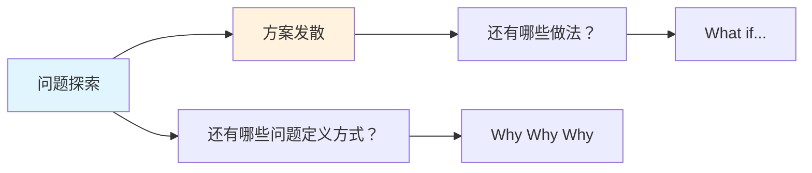

## 概念：发散思维

> 发散思维是一种探索性认知过程，旨在通过**打破思维定势**，在短时间内从单一出发点生成尽可能多样的、非线性的潜在解决方案。

**解决的核心痛点**：打破功能固着和思维惯性，解决没有 " 标准答案 " 的开放性难题。

---

### 核心命题

- 数量优先于质量是发散阶段的第一原则
	- **原理**：只有把显而易见的想法都倒空了，潜意识里的创新点子才会浮现
- 延迟判断是保护创意的关键
	- **原理**：发散时不能同时进行评价，批判性思维会扼杀萌芽中的脆弱想法
- 侧向思维通过逻辑跳跃产生顿悟
	- **原理**：不是在一个坑里挖得更深，而是去别处挖个新坑

---

### 运行机制

#### 双钻模型的上半场

#### 核心流程

| 阶段 | 动作 | 心态 |
|:---|:---|:---|
| **问题发散** | 追问 " 还有吗？" | 开放好奇 |
| **方案发散** | 追问 "What if…" | 荒谬也无妨 |

---

### 关键区别

| 维度 | [[发散思维]] | [[收敛思维]] |
|:---|:---|:---|
| **方向** | 由一到多 | 由多到一 |
| **心态** | 开放、好奇、甚至荒谬 | 严谨、批判、逻辑 |
| **口头禅** | "Yes, and…" | "Yes, but…" |
| **目标** | 创造选择 | 做出决定 |

---

### 应用场景

- ✅ **适用场景**
	- **UI/UX 设计**：使用 Crazy 8s 方法，在 8 分钟内画出 8 种不同的界面布局
	- **技术选型**：先列出所有可能的框架，分析可能性的边界
	- **写作/笔记**：自由书写，不纠结语法和错别字，只管输出
- ⛔ **误用**
	- **过早优化**：头脑风暴刚开始就说 " 技术上实现不了 "，扼杀创意
	- **无休止发散**：只有发散没有收敛，导致分析瘫痪，项目无法落地

---

### 知识图谱

- **父级概念**：[[批判性思维]] — 发散思维为批判性思维提供原材料
- **子级概念**：
	- 头脑风暴 — 发散思维的核心技法
	- SCAMPER — 发散思维的改进工具
- **并列概念**：
	- [[收敛思维]] — 必须成对出现，收敛是发散的下一阶段
- **相关概念**：
	- [[线性思维]] — 发散思维突破线性因果的限制
	- 侧向思维 — 通过逻辑跳跃产生顿悟的思维方式

---

### FAQ

- [[Q-如何判断发散阶段已经充分，可以开始收敛]]
- [[Q-发散思维和创造力是一回事吗]]

---

### 参考延伸

- 《水平思考法》— Edward de Bono，发散思维的经典之作
- 《设计思维》— IDEO，发散 - 收敛模型的推广者
