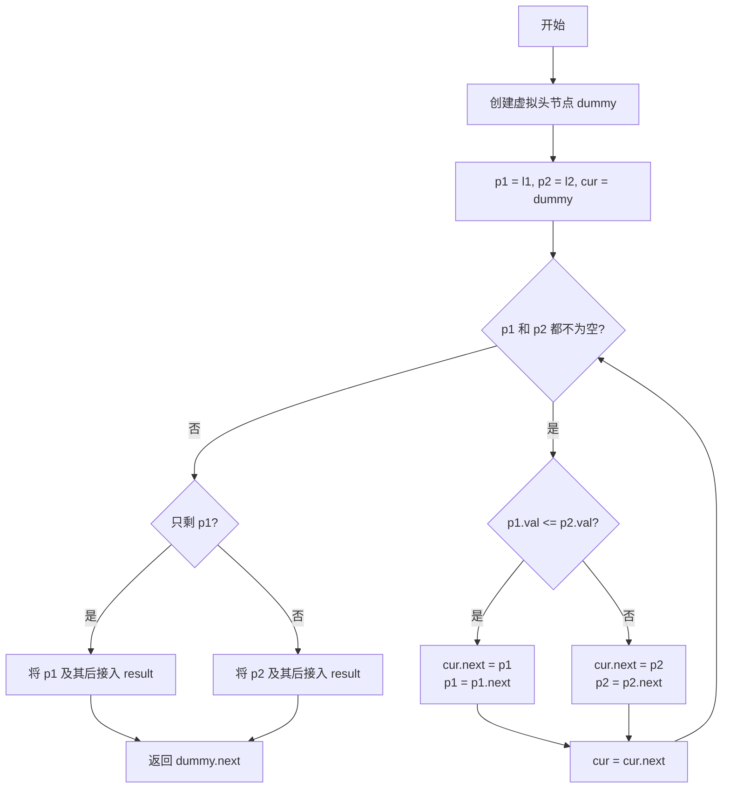

## SOP：合并两个有序链表

> 将两个已排序的链表合并为一个有序链表，返回合并后的新链表头节点

目标：将两个升序链表 `l1` 和 `l2` 合并为一个升序链表
实现：使用双指针遍历 + 虚拟头节点

---

### 适用场景

- 场景 1：合并两个已排序的数组（如 LeetCode 21）
- 场景 2：合并多个升序序列（如 K 路归并）
- 场景 3：外部排序中的有序段合并

---

### 流程图解



---

### 核心步骤

1. **创建虚拟头节点**
	 - 注意：统一操作，避免单独处理头节点
2. **初始化双指针**
	 - p1 指向 l1 头，p2 指向 l2 头，cur 指向 dummy
3. **循环比较并拼接**
	 - 当 p1 和 p2 都存在时，比较 val
	 - 较小者接入 result，指针后移
4. **处理剩余节点**
	 - 哪个链表有剩余，直接接入（已有顺序）
5. **返回结果**
	 - dummy.next 即合并后的新链表头

---

### 代码实现

**迭代版本**：

```javascript
function mergeTwoLists(l1, l2) {
  const dummy = new ListNode(0)
  let cur = dummy

  while (l1 && l2) {
    if (l1.val <= l2.val) {
      cur.next = l1
      l1 = l1.next
    } else {
      cur.next = l2
      l2 = l2.next
    }
    cur = cur.next
  }

  // 处理剩余节点
  cur.next = l1 || l2

  return dummy.next
}
```

**递归版本**：

```javascript
function mergeTwoLists(l1, l2) {
  // 递归终止条件
  if (!l1) return l2
  if (!l2) return l1

  // 选择较小者作为头，递归合并剩余部分
  if (l1.val <= l2.val) {
    l1.next = mergeTwoLists(l1.next, l2)
    return l1
  } else {
    l2.next = mergeTwoLists(l1, l2.next)
    return l2
  }
}
```

---

### 常见坑点

- ⛔ **反模式**：比较时用 `p1.val < p2.val`（边界 - 相等时未处理）
	- 正确：`<=` 保证稳定性，相等时取 l1
- ⛔ **反模式**：忘记处理剩余节点（l1 或 l2 有剩余时未接入）
- 🔧 **排查**：如果结果为空，检查初始化是否正确（dummy.next 是否正确赋值）

---

### 知识图谱

- **相关概念**：
	- [[链表]] — 基础数据结构
	- [[递归树]] — 递归版本的实现原理
	- [[虚拟头节点]] — 简化链表操作的哨兵节点
