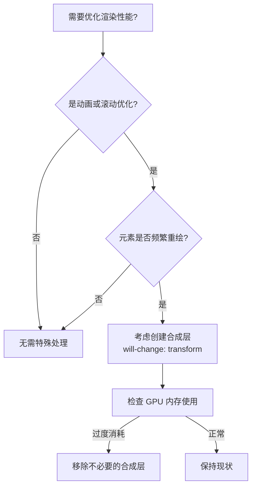
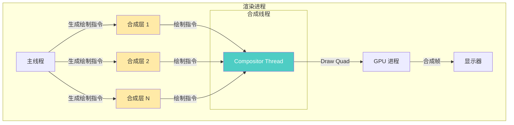

## 合成层 vs 合成线程

### 一句话对比

**合成层**是浏览器为实现 GPU 加速而创建的数据结构（图层），**合成线程**是渲染进程中负责将合成层合成为一帧并提交给 GPU 的常驻线程。

---

### 核心对比

| 维度                | **[[合成层]]**                        | **[[合成线程]]**       |
|:---------------- |:--------------------------------- |:----------------- |
| **定义**            | 拥有独立纹理、可被 GPU 单独光栅化的图层             | 渲染进程中负责图层合成、帧提交的线程 |
| **核心本质**          | 数据结构（资源）                           | 执行单元（操作者）          |
| **生命周期**          | 按需创建/销毁                            | 常驻运行               |
| **能否被 " 开启/关闭 "** | 可通过 `will-change`，`transform` 提示创建 | 无法关闭，始终运行          |

---

### 差异点

- **层级**：
	- 合成层：资源层，存在于内存中
	- 合成线程：执行层，负责操作这些资源
- **创建方式**：
	- 合成层：`will-change: transform`、`translateZ(0)`、视频/Canvas 元素等
	- 合成线程：无法手动创建，是渲染进程的常驻组件
- **与主线程关系**：
	- 合成层：主线程决定哪些元素需要创建合成层
	- 合成线程：独立于主线程运行，不阻塞 JS 执行
- **性能影响**：
	- 合成层：过多会消耗大量 GPU 内存
	- 合成线程：本身不产生性能问题，阻塞时只会导致跳帧

---

### 场景选择

- **需要创建合成层当**：
	- 动画/过渡需要 60fps 流畅度（`transform`、`opacity` 动画）
	- 页面滚动性能差，需要对滚动内容建立独立层
	- 特定元素需要隔离渲染（避免被其他内容影响）
- **不需要刻意创建合成层当**：
	- 动画本身就很短（< 100ms）
	- 元素很小或变化不频繁
	- 内存受限的设备（移动端低内存模式）

---

### 决策树

---

### 关系图

---

### 知识图谱

> 知识图谱链接相关概念，建立对比关系网络

- **父级概念**：[[渲染进程]] — 两者都是渲染进程的内部组件
- **相关概念**：
	- [[回流和重绘]] — 与合成层创建密切相关
	- [[INP]] — 主线程阻塞会影响合成线程的帧提交
	- [[长任务]] — 主线程长任务会延迟合成层的创建指令

---

### 参考延伸

- [[深入了解现代网络浏览器(3) 渲染进程]] — Chrome 官方关于硬件加速合成的解释
- [will-change 使用指南](https://developer.mozilla.org/zh-CN/docs/Web/CSS/will-change) — MDN 关于合成层的 CSS 提示
