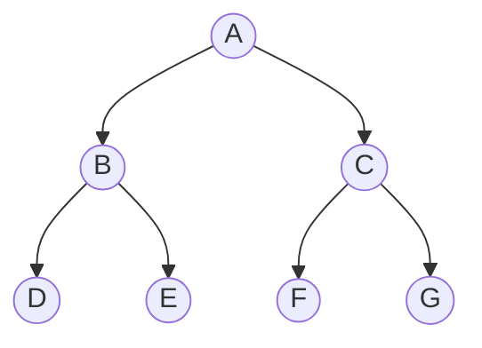

## 概念：后序遍历

后序遍历（Post-order Traversal）是二叉树深度优先遍历（DFS）的三种经典遍历顺序之一。在后序遍历中，对于任意子树，算法都会先完整地遍历其左子树，再完整地遍历其右子树，最后才访问其根节点。这一特性可以用递归式简单表示为：

$$PostOrder(node) = PostOrder(node.left) + PostOrder(node.right) + Visit(node)$$

**解决的核心痛点**：解决了二叉树自顶向下求解时，根节点无法预先获取子树完整统计信息的问题。在需要**自底向上（Bottom-up）** 合并、传递、归纳子树数据（如计算树的高度、求子树节点总数、验证平衡二叉树、判断二叉搜索树合法性、销毁二叉树等）的场景下，后序遍历保证了当访问根节点时，其左右子树的所有状态都已被完美计算完毕。

---

### 核心命题

* [[后序遍历的自底向上特性是二叉树分治与动态规划的天然载体]]
		* **原理**：后序遍历自下而上地处理子树。这意味着当前节点的决策天然可以依赖于左右子树的返回值，从而将整棵树的问题完美划分为正交的左右子问题（分治法的基础）。
* [[后序遍历迭代实现中的双栈法或单栈逆序本质上是前序遍历的镜像逆操作]]
		* **原理**：迭代后序遍历相对前序和中序较为复杂。但通过对前序遍历的"根-左-右"顺序稍微调整为"根-右-左"，再将结果整体反转（逆序），便能直接得到"左-右-根"的后序遍历序列。其在逻辑上等价于利用双栈实现的反向拓扑排序。

---

### 运行机制

以经典的完全二叉树遍历为例，后序遍历的访问顺序如下：

> D->E->B->F->G->C->A

#### 核心要素与运作特征

1. **执行边界控制**：递归程序或迭代栈通过对空节点 `null` 进行拦截，作为递归基（Base Case）层层返回。
2. **栈帧生命周期**：在后序遍历中，根节点的栈帧在整个遍历过程中停留时间最长。它必须等待左子树函数调用栈彻底清空、右子树调用栈彻底清空，并拿到两侧返回值后，才会执行 `Visit(node)` 并最终退栈。
3. **回溯判定（迭代法）**：在单栈迭代实现中，当从右子树返回根节点时，需要利用辅助指针 `lastVisited` 来记录上一次被访问和打印的节点，避免由于根节点未出栈而导致重新进入右子树，发生无限循环。

---

### 关键区别

| 维度 | **后序遍历 (Post-order)** | **[[前序遍历]] (Pre-order)** | **[[中序遍历]] (In-order)** |
| :--- | :--- | :--- | :--- |
| **核心逻辑** | 左子树 ➔ 右子树 ➔ 根节点 | 根节点 ➔ 左子树 ➔ 右子树 | 左子树 ➔ 根节点 ➔ 右子树 |
| **信息流向** | 自底向上（先拿子树结果，再解当前问题） | 自顶向下（先处理根节点，再往子树传递） | 从左到右（在二叉搜索树中呈升序排列） |
| **典型用途** | 销毁树、求高度/深度、子树合并、后序表达式 | 复制树、序列化、前排拓扑、前缀表达式 | 二叉搜索树有序输出、中缀表达式、BST节点查找 |
| **迭代实现难度** | 极高（需双栈或追踪上次访问节点） | 较低（简单单栈入右左） | 中等（单栈向左探底再回溯） |

---

### 适用范围

* ✅ **适用场景**
	* **树的销毁与内存释放**：在诸如 C++ 的手动内存管理语言中，销毁一棵二叉树必须采用后序遍历。必须先销毁左子树和右子树，最后才能安全地释放当前节点。如果先释放当前节点，其子节点指针就会变为悬空指针，导致内存泄漏。
	* **自底向上的树属性计算**：如求解二叉树的最大深度、平衡二叉树校验（自下而上返回高度，若不平衡直接截断）、求二叉树中的最大路径和（LeetCode 124）等。
	* **后缀表达式（逆波兰表达式）求值**：编译器在处理抽象语法树（AST）求值时，后序遍历结果可以直接输入一个计算栈，从而实现无需括号的天然优先级计算。
* ⛔ **误用**
	* **在二叉搜索树（BST）中尝试获取有序序列**：BST 的有序输出必须且仅能依靠中序遍历。后序遍历无法得到任何单调性结果。
	* **快速查找父节点到子节点的路径**：前序遍历由于"先根后子"的特性，能够更直观、更快速地在下降时记录路径。而后序遍历在未完成回溯前无法即时输出完整链路。
* **失效边界**
	* **尾递归优化失效**：由于递归实现的后序遍历中，根节点的操作（`Visit`）必然是最后一步，必须等待左右子树的栈帧全部退栈。这意味着它在大深度的非平衡树（如退化为链表的树）中，容易引发调用栈溢出（Stack Overflow），且无法直接进行尾递归优化。

---

### 批判

* **外部批判**
	* *算法工程界*：非递归（迭代版）后序遍历在所有树遍历中是工程复杂度最高的一种。单栈实现需要处理繁琐的 `lastVisited` 逻辑，极易产生指针死循环或逻辑漏洞。在追求开发效率与代码可读性的生产环境下，非必要时工程师往往会竭力避免手写手动的迭代后序遍历。
* **内在张力**
	* *内存开销与自底向上的博弈*：后序遍历自底向上的过程意味着在处理到最高层根节点之前，整条深度的调用栈都必须完整驻留在内存中。如果面对上千万节点的退化长链树，其内存栈空间消耗将极其庞大，这与其完美的子问题合并美学形成了工程上的张力。

---

### FAQ

* [[Q-后序遍历迭代实现为什么必须引入lastVisited指针]] — 深入剖析单栈法中的回溯判定与重复入栈问题
* [[Q-如何利用后序遍历思想在一次遍历中求解二叉树最大路径和]] — 状态自底向上合并的分治算法精髓

---

### SOP

* [[SOP-实现二叉树后序遍历的递归与三种迭代算法]] — 经典递归、双栈逆序法及单栈+lastVisited法的标准模板代码与测试
* [[SOP-使用后序遍历自底向上重构树结构]] — 平衡二叉树校验或子树裁剪的标准化实现步骤

---

### 知识图谱

* **父级概念** ：[[二叉树]] — 对二叉树中所有节点进行系统化访问的方法
* **子级概念** ：
	* [[T-后序表达式]] — 又称逆波兰表达式，后序遍历 AST 的直接产物
	* [[T-自底向上分治]] — 依靠子树返回值构建全局解的算法思想
* **并列概念** ：
	* [[前序遍历]] — 先根后子的 DFS 遍历
	* [[中序遍历]] — 左根右的 DFS 遍历
	* [[层序遍历]] — 基于队列的 BFS 广度优先遍历
* **相关概念** ：
	* [[二叉搜索树]] — 节点值具备大小关系的特殊二叉树
	* [[深度优先搜索]] — DFS 通用图/树遍历机制
* **参考文章**
	* Introduction to Algorithms (CLRS) - Binary Tree Traversals
	* '202609071053'
