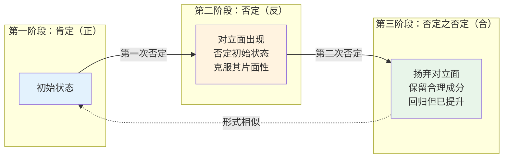
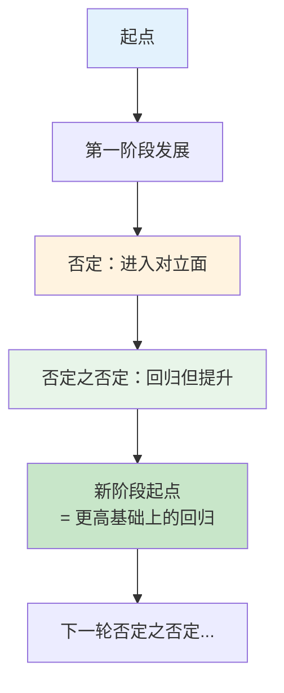

## 概念：否定之否定

> 事物的发展通过"肯定→否定→否定之否定"三个阶段，完成一个螺旋式上升周期，每次否定是"扬弃"（既克服又保留），最终在更高阶段实现对原有规定的回归。

**解决的核心痛点**：线性进步观或循环史观都无法解释为何发展既有前进又有曲折——否定之否定提供了螺旋上升的辩证解释。

---

### 核心命题

- **发展是否定之否定的螺旋上升过程，而非直线前进或简单循环**
  - **原理**：直线前进忽略曲折与反复，简单循环否认质的飞跃。否定之否定同时解释了"回归"（形式上的重复）和"前进"（内容上的提升）。
- [[否定是扬弃，既克服又保留]]
  - **原理**：否定不是全盘抛弃，而是批判地继承。旧阶段中的合理成分被保留到新阶段，但经过改造后以新的形式存在。
- **否定之否定不是回到原点，而是在更高阶段上的回归**
  - **原理**：第二次否定看似回到起点，但起点已被第一次否定改造过，因此是在更高基础上重复某些特征（如社会发展中的"螺旋式"）。

---

### 运行机制

**螺旋上升示意图**：

**经典三阶段模型**：

| 阶段 | 逻辑地位 | 特征 | 示例：种子 → 植物 → 果实 |
|:---:|:---|:---|:---|
| **肯定** | 正 | 初始规定，自身同一 | 种子（一粒种子就是它自己） |
| **否定** | 反 | 对立面，否定初始规定 | 植物（种子被否定，长出植株） |
| **否定之否定** | 合 | 扬弃对立，回归但提升 | 果实（植物被否定，但产出多粒新种子） |

---

### 关键区别

| 维度 | 否定之否定（辩证法） | 形而上学发展观 |
|:--- |:--- |:--- |
| **发展形式** | 螺旋式上升，前进性与曲折性统一 | 要么直线前进，要么简单循环 |
| **否定的性质** | 扬弃（克服+保留） | 全盘否定或彻底抛弃 |
| **对待矛盾** | 矛盾是发展的内在动力 | 矛盾是异常，应消除 |
| **对"回归"的理解** | 更高阶段的回归，形式相似、内容提升 | 要么回到原点，要么永久断裂 |

---

### 适用范围

- ✅ **适用场景**
  - **历史分析**：理解社会形态的更替（原始社会→奴隶社会→封建社会→资本主义→社会主义，不是线性演进，而是辩证发展）
  - **理论发展**：理解思想史上的"正反合"运动（如经验论→唯理论→康德综合）
  - **个人成长**：理解学习中的"否定旧认知→建立新认知→更高水平的融会贯通"
  - **技术演进**：理解"旧技术被替代→新技术暴露缺陷→回归旧技术原则但以新形式实现"（如集中式计算→分布式计算→云计算的辩证关系）
- ⛔ **误用**
  - **庸俗套用**：任何变化都强套"否定之否定"三段式，变成空洞标签
  - **目的论绑架**：把否定之否定理解为"必然走向某个预定终点"，忽略历史开放性
  - **忽视条件**：忽略具体条件谈否定之否定，把辩证法变成公式
- **失效边界**
  - **微观个体决策**：个人选择、随机事件等微观领域的变化往往受多因素驱动，强套三段式是过度延伸
  - **非线性复杂系统**：天气、生态系统等复杂适应系统呈现涌现行为，否定之否定的线性递进框架无法描述
  - **共时性结构**：语言结构、社会关系网络等共时性系统，不适用于描述历时性发展的三段式

---

### 批判

- **外部批判**
  - **波普尔**：辩证法无法被证伪，任何发展都能事后解释为否定之否定，因此失去了理论的预测力，属于封闭理论体系
  - **后现代主义**：否定之否定预设"合"作为终点，本质是**目的论**的变体，忽略了历史的开放性和偶然性
- **内在张力**
  - **事后追溯问题**：三段式划分往往出自事后追溯而非事前预测，容易沦为马后炮标签
  - **扬弃标准模糊**：如何区分"真正的扬弃"和"简单的连续"？缺乏客观判定标准，容易被解释者主观操控

---

### 知识图谱

- **父级概念**：[[政治经济|A-政治经济]] — 辩证唯物主义是马克思主义政治经济学的哲学基础
- **并列概念**：
  - [[形而上学]] — 与辩证法对立的发展观
  - [[逻辑学]] — 辩证法与形式逻辑同属方法论体系
- **相关概念**：
  - [[存在]] — 否定之否定的起点"肯定"阶段涉及存在的直接规定
  - [[虚无主义]] — 否定之否定的第一次"否定"若止步不前，会导向虚无主义
- **相关文章**：
  - [[反者道之动]] — 从老子"反者道之动"角度探讨历史螺旋上升，与否定之否定形成中西对读

### 参考延伸

- Hegel — 《精神现象学》（辩证法的系统奠基）
- Marx — 《资本论》第一卷（辩证方法在政治经济学中的典范应用）
- Engels — 《自然辩证法》（辩证法在自然科学中的展开）
- 列宁 — 《哲学笔记》（对黑格尔辩证法的唯物主义改造）
