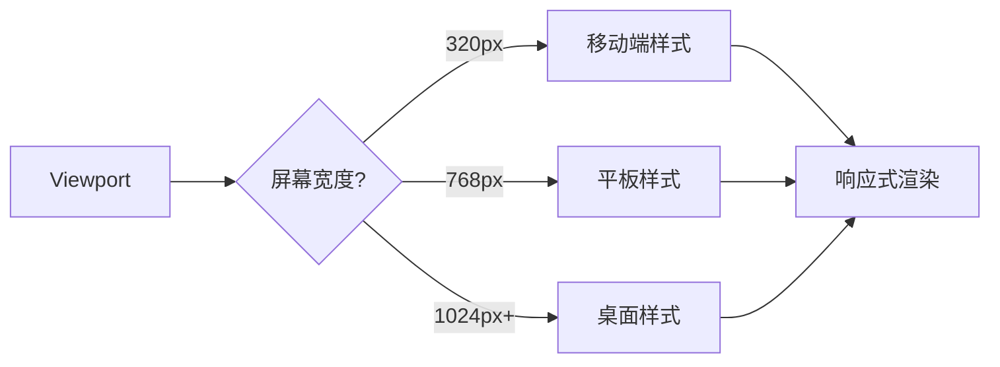

## 概念：响应式布局

> 响应式布局是一种使网页在不同设备和屏幕尺寸下都能良好展示的技术，通过一套代码适配多种屏幕。

**解决的问题**：移动端、平板、桌面等多种设备的不同屏幕尺寸适配

---

### 核心命题

- **响应式三要素**
	- 弹性图片：图片随容器缩放
	- 媒体查询：针对不同断点设置样式
	- 弹性布局：Flexbox/Grid 自适应
- **移动优先 vs 桌面优先**
	- 移动优先：min-width 小到大
	- 桌面优先：max-width 大到小

---

### 运行机制



---

### 核心实现方式

#### 1. 视口 meta 标签

```html
<meta name="viewport" content="width=device-width, initial-scale=1.0">
```

#### 2. 媒体查询

```css
/* 移动优先 */
body {
  font-size: 16px;
}

@media (min-width: 768px) {
  body { font-size: 18px; }
}

@media (min-width: 1024px) {
  body { font-size: 20px; }
}
```

#### 3. 弹性单位

```css
/* rem 相对于根元素 */
.container { width: 100%; }
/* vw/vh 相对于视口 */
.full-screen { height: 100vh; }
```

#### 4. Flexbox 布局

```css
.container {
  display: flex;
  flex-wrap: wrap;
}
.item {
  flex: 1 1 300px; /* 自适应 */
}
```

#### 5. Grid 布局

```css
.container {
  display: grid;
  grid-template-columns: repeat(auto-fit, minmax(300px, 1fr));
}
```

---

### 常见断点

| 设备 | 断点 | 描述 |
|:---|:---:|:---|
| 手机 | < 576px | 小屏设备 |
| 平板 | 576px - 992px | 中等屏幕 |
| 笔记本 | 992px - 1200px | 大屏幕 |
| 桌面 | > 1200px | 超大屏幕 |

---

### 与自适应的区别

| 维度 | 响应式布局 | 自适应布局 |
|:---|:---|:---|
| 原理 | 一套代码，多尺寸适配 | 多套代码，按设备切换 |
| 设计 | 移动优先 | 渐进增强/优雅降级 |
| 维护 | 统一维护 | 多套维护 |

---

### 知识图谱

- **父级概念**：[[CSS]]
- **关联概念**：
	- [[媒体查询]] — 断点设置
	- [[移动端 1px 问题如何解决？]] — 移动端适配
	- [[Flexbox]] — 弹性布局
	- [[CSS Grid]] — 网格布局

---

### 参考延伸

- MDN: Responsive design
- CSS Tricks: Responsive Web Design
