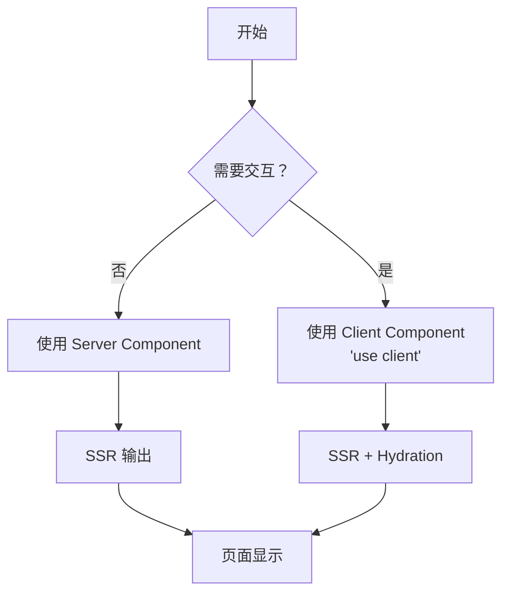

## SOP：在 Next.js 中使用 Hydration

> 本 SOP 定义 Next.js 中 Hydration 的标准流程，涵盖 Server Component、Client Component 的划分原则和常见问题处理。

---

### 适用场景

- ✅ **场景 1**：首屏需要 SEO 且后续有交互的页面（如博客、产品页）
- ✅ **场景 2**：需要保持 SSR 和 CSR 输出一致的组件开发
- ✅ **场景 3**：从 CSR 迁移到 SSR 的页面改造

---

### 流程图解



---

### 核心步骤

#### 1. 判断组件类型

| 组件类型 | 使用场景 | 渲染方式 |
|:---|:---|:---|
| **Server Component** | 不需要交互，只需要数据展示 | SSR，直接输出 HTML |
| **Client Component** | 需要 `useState`、`useEffect`、事件监听等 | SSR + Hydration |

```tsx
// Server Component（默认）
async function BlogList() {
  const posts = await db.posts.findMany() // 直接访问数据库
  return <ul>{posts.map(p => <li key={p.id}>{p.title}</li>)}</ul>
}

// Client Component（需要交互）
'use client'
import { useState } from 'react'
function LikeButton({ initialLikes }: { initialLikes: number }) {
  const [likes, setLikes] = useState(initialLikes)
  return <button onClick={() => setLikes(likes + 1)}>{likes} 👍</button>
}
```

#### 2. 避免 Hydration Mismatch

**规则**：Server Component 和 Client Component 的输出必须一致

```tsx
// ❌ 错误：服务端和客户端渲染结果不同
'use client'
function TimeDisplay() {
  const [time, setTime] = useState('')
  useEffect(() => setTime(new Date().toLocaleTimeString()), [])
  return <span>{time || '加载中...'}</span>
}

// ✅ 正确：使用 suppressHydrationWarning 或延迟渲染
'use client'
function TimeDisplay() {
  const [time, setTime] = useState<string | null>(null)
  useEffect(() => setTime(new Date().toLocaleTimeString()), [])
  if (!time) return <span suppressHydrationWarning>加载中...</span>
  return <span>{time}</span>
}
```

#### 3. 处理第三方库

第三方库可能使用浏览器 API，需要包装为 Client Component：

```tsx
// 创建一个包装组件
'use client'
import { useState } from 'react'
import dynamic from 'next/dynamic'

// 动态导入第三方库
const DatePicker = dynamic(() => import('react-datepicker'), { ssr: false })

function DatePickerWrapper() {
  const [date, setDate] = useState<Date | null>(new Date())
  return <DatePicker selected={date} onChange={setDate} />
}
```

#### 4. 优化 Hydration 性能

**使用 `Suspense` 分段加载**：

```tsx
import { Suspense } from 'react'

function Page() {
  return (
    <div>
      <h1>我的博客</h1>
      <Suspense fallback={<Loading />}>
        <BlogList /> {/* Server Component */}
      </Suspense>
      <Suspense fallback={<div>评论加载中...</div>}>
        <Comments /> {/* Client Component */}
      </Suspense>
    </div>
  )
}
```

---

### 常见坑点

- ⛔ **在 Client Component 中直接使用 `new Date()`**
	- **排查**：使用 `useEffect` + `suppressHydrationWarning`，或在 Server Component 中计算
- ⛔ **在 Client Component 中使用 `window`/`document`**
	- **排查**：确保浏览器 API 访问在 `useEffect` 中进行
- ⛔ **混用 Server 和 Client 数据源**
	- **排查**：Server Component 的数据通过 props 传递给 Client Component
- 🔧 **Hydration 不匹配警告**
	- **排查**：检查组件中是否有随机值、浏览器 API 调用或时区差异

---

### 知识图谱

- **父级概念**：[[NextJS]] — 本 SOP 是 Next.js 开发的实践指南
- **关联概念**：
	- [[Hydration]] — SOP 所涉及的核心概念
	- [[SSR]] — Hydration 的应用场景
	- [[CSR]] — 与 SSR 对比的渲染模式
