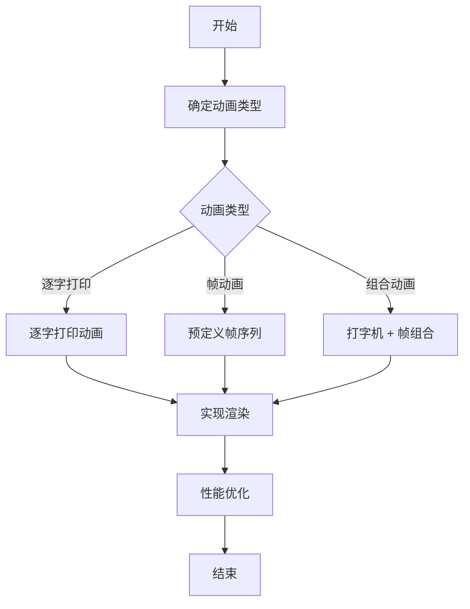

## SOP：在 React 中实现 ASCII 动画

> 本 SOP 定义在 React 中实现 ASCII 终端风格动画的标准流程，适用于 CLI 工具界面、加载动画、技术博客示例等场景。

---

### 适用场景

- ✅ **场景 1**：CLI 工具的 Web 界面，需要终端风格的加载动画
- ✅ **场景 2**：技术博客/文档中的算法可视化演示
- ✅ **场景 3**：复古风格网页的装饰性动画
- ✅ **场景 4**：终端模拟器组件

---

### 流程图解



---

### 核心步骤

#### 1. 确定动画类型

| 类型 | 特点 | 适用场景 |
|:---|:---|:---|
| **逐字打印** | 字符依次出现，模拟打字效果 | CLI 输出、教程演示 |
| **帧动画** | 预定义多帧，定时切换 | 复杂动画效果 |
| **组合动画** | 打字 + 帧混合 | 富文本终端 |

#### 2. 逐字打印动画实现

```tsx
import { useState, useEffect } from 'react'

function Typewriter({ text, speed = 50 }: { text: string; speed?: number }) {
  const [displayText, setDisplayText] = useState('')

  useEffect(() => {
    let index = 0
    const timer = setInterval(() => {
      if (index < text.length) {
        setDisplayText(text.slice(0, index + 1))
        index++
      } else {
        clearInterval(timer)
      }
    }, speed)

    return () => clearInterval(timer)
  }, [text, speed])

  return <pre style={{ fontFamily: 'monospace' }}>{displayText}_</pre>
}
```

#### 3. 帧动画实现

```tsx
import { useState, useEffect } from 'react'

const frames = ['|', '/', '-', '\\']

function Spinner({ interval = 100 }: { interval?: number }) {
  const [frameIndex, setFrameIndex] = useState(0)

  useEffect(() => {
    const timer = setInterval(() => {
      setFrameIndex((prev) => (prev + 1) % frames.length)
    }, interval)

    return () => clearInterval(timer)
  }, [interval])

  return <span style={{ fontFamily: 'monospace' }}>{frames[frameIndex]}</span>
}
```

#### 4. 使用 `<pre>` + 终端样式

```tsx
function TerminalOutput({ children }: { children: string }) {
  return (
    <pre
      style={{
        backgroundColor: '#1e1e1e',
        color: '#00ff00',
        padding: '16px',
        borderRadius: '8px',
        fontFamily: 'Consolas, Monaco, monospace',
        overflow: 'auto',
      }}
    >
      {children}
    </pre>
  )
}
```

#### 5. 使用 Framer Motion 优化

Framer Motion 提供了声明式的动画 API，性能更好且更容易控制：

```tsx
import { motion, useAnimation, useInView } from 'framer-motion'
import { useEffect, useRef } from 'react'

// 逐字打印动画（motion + AnimatePresence）
function MotionTypewriter({ text }: { text: string }) {
  const ref = useRef(null)
  const isInView = useInView(ref, { once: true })

  return (
    <motion.pre
      ref={ref}
      initial={{ opacity: 0 }}
      animate={isInView ? { opacity: 1 } : {}}
    >
      {text.split('').map((char, i) => (
        <motion.span
          key={i}
          initial={{ opacity: 0 }}
          animate={{ opacity: 1 }}
          transition={{ delay: i * 0.05 }}
        >
          {char}
        </motion.span>
      ))}
    </motion.pre>
  )
}

// 光标闪烁动画（纯 CSS，无需 JS）
function BlinkingCursor() {
  return (
    <motion.span
      animate={{ opacity: [1, 0] }}
      transition={{ duration: 0.8, repeat: Infinity, ease: 'steps(2)' }}
    >
      _
    </motion.span>
  )
}
```

**Framer Motion 优势**：

| 特性 | 优势 |
|:---|:---|
| **声明式** | 只需描述动画结果，框架处理帧 |
| **性能优化** | 自动在 `requestAnimationFrame` 上运行 |
| **Layout Animation** | 自动处理布局变化的动画 |
| **手势支持** | 易于添加拖拽、滑动等交互 |

**安装**：`npm install framer-motion`

#### 6. 性能优化

- **使用 `useRef` 存储定时器**：避免闭包问题
- **使用 CSS `white-space: pre`**：保留空白字符
- **考虑使用 `requestAnimationFrame`**：获得更流畅的动画
- **减少重渲染**：将动画状态隔离到独立组件

---

### 常见坑点

- ⛔ **光标闪烁不一致**
	- **排查**：使用 CSS `caret-color` 统一光标样式，确保闪烁频率一致
- ⛔ **中文/特殊字符宽度问题**
	- **排查**：使用等宽字体（Consolas、Monaco），避免半角字符导致的对齐问题
- ⛔ **动画卡顿**
	- **排查**：将 `setInterval` 改为 `requestAnimationFrame`，或使用 CSS 动画替代 JS
- 🔧 **React Strict Mode 双重执行**
	- **排查**：确保 `useEffect` cleanup 函数正确清理定时器

---

### 知识图谱

- **父级概念**：[[React]] — 本 SOP 是 React 开发的实践指南
- **关联概念**：
	- [[ASCII动画]] — SOP 所涉及的核心概念
	- [[动画原理]] — 动画的理论基础
	- [[CSS Animation]] — CSS 驱动的动画实现
	- Framer Motion — React 动画库（本 SOP 使用的优化工具）
- **参考文章**
	- [developedbyed/react-gradient-glow](https://github.com/developedbyed/react-gradient-glow)
