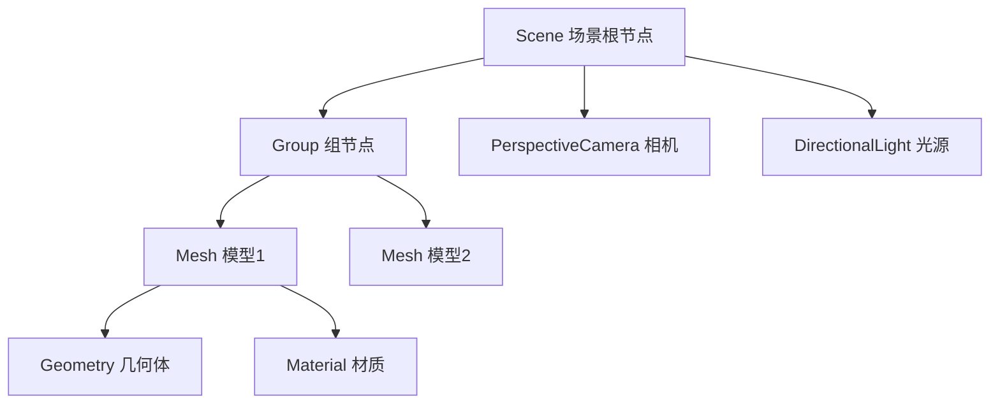

> 场景图结构（Scene Graph）是 ThreeJS 中用树形结构组织 3D 场景的对象层次体系

**解决的核心痛点**：3D 场景包含大量对象（灯光、相机、模型、材质等），需要一种结构来管理它们的层次关系和变换传播。

---

## 核心命题

> 核心命题引用 atomic 笔记（陈述句观点），每个命题是一句话洞见

- （待补充 atomic 洞见）

---

## 运行机制

**场景图结构原理**：

**核心特点**：
- **树形层次**：根节点 → 组节点 → 叶子节点（具体对象）
- **变换传播**：子节点继承父节点的变换（位置、旋转、缩放）
- **可见性继承**：父节点不可见时，子节点也不可见
- **渲染顺序**：从根节点深度优先遍历，按层次顺序渲染

---

## 关键区别

| 维度 | 场景图结构 | 普通对象数组 |
|:--- |:--- |:--- |
| **组织方式** | 树形层次结构 | 扁平数组 |
| **变换传播** | 自动继承父级变换 | 需手动计算 |
| **可见性** | 父节点控制子节点可见性 | 需单独控制每个对象 |
| **适用场景** | 复杂场景、层级关系明确 | 简单场景、无层级需求 |

---

## 应用场景

- ✅ **适用场景**
	- **3D 游戏**：角色、装备、场景对象的层级管理
	- **WebVR/AR**：多相机、多光源的复杂场景
	- **3D 可视化**：建筑模型、机械装配的层次展示
- ⛔ **误用**
	- **简单场景**：只有几个独立对象时，不需要复杂层次结构

---

## SOP

> 与本概念相关的标准操作流程

- （暂无相关 SOP，待补充）

---

## FAQ

> 与本概念相关的开放性问题

- （暂无相关 Question，待补充）

---

## 知识图谱

> 知识图谱链接 term（术语定义）和相关 concept

- **父级概念**：
	- [[ThreeJS]] — 场景图结构是其核心概念
- **子级概念**：
	- [[Group]] — ThreeJS 中的组节点，用于组织子对象
- **并列概念**：
	- [[Object3D]] — ThreeJS 中所有 3D 对象的基类
- **相关概念**：
	- [[变换矩阵]] — 场景图中变换传播的基础
	- [[渲染管线]] — 场景图遍历后的渲染流程

---

## 参考延伸

- [ThreeJS Scene Graph 文档](https://threejs.org/docs/#api/en/scenes/Scene)
- [ThreeJS Group 文档](https://threejs.org/docs/#api/en/objects/Group)
- [深入理解 ThreeJS 场景图](https://threejs.org/manual/#en/scenegraph)
