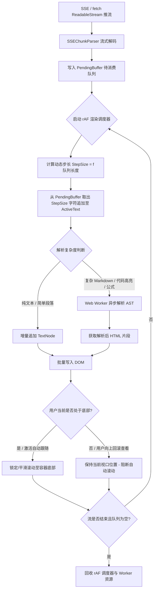

## SOP：实现大模型流式打字机效果及渲染性能优化

> 规范从后端 SSE/Fetch ReadableStream 接收流式 Token 到前端平滑打字机视觉输出与 Markdown 渲染的全链路流程，彻底解决高频更新导致的浏览器卡顿、Markdown 语法闭合破损以及滚动锚定抖动问题。

* **目标**：在 60FPS/120FPS 下平滑展示流式文本打字效果，CPU 占用率低于 15%，彻底规避长文本（>10k Token）流式输出下的主线程卡顿与打字机积压延迟。
* **实现**：采用"双缓冲队列 + rAF 动态步长消费 + Web Worker 异步 Markdown 解析 + DOM 增量更新 + 智能滚动锚定"架构。

> **问题溯源**：本 SOP 是 [[Q-大模型流式输出前端如何做到既流畅又防卡顿]] 的收敛成果——经过多方案对比和实践验证，固化为标准流程。

---

### 适用场景

* **场景 1（AI 对话流式交互）**：ChatGPT / Claude 类似的流式会话界面，伴随代码块高亮、数学公式（KaTeX/MathJax）与 Markdown 解析。
* **场景 2（长文档流式生成与打字）**：大模型生成数千至上万字的报告、代码文件，需实时预览且不卡顿。
* **场景 3（网络抖动下的平滑视觉呈现）**：网络推流突发（Burst）或分块过大时，避免文字突兀大段闪现，实现平滑匀速/自适应打字效果。

---

### 流程图解



---

### 核心步骤

1. **流式数据接收与双缓冲解耦（Decoupling Stream & Render）**
* 通过 `fetch` 的 `response.body.getReader()` 逐块读取，将网络层与渲染层彻底解耦。
* 维护 `pendingQueue`（待打字字符队列）与 `displayedText`（已渲染字符串），避免网络推送节奏直接绑定 DOM 操作。

2. **自适应动态步长打字调度器（Dynamic Step rAF Driver）**
* 在 `requestAnimationFrame` 中按帧消费 `pendingQueue`。
* **动态步长算法**：当网络拥堵突然推送大量 Token 或队列积压严重（如 `queue.length > 50`）时，自适应增大单帧消费字符数（`step = Math.max(1, Math.floor(queue.length / 8))`），避免产生"打字机严重滞后于网络流"的现象。

3. **Markdown 异步解析与防语法破损（Markdown Streaming Parsing）**
* 大模型流式输出过程中，未完成的代码块（如 `ts 没有结尾的 `）或加粗语法会导致全量重新解析时布局跳跃。
* 将复杂 Markdown/代码语法高亮交给 **Web Worker** 解析，主线程接收解析完成的 HTML 字符串进行批量替换或增量挂载。

4. **智能滚动锚定（Smart Scroll Anchoring）**
* 监听用户滚动行为：计算 `isAtBottom = scrollHeight - scrollTop - clientHeight <= 30`。
* 用户停留在底部时，随内容增长自动执行 `element.scrollTop = element.scrollHeight`；用户向上滑动查看历史内容时，自动切断滚动吸附，避免打扰阅读。

5. **生命周期回收与销毁**
* 监听组件销毁、用户点击"停止生成"或网络流中断（`AbortController`），必须立即 `cancelAnimationFrame`、`reader.cancel()` 并终止 Worker。

---

### 实践/示例

#### 完整流式打字机控制器（TypeScript 实现）

```typescript
export interface TypewriterOptions {
  onUpdate: (displayedText: string) => void;
  onComplete?: () => void;
  baseCharsPerFrame?: number;
}

export class StreamTypewriter {
  private pendingQueue: string[] = [];
  private displayedText: string = '';
  private rafId: number | null = null;
  private isStreamDone: boolean = false;
  private options: TypewriterOptions;

  constructor(options: TypewriterOptions) {
    this.options = {
      baseCharsPerFrame: 1,
      …options
    };
  }

  /** 追加网络流推过来的字符片段 */
  public push(chunk: string): void {
    if (!chunk) return;
    // 将字符串打散推入待渲染队列
    this.pendingQueue.push(…chunk.split(''));
    this.ensureTick();
  }

  /** 标记网络流已结束 */
  public finish(): void {
    this.isStreamDone = true;
    this.ensureTick();
  }

  private ensureTick(): void {
    if (this.rafId === null) {
      this.rafId = window.requestAnimationFrame(this.tick);
    }
  }

  private tick = (): void => {
    if (this.pendingQueue.length === 0) {
      this.rafId = null;
      if (this.isStreamDone) {
        this.options.onComplete?.();
      }
      return;
    }

    // 动态步长计算：根据积压深度自适应加速，防止打字动画落后网络太多
    const queueLen = this.pendingQueue.length;
    let step = this.options.baseCharsPerFrame || 1;
    if (queueLen > 100) {
      step = Math.ceil(queueLen / 6); // 极度积压，高速冲刷
    } else if (queueLen > 30) {
      step = Math.ceil(queueLen / 12);
    }

    const charsToConsume = this.pendingQueue.splice(0, step).join('');
    this.displayedText += charsToConsume;
    this.options.onUpdate(this.displayedText);

    // 继续下一帧调度
    this.rafId = window.requestAnimationFrame(this.tick);
  };

  /** 销毁与打断控制器 */
  public destroy(): void {
    if (this.rafId !== null) {
      window.cancelAnimationFrame(this.rafId);
      this.rafId = null;
    }
    this.pendingQueue = [];
    this.displayedText = '';
  }
}

```

#### 智能滚动吸附（Smart Scroll Hook 示例）

```typescript
export function useSmartScroll(containerRef: HTMLElement) {
  let isLockedToBottom = true;

  const handleScroll = () => {
    const { scrollTop, scrollHeight, clientHeight } = containerRef;
    const distanceToBottom = scrollHeight - scrollTop - clientHeight;
    // 距离底部小于 30px 视为处于底部
    isLockedToBottom = distanceToBottom <= 30;
  };

  const autoScrollToBottom = () => {
    if (isLockedToBottom) {
      containerRef.scrollTop = containerRef.scrollHeight;
    }
  };

  return { handleScroll, autoScrollToBottom };
}

```

---

### 常见坑点

* ⛔ **反模式：收到 SSE 数据直接 `innerHTML += chunk**`
	* 高频触发重排与重绘，且每次 `innerHTML` 累加都会销毁内部所有 DOM/事件监听器并全量重建，导致长文本输入时直接出现几百毫秒的主线程 Long Task 卡顿。
* ⛔ **反模式：使用 `setInterval` 逐字打字未做动态步长调节**
	* 当服务端瞬时吐出 500 字，如果固定每 20ms 打 1 个字，需要 10 秒才能打完，用户将感知到严重延迟脱节。
* ⛔ **反模式：未处理非闭合 Markdown 语法（如未闭合的 ``` 代码块）**
	* 流式更新过程中，未闭合的语法会导致解析器将后续所有内容都吞进代码块，直到最后一个 ``` 出现才突然结构复原，引起严重的页面高度塌陷与跳变。
* 🔧 **排查：打字过程中界面掉帧或卡死**
	* 打开 **Chrome DevTools -> Performance**，排查是否在主线程同步调用了耗时的 `marked.parse()` 或 `Prism.highlightAll()`。如有，应立即将解析任务迁移至 Web Worker。

---

### 知识图谱

* **相关概念**：
	* [[实施前端高性能动画与渲染节流]]
	* [[浏览器渲染流水线与重排重绘]]
	* [[Web Worker多线程并行计算]]
	* [[Server-Sent Events与流式传输]]
* **问题来源**：
	* [[Q-大模型流式输出前端如何做到既流畅又防卡顿]] — 此 SOP 解决的问题来源
