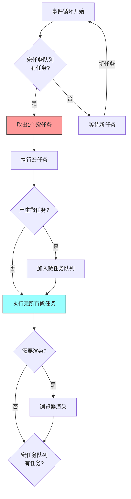
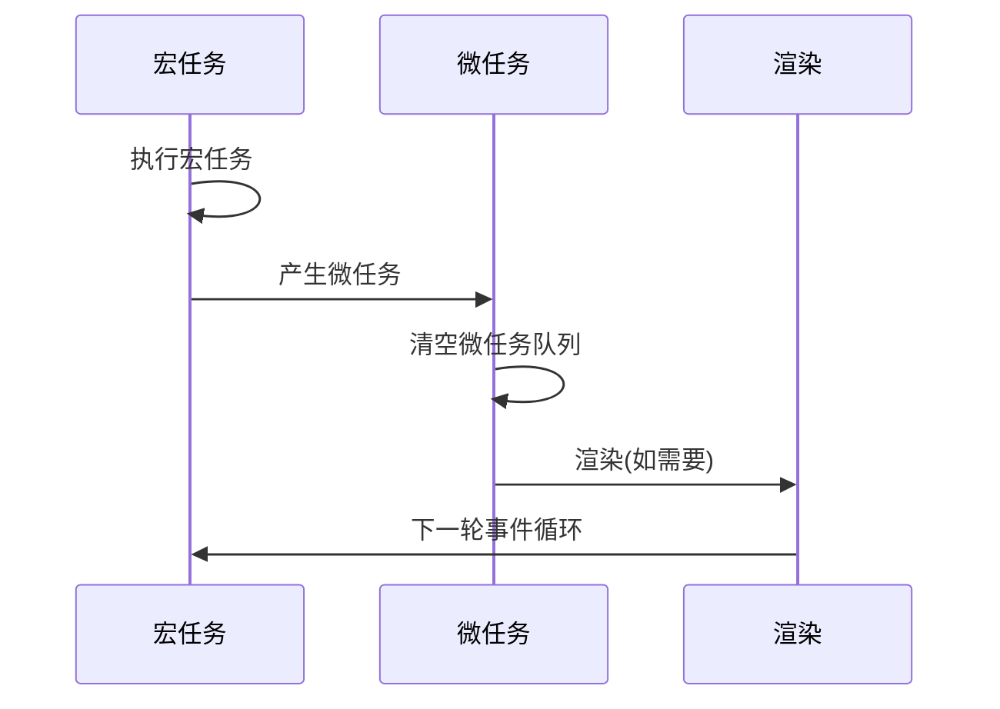
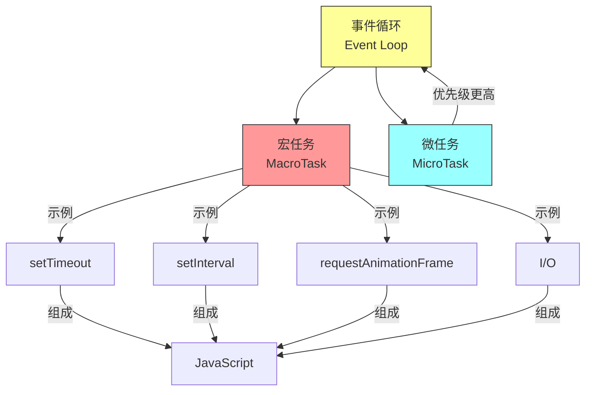

## 核心定义

宏任务 (MacroTask) 是 JavaScript 事件循环中的任务单位，每次事件循环从宏任务队列中取出一个任务执行。宏任务是相对于微任务而言的粒度较大的任务。

## 核心命题

- **任务粒度**：宏任务是较大的任务单位，每次事件循环执行一个
- **执行时机**：在当前宏任务执行完毕后，才会执行微任务队列
- **浏览器渲染**：部分宏任务（如 requestAnimationFrame）会触发浏览器渲染
- **阻塞风险**：大量同步宏任务会阻塞事件循环，导致页面卡顿

## 运行机制

### 执行流程

### 常见宏任务

| API | 说明 | 备注 |
|-----|------|------|
| `setTimeout` | 定时器 | 延迟至少 4ms |
| `setInterval` | 间隔定时器 | 可能累积延迟 |
| `setImmediate` | Node.js 立即执行 | 仅 Node.js |
| `requestAnimationFrame` | 渲染帧回调 | 在渲染前执行 |
| I/O 操作 | 文件/网络读写 | Node.js 特有 |
| UI 渲染 | DOM 更新 | 浏览器特有 |

## 关键区别

### 宏任务 vs 微任务

| 特征 | 宏任务 (MacroTask) | 微任务 (MicroTask) |
|------|-------------------|-------------------|
| 执行时机 | 每个事件循环阶段 | 每个宏任务结束后 |
| 执行数量 | 每次 1 个 | 每次全部清空 |
| 优先级 | 较低 | 较高 |
| 典型 API | setTimeout, setInterval | Promise.then |
| 阻塞渲染 | 可能阻塞 | 不阻塞渲染 |

### 与 [[微任务]] 的执行顺序

## 应用场景

### 适用场景

- **定时任务**：需要延迟执行的操作
- **轮询**：周期性检查状态
- **渲染控制**：需要与浏览器渲染同步的操作

### 注意事项

- **setTimeout(0)**：并非立即执行，至少 4ms 延迟
- **setInterval**：长时间运行可能累积延迟
- **大量同步代码**：会阻塞事件循环，导致页面无响应
- **requestAnimationFrame**：适合动画，但回调数量有限制

## 知识图谱

### 相关概念

- [[事件循环]]：宏任务所在的运行环境
- [[微任务]]：优先级更高的任务类型
- [[执行栈]]：代码执行时的调用栈
- [[JavaScript]]：宏任务所属的运行时环境
