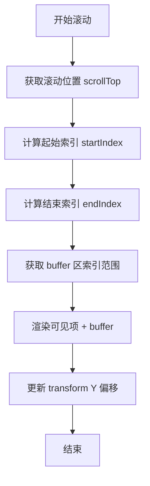

## SOP：实现简易虚拟列表

> 一句话描述这个 SOP 的目标和适用场景

目标：通过计算可视区域，只渲染可见项及其缓冲区域，实现大数据量列表的高性能渲染
实现：在 Vue/React 中实现一个基础的虚拟列表组件

---

### 适用场景

- 场景 1：渲染大量数据列表（>1000 条），如日志列表、商品列表、消息列表
- 场景 2：固定行高列表场景（已知每项高度）
- 场景 3：需要优化首屏渲染性能的長列表

---

### 流程图解



---

### 核心步骤

1. **计算可视区域**：获取容器高度和滚动位置
	 - 注意：容器高度固定，需使用 `clientHeight` 而非 `offsetHeight`
2. **计算起始索引**：`startIndex = Math.floor(scrollTop / itemHeight)`
3. **计算结束索引**：`endIndex = Math.ceil((scrollTop + clientHeight) / itemHeight)`
4. **添加 Buffer 区**：前后各扩展 `bufferSize` 项，避免快速滚动时出现空白
5. **渲染切片数据**：只渲染 `[startIndex - buffer, endIndex + buffer]` 范围内的数据
6. **设置偏移量**：用 `transform: translateY(startIndex * itemHeight)px` 定位

---

### 实践/示例

**Vue 3 实现**

```vue
<template>
  <div
    class="virtual-list"
    ref="containerRef"
    @scroll="onScroll"
  >
    <div class="virtual-list-spacer" :style="{ height: totalHeight + 'px' }">
      <div class="virtual-list-content" :style="{ transform: `translateY(${offsetY}px)` }">
        <div
          v-for="item in visibleData"
          :key="item.id"
          class="virtual-list-item"
        >
          {{ item.content }}
        </div>
      </div>
    </div>
  </div>
</template>

<script setup>
import { ref, computed, onMounted } from 'vue'

const props = defineProps({
  listData: { type: Array, default: () => [] },
  itemHeight: { type: Number, default: 50 },
  bufferSize: { type: Number, default: 3 }
})

const containerRef = ref(null)
const scrollTop = ref(0)

const containerHeight = ref(0)

onMounted(() => {
  containerHeight.value = containerRef.value.clientHeight
})

const startIndex = computed(() => {
  return Math.max(0, Math.floor(scrollTop.value / props.itemHeight) - props.bufferSize)
})

const endIndex = computed(() => {
  const visibleCount = Math.ceil(containerHeight.value / props.itemHeight)
  return Math.min(props.listData.length, visibleCount + props.bufferSize * 2 + startIndex.value)
})

const visibleData = computed(() => {
  return props.listData.slice(startIndex.value, endIndex.value)
})

const totalHeight = computed(() => props.listData.length * props.itemHeight)

const offsetY = computed(() => startIndex.value * props.itemHeight)

const onScroll = (e) => {
  scrollTop.value = e.target.scrollTop
}
</script>

<style>
.virtual-list {
  height: 400px;
  overflow-y: auto;
  position: relative;
}
.virtual-list-spacer {
  position: relative;
}
.virtual-list-content {
  position: absolute;
  top: 0;
  left: 0;
  right: 0;
}
.virtual-list-item {
  height: 50px;
  box-sizing: border-box;
}
</style>
```

---

### 常见坑点

- ⛔ **动态高度场景**：上述实现假设固定行高，动态高度需使用 `ResizeObserver` 或收集位置信息
- ⛔ **使用 offsetHeight**：容器高度计算应使用 `clientHeight`，`offsetHeight` 包含 border
- 🔧 **滚动闪烁**：如果出现闪烁，检查 `bufferSize` 是否足够（通常 3-5 项）
- 🔧 **白屏**：检查 `startIndex` 是否可能为负数，确保使用 `Math.max(0, …)`

---

### 知识图谱

- **相关概念**：
	- [[虚拟列表]]
	- [[长列表优化]]
