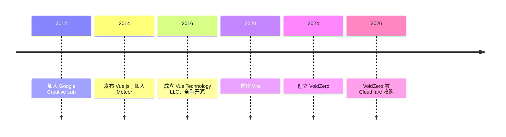

> Vue.js 与 Vite 的创建者，从艺术设计自学转前端，以"渐进式框架"理念重构了主流前端生态。

## 人物卡片

| 项目 | 信息 |
|------|------|
| **姓名** | 尤雨溪（Evan You） |
| **生卒** | 待核实（江苏无锡人） |
| **国籍** | 中国（常驻新加坡） |
| **职业** | 独立开源开发者 / VoidZero 创始人（现 Cloudflare 开源团队） |
| **代表领域** | 前端框架、前端工程化、开源 |

---

### 生平简介

尤雨溪，江苏无锡人。高中就读于上海复旦大学附属中学，后赴美就读科尔盖特大学（艺术史/室内艺术），再于帕森斯设计学院获 Design & Technology 硕士（2013）。硕士期间自学 JavaScript，完成从设计到开发的身份转换。2012-2014 在 Google Creative Lab 做前端，期间对 AngularJS 产生不满，萌生创作更轻量框架的想法；2014 年发布 Vue.js。此后历任 Meteor 核心开发者（2014-2016）、全职独立开源（2016 起，首位通过 Patreon 获社区赞助维持全职开源的开发者）、2020 年推出 Vite、2024 年创立 VoidZero、2026 年 VoidZero 被 Cloudflare 收购后加入其开源团队。

> ⚠️ 出生年份等细节未经独立核实，以上主要基于公开资料整理。

---

### 人生时间线

| 时间 | 事件 | 影响 |
|------|------|------|
| 2012-2014 | Google Creative Lab | 前端职业起点，萌生 Vue 想法 |
| 2014-02 | 发布 Vue.js（GitHub 首发） | 渐进式框架诞生 |
| 2014-2016 | Meteor 核心开发者 | 为 Vue 争取发展空间 |
| 2016 | 成立 Vue Technology LLC，全职开源 | 首位 Patreon 赞助的全职开源者 |
| 2020 | 推出 Vite | 构建工具格局改变，下载量超 Webpack |
| 2024 | 创立 VoidZero | 打造统一 JS/TS 工具链 |
| 2026 | VoidZero 被 Cloudflare 收购 | 团队并入 Cloudflare 开源团队；Vue 保持独立 |

---

### 主要成就

- **Vue.js**（2014）：渐进式 JavaScript 框架，200 万+ 用户、25 万+ GitHub 星标，与 Angular/React 并列主流
- **Vite**（2020）：下一代前端构建工具，下载量超越 Webpack
- **VoidZero 工具链**：Oxc（Rust 工具链）、Rolldown（打包器）、Vitest（测试运行器）、Vite+
- **开源理念**：首位通过 Patreon 众筹维持全职开源的独立开发者

---

### 思想与观点

> 提炼人物的核心思想，链接到相关 atomic/concept 笔记

- **渐进式框架**：Vue 可逐步增强、按需引入，而非全有或全无——降低上手门槛（[[Vue 核心思想]]）
- **开发者体验优先的工程化**：Vite 以原生 ESM 为基座，追求极致的开发体验
- **工具链统一愿景**：用 Rust 重写 JS 工具链（Oxc/Rolldown），打造高性能统一工具生态
- **开源可持续**：通过众筹/公司化让开源项目获得可持续资金

---

### 代表作品

- **Vue.js**（vuejs.org）— 渐进式框架
- **Vite**（vitejs.dev）— 构建工具
- **Vitest / Oxc / Rolldown** — VoidZero 工具链
- **petite-vue** — 轻量版 Vue

---

### 关系网络

- **前任东家**：Google Creative Lab、Meteor 公司
- **公司**：VoidZero（2026 并入 Cloudflare）
- **生态**：VueConf 等前端社区，与 Angular、React 构成主流三框架格局

---

### 名言

> 渐进式——Vue 的核心设计理念：可以用一点，也可以全用。

> 更多名言待补充（需核对可靠来源）

---

### 评价与争议

- **影响力**：Vue 与 Vite 深刻塑造了前端开发体验，被广泛视为华语世界最具全球影响力的开源开发者之一
- **争议/讨论**：VoidZero 收购后 Vue 的独立定位、Rust 工具链对既有生态的冲击等引发社区讨论
- **风格**：注重开发者体验与"渐进式"采纳路径

---

### 知识图谱

- **父级领域**：[[Vue]]（Vue 概念笔记）
- **相关概念**：
	- [[Vue]] — 其创造的框架
	- [[Vite]] — 其创造的构建工具
	- [[前端开发]] — 所属领域
- **相关人物**：
	- 无直接人物笔记（可后续补充 Vue 核心团队）
- **参考来源**
	- 百度百科、维基百科、RedMonk 访谈、个人官网等（2026-07 检索）
