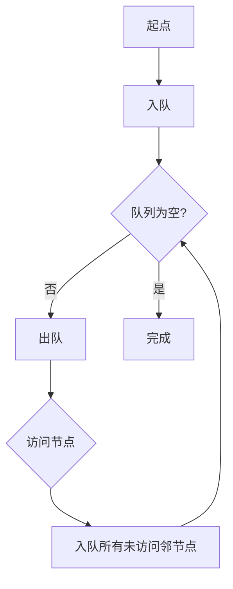

## 概念：广度优先搜索

> 广度优先搜索（BFS）是一种图的遍历算法，从起始节点出发，先访问所有相邻节点，再逐层向外扩展，直到找到目标或遍历完成。

> 从树的视角看：从根节点开始，沿着树的宽度遍历节点，若所有节点均被访问则算法中止。BFS 通常用队列实现，先进先出的结构确保先被访问的节点其邻居也先被访问。

**解决的问题**：寻找最短路径、层级遍历、最短距离

---

### 核心命题

- **搜索策略**：层级优先，先访问所有同层节点
- **实现方式**：队列
- **时间复杂度**：O(V + E)，V=顶点数，E=边数
- **空间复杂度**：O(W)，W=最大层宽度

---

### 运行机制



---

### 具体实现

#### 1. 队列实现（标准）

```javascript
function bfs(graph, start) {
  const visited = new Set();
  const queue = [start];
  visited.add(start);

  while (queue.length > 0) {
    const node = queue.shift();
    console.log(node); // 访问节点

    for (const neighbor of graph[node]) {
      if (!visited.has(neighbor)) {
        visited.add(neighbor);
        queue.push(neighbor);
      }
    }
  }
}

// 使用
const graph = {
  A: ['B', 'C'],
  B: ['D', 'E'],
  C: ['F'],
  D: [],
  E: ['F'],
  F: []
};
bfs(graph, 'A'); // A B C D E F
```

#### 2. 记录层级

```javascript
function bfsWithLevel(graph, start) {
  const visited = new Set();
  const queue = [[start, 0]];
  visited.add(start);

  while (queue.length > 0) {
    const [node, level] = queue.shift();
    console.log(`节点: ${node}, 层级: ${level}`);

    for (const neighbor of graph[node]) {
      if (!visited.has(neighbor)) {
        visited.add(neighbor);
        queue.push([neighbor, level + 1]);
      }
    }
  }
}
```

#### 3. 最短路径

```javascript
function shortestPath(graph, start, target) {
  if (start === target) return 0;

  const visited = new Set();
  const queue = [[start, 0]];
  visited.add(start);

  while (queue.length > 0) {
    const [node, dist] = queue.shift();

    for (const neighbor of graph[node]) {
      if (neighbor === target) return dist + 1;

      if (!visited.has(neighbor)) {
        visited.add(neighbor);
        queue.push([neighbor, dist + 1]);
      }
    }
  }

  return -1; // 无法到达
}
```

---

### 应用场景

| 场景 | 说明 |
|:---|:---|
| 最短路径 | 无权图中的最短路径 |
| 层级遍历 | 按层级访问节点 |
| 迷宫问题 | 寻找最短出口 |
| 社交网络 | 共同好友推荐 |
| 单词接龙 | LeetCode 127 |

---

### 与深度优先搜索对比

| 维度 | BFS | DFS |
|:---|:---|:---|
| 数据结构 | 队列 | 栈/递归 |
| 搜索顺序 | 层级优先 | 深度优先 |
| 空间复杂度 | O(W)，W=最大层宽 | O(H)，H=树高 |
| 找到最短路径 | 是 | 否 |
| 适用场景 | 最短路径、层级遍历 | 深层搜索、路径检测 |

---

### 知识图谱

- **父级概念**：[[算法与数据结构]]
- **关联概念**：
	- [[深度优先搜索]] — 对比学习
	- [[队列]] — BFS 的实现基础

---

### 参考延伸

- LeetCode 111. Minimum Depth of Binary Tree（BFS 应用）
- LeetCode 127. Word Ladder（BFS 应用）
