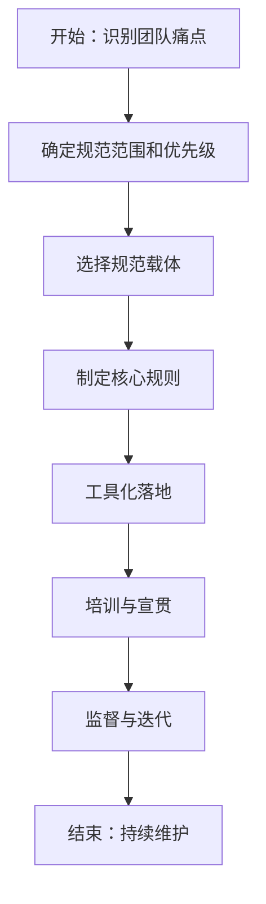

## SOP：建立前端工程规范

> 标准化团队前端工程规范的建立流程，确保代码质量和协作效率

目标：建立覆盖编码、协作、交付全流程的前端工程规范体系
实现：新团队 2 周内完成规范初版，存量项目逐步接入

---

### 适用场景

- 场景 1：新团队起步，需要从零建立工程规范
- 场景 2：团队扩张，需要统一代码风格和协作流程
- 场景 3：存量项目质量提升，需要渐进式规范落地

---

### 流程图解



---

### 核心步骤

1. **识别痛点**：收集团队当前面临的问题（如代码风格不一、MRD 质量差、发布事故）
	 - 注意：聚焦高频问题，不要试图一步到位解决所有问题
2. **确定范围和优先级**：将规范分为 Must（强制）/ Should（建议）/ Could（可选）三级
	 - 注意：首次落地建议不超过 5 条 Must 规则
3. **选择规范载体**：用 ESLint/Prettier 等工具承载代码规范，用文档承载流程规范
	 - 注意：能用工具自动化的不写文档，能写文档的不靠口头约定
4. **制定核心规则**：针对每条规范明确 " 为什么 "（解决什么问题），而非 " 是什么 "
	 - 注意：规则要有明确的判断标准，避免歧义
5. **工具化落地**：通过 Git Hooks、CI 流水线强制执行规范
	 - 注意：CI 阶段失败要有明确的错误信息，指导开发者修复
6. **培训与宣贯**：团队 code review 中持续强调规范原则
	 - 注意：规范是手段不是目的，避免为了规范而规范
7. **监督与迭代**：定期回顾规范的执行情况，移除不适用的规则

---

### 实践/示例

#### 代码规范载体

```json
// .eslintrc.js 示例
module.exports = {
  extends: ['eslint:recommended', 'plugin:@typescript-eslint/recommended'],
  rules: {
    '@typescript-eslint/no-unused-vars': ['error', { argsIgnorePattern: '^_' }],
    'no-console': process.env.NODE_ENV === 'production' ? 'warn' : 'off'
  }
}
```

#### Git Hooks 自动检查

```json
// package.json
{
  "husky": {
    "hooks": {
      "pre-commit": "lint-staged",
      "commit-msg": "commitlint -E HUSKY_GIT_PARAMS"
    }
  }
}
```

---

### 常见坑点

- ⛔ **反模式**：一次性制定完整的规范体系 → 规范太多团队无法落地，最终形同虚设
- ⛔ **反模式**：规范只有文档没有工具 → 依赖人工遵守，执行全凭自觉
- 🔧 **排查**：团队成员持续违反规范 → 检查规范是否过于复杂，或工具配置是否合理
- 🔧 **排查**：规范推行遭到抵触 → 重新审视规范是否解决了真实痛点，是否有更好的方案

---

### 知识图谱

- **相关概念**：
	- [[代码审查流程]]
	- [[Git 工作流]]
	- [[前端自动化测试]]
