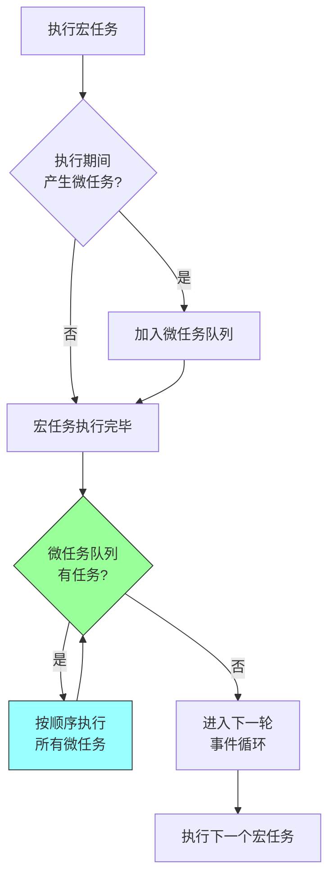
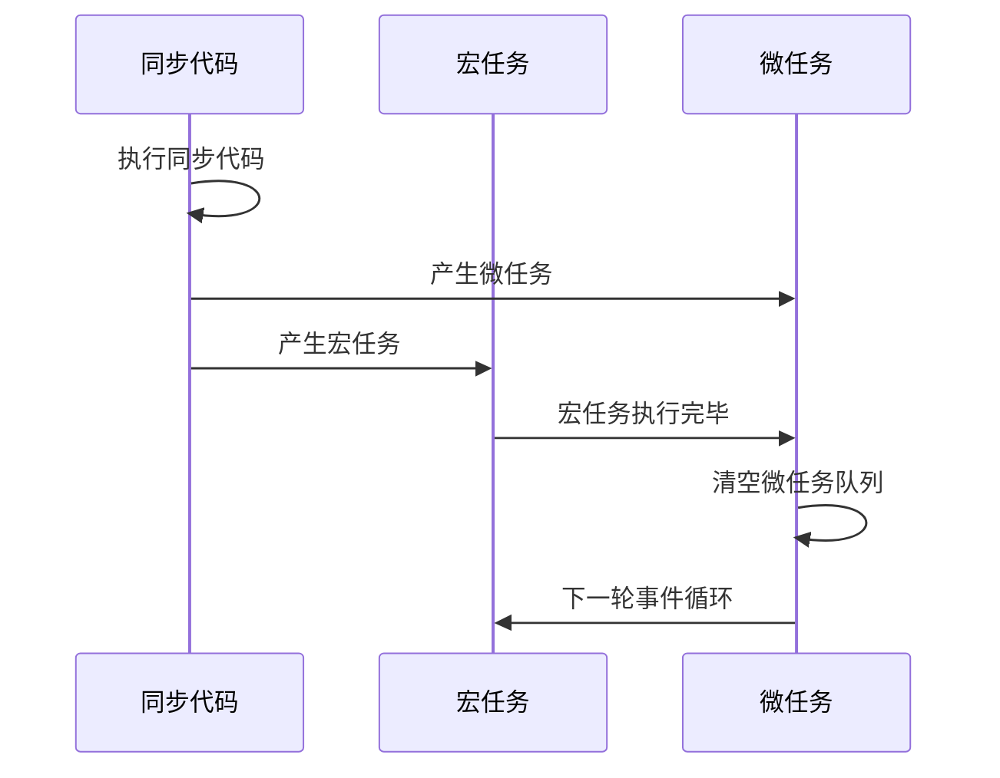
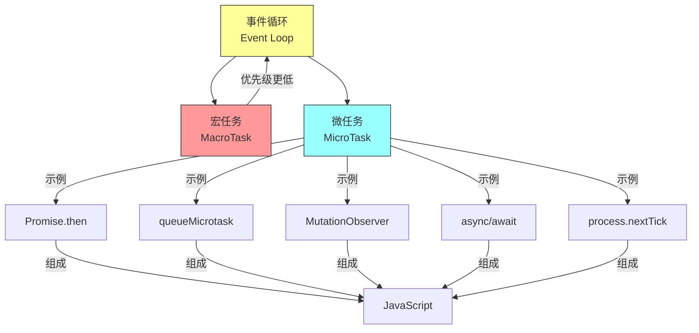

## 核心定义

微任务 (MicroTask) 是 JavaScript 事件循环中的任务单位，优先级高于宏任务。每个宏任务执行完毕后，会立即清空微任务队列中的所有微任务。

## 核心命题

- **高优先级**：微任务在每个宏任务后优先执行
- **全部清空**：每次宏任务执行完毕后，会清空所有微任务
- **不阻塞渲染**：微任务执行不会阻塞浏览器渲染
- **确定性执行**：确保 Promise 等异步操作的结果在下一个宏任务前确定

## 运行机制

### 执行流程



### 常见微任务

| API | 说明 | 备注 |
|-----|------|------|
| `Promise.then/catch/finally` | Promise 回调 | 最常见 |
| `async/await` | 语法糖 | 本质是 Promise |
| `MutationObserver` | DOM 变化观察 | 浏览器特有 |
| `queueMicrotask` | 通用微任务队列 | 标准 API |
| `process.nextTick` | Node.js 立即执行 | 仅 Node.js，优先级最高 |

### queueMicrotask 示例

```javascript
queueMicrotask(() => {
  console.log('这是微任务');
});
```

## 关键区别

### 微任务 vs 宏任务

| 特征 | 微任务 (MicroTask) | 宏任务 (MacroTask) |
|------|-------------------|-------------------|
| 执行时机 | 每个宏任务结束后 | 每个事件循环阶段 |
| 执行数量 | 每次全部清空 | 每次 1 个 |
| 优先级 | 较高 | 较低 |
| 典型 API | Promise.then, queueMicrotask | setTimeout, setInterval |
| 阻塞渲染 | 不阻塞 | 可能阻塞 |

### 执行顺序示例

```javascript
console.log('1. 同步代码');

setTimeout(() => console.log('2. 宏任务'), 0);

Promise.resolve().then(() => console.log('3. 微任务1'));

queueMicrotask(() => console.log('4. 微任务2'));

console.log('5. 同步代码结束');

// 输出顺序: 1 -> 5 -> 3 -> 4 -> 2
```

### 与 [[宏任务]] 的执行顺序



## 应用场景

### 适用场景

- **异步结果处理**：Promise 回调
- **DOM 变化监听**：MutationObserver
- **任务调度**：需要确保在渲染前完成的任务

### 注意事项

- **微任务嵌套**：微任务中产生的微任务会在当前阶段全部执行完毕
- **大量微任务**：可能导致宏任务延迟执行
- **process.nextTick**：Node.js 中优先级高于其他微任务
- **async/await**：await 之后的代码相当于 Promise.then 回调

### 反模式

- **在微任务中执行耗时操作**：会阻塞后续宏任务的执行
- **递归创建微任务**：可能导致事件循环饥饿

## 知识图谱



### 相关概念

- [[事件循环]]：微任务所在的运行环境
- [[宏任务]]：粒度更大的任务类型
- [[Promise]]：产生微任务的典型方式
- [[async/await]]：Promise 的语法糖
- [[JavaScript]]：微任务所属的运行时环境
