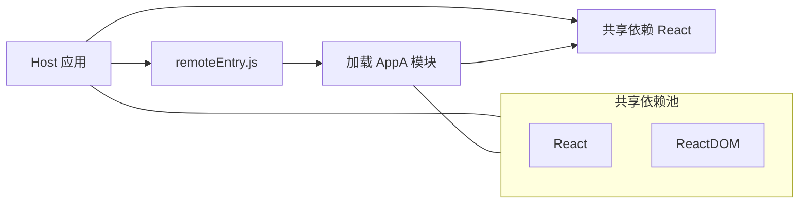

## SOP：微前端 Module Federation 方案

> 使用 Webpack 5 内置 Module Federation 实现运行时模块共享的标准流程，适用于需要共享依赖的渐进迁移场景。

---

### 适用场景

- 场景 1：多个应用间需要共享公共依赖（React、Vue 等）
- 场景 2：渐进式技术迁移，不希望完全拆分为独立部署
- 场景 3：追求更好的构建时性能，避免重复打包公共依赖

---

### 流程图解



---

### 核心步骤

#### 1. Host（主应用）配置

```javascript
// host webpack.config.js
new ModuleFederationPlugin({
  name: 'host',
  remotes: {
    appA: 'appA@http://localhost:3001/remoteEntry.js',
  },
})
```

#### 2. Remote（微应用）配置

```javascript
// appA webpack.config.js
new ModuleFederationPlugin({
  name: 'appA',
  filename: 'remoteEntry.js',
  exposes: {
    './App': './src/App',
  },
  shared: ['react', 'react-dom'],
})
```

---

### 常见坑点

- ⛔ **版本冲突**
	- **原因**：Host 和 Remote 的共享库版本不一致
	- **排查**：确保 `shared` 配置中版本一致，或使用 `singleton: true` 强制单例
- ⛔ **remoteEntry.js 加载失败**
	- **排查**：确认 Remote 应用的 `filename` 和 Host 的 `remotes` URL 匹配

---

### 知识图谱

- **父级概念**：[[微前端]]
- **关联概念**：
	- [[微前端路由分发模式]]
	- [[微前端沙箱隔离]]
