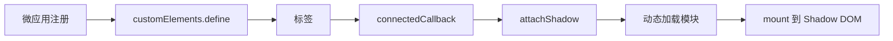

## SOP：微前端 Web Components 封装

> 使用原生 Web Components 技术封装微前端的标准流程，适用于需要跨框架复用的场景。

---

### 适用场景

- 场景 1：需要在不同框架（React / Vue / Angular）间复用同一微应用
- 场景 2：追求原生技术栈，不想引入额外框架依赖
- 场景 3：Shadow DOM 提供天然样式隔离

---

### 流程图解



---

### 核心步骤

#### 1. 定义自定义元素

```javascript
class MicroApp extends HTMLElement {
  async connectedCallback() {
    const shadow = this.attachShadow({ mode: 'open' })
    const { mount } = await import(this.getAttribute('entry'))
    mount(shadow)
  }
}
customElements.define('micro-app', MicroApp)
```

#### 2. 在 HTML 中使用

```html
<micro-app entry="./app-a.js"></micro-app>
<micro-app entry="./app-b.js"></micro-app>
```

---

### 常见坑点

- ⛔ **Shadow DOM 样式穿透**
	- **排查**：确认使用 `{ mode: 'open' }`，样式通过 CSS 变量或 `:host` 选择器传递
- ⛔ **模块加载路径问题**
	- **排查**：动态 import 的路径是相对于当前页面，需确保资源可访问

---

### 知识图谱

- **父级概念**：[[微前端]]
- **关联概念**：
	- [[微前端路由分发模式]]
	- [[微前端沙箱隔离]]
