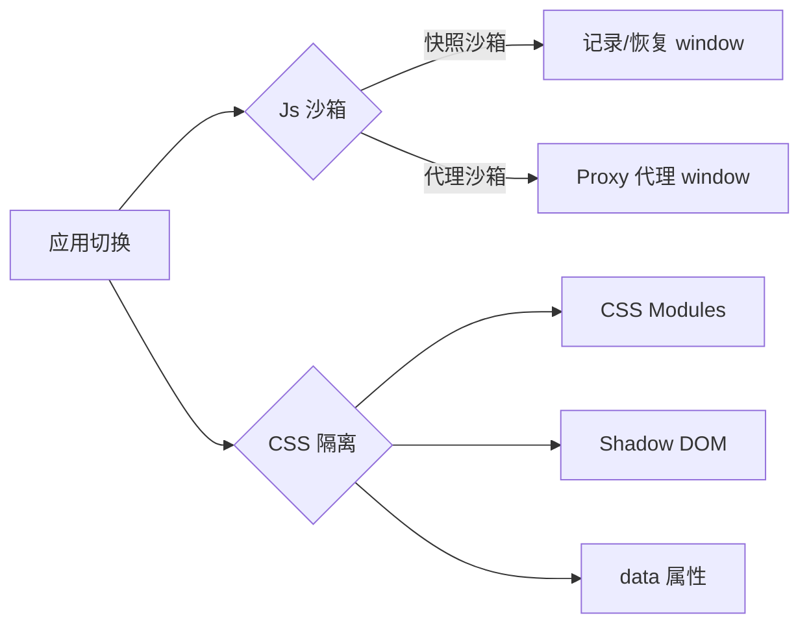

## SOP：微前端沙箱隔离

> 实现多个微应用在同一页面共存时互相隔离的标准流程，涵盖 JS 沙箱和 CSS 隔离两种机制。

---

### 适用场景

- 场景 1：多团队并行开发，需要防止应用间变量污染
- 场景 2：不同技术栈的微应用共存（React + Vue）
- 场景 3：需要严格样式隔离的多品牌定制场景

---

### 流程图解



---

### JS 沙箱

#### 快照沙箱

记录初始全局状态，每次切换应用时恢复快照：

```javascript
class SnapshotSandbox {
  constructor() {
    this.modifyMap = {}
    this.originSnapshot = {}
  }
  active() {
    this.originSnapshot = { ...window }
  }
  inactive() {
    for (const key in window) {
      if (window[key] !== this.originSnapshot[key]) {
        this.modifyMap[key] = window[key]
        window[key] = this.originSnapshot[key]
      }
    }
  }
}
```

#### 代理沙箱（推荐）

为每个应用创建独立的全局代理：

```javascript
new ProxySandbox('app-a', {
  window: new Proxy(window, {
    set: (target, prop, value) => { /* 仅修改 app-a 的副本 */ },
  })
})
```

---

### CSS 隔离

| 方案 | 实现 | 优缺点 |
|:---|:---|:---|
| CSS Modules | 编译时自动加前缀 | 需要构建工具支持 |
| Shadow DOM | 原生隔离 | Web Components 专属 |
| 命名约定 | BEM / CSS-in-JS | 依赖团队规范 |
| `data-micro-app` 属性 | 运行时加属性选择器 | 运行时开销 |

---

### 常见坑点

- ⛔ **全局变量泄漏**
	- **排查**：检查是否所有应用都通过沙箱运行，确认 `active` / `inactive` 正确调用
- ⛔ **样式冲突**
	- **排查**：优先使用 CSS Modules 或 CSS-in-JS，避免全局样式

---

### 知识图谱

- **父级概念**：[[微前端]]
- **关联概念**：
	- [[微前端路由分发模式]]
	- [[微前端ModuleFederation方案]]
- **问题来源**：
	- 无
