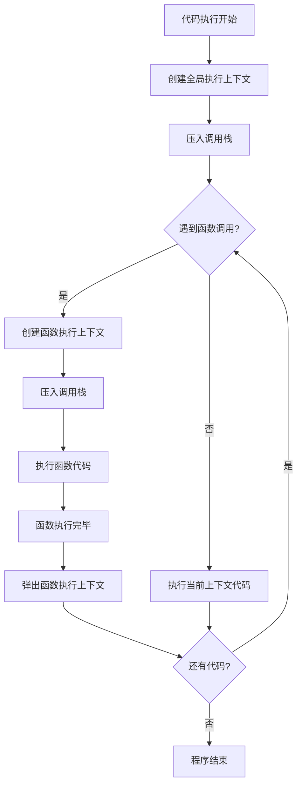
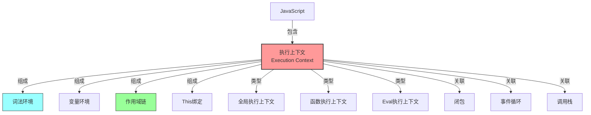

## 🧩 概念：执行上下文

### 1. 核心定义 (The Essence)

> [!abstract]
> 执行上下文 (Execution Context) 是 JavaScript 代码执行时的环境，它包含了代码执行所需的所有信息，如词法环境、变量环境和 `this` 绑定。

**解决的核心痛点**：JavaScript 代码在执行时需要一套完整的 " 执行环境 " 来管理变量、确定作用域和 `this` 指向。执行上下文正是为了解决 " 代码执行环境管理 " 问题而存在的，它为每段代码的执行提供了必要的上下文信息。

### 2. 核心命题与原则 (Atomic Propositions)

- [[执行上下文分为创建阶段和执行阶段]]
	- **原理**：执行上下文的生命周期包括两个阶段：创建阶段（初始化词法环境、建立作用域链、确定 `this` 值）和执行阶段（逐行执行代码，修改变量值）。
- [[全局执行上下文是代码运行的起点]]
	- **原理**：当 JavaScript 代码开始执行时，首先会创建全局执行上下文，它只有一个，在整个程序运行期间都存在。
- [[函数执行上下文在函数调用时创建]]
	- **原理**：每次函数调用都会创建一个新的函数执行上下文，函数执行完毕后，其执行上下文会被销毁（除非形成闭包）。

### 3. 运行机制/模型 (Mechanism)

#### ⚙️ 运作流程

#### 🆚 关键区别 (Compare & Contrast)

| 维度       | **[[执行上下文]]**               | **[[作用域]]**            |
|:------- |:-------------------------- |:--------------------- |
| **核心逻辑** | 代码执行时的环境，包含词法环境、变量环境、`this` | 变量和函数的可访问范围，由代码的物理位置决定 |
| **创建时机** | 代码执行时动态创建（全局/函数调用）          | 代码定义时静态确定（词法作用域）       |
| **主要内容** | 词法环境、变量环境、`this` 值          | 变量和函数的可访问性规则           |
| **数量关系** | 一个作用域可能对应多个执行上下文（多次函数调用）    | 一个执行上下文对应一个作用域链        |

### 4. 应用场景与反模式 (Use Cases)

- ✅ **适用场景**
	- **理解变量提升**：通过执行上下文的创建阶段，可以清晰理解变量和函数声明为什么会被 " 提升 "。
	- **调试作用域问题**：当变量访问出现意外结果时，检查当前执行上下文的作用域链可以帮助定位问题。
	- **理解闭包机制**：闭包能够访问外部函数的变量，本质上是因为内部函数保存了外部函数的词法环境引用，即使外部函数已执行完毕，词法环境仍然被内部函数引用而不会被销毁。
- ⛔ **误用与反模式 (Anti-Patterns)**
	- **混淆执行上下文与作用域**：虽然相关，但执行上下文是动态的（运行时创建），而作用域是静态的（定义时确定）。
	- **忽略执行上下文栈**：不理解执行上下文栈的压入和弹出机制，可能导致对代码执行顺序的误解。

### 5. 知识图谱 (Knowledge Graph)

- **父级概念**：[[JavaScript]]
- **子概念/组成部分**：[[词法环境]]、[[变量环境]]、[[作用域链]]、[[This绑定]]
- **关联概念**：[[闭包]]、[[事件循环]]、[[执行栈|调用栈]]
- **相关工具/库**：浏览器开发者工具的 Call Stack 面板可用于查看当前执行上下文栈。

### 6. 参考与延伸

- **经典文献**：《JavaScript 高级程序设计》、《你不知道的 JavaScript》
- **推荐阅读**：[[彻底明白作用域、执行上下文]] 这篇文章详细解释了执行上下文、变量对象和作用域的关系。
