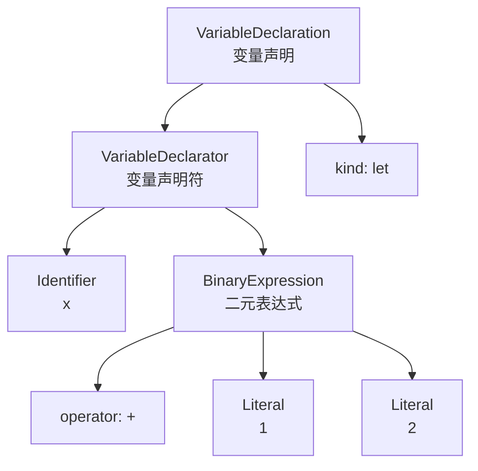

## 术语：抽象语法树

> **别名**: Abstract Syntax Tree, AST
> **领域**: #前端开发/编译器

### 定义

抽象语法树 (Abstract Syntax Tree, AST) 是源代码的抽象语法结构的树形表示。树中的每个节点表示源代码中的一个语法构造，是编译器理解和处理程序的基础数据结构。

### 示例

对于代码 `let x = 1 + 2`：

### 作用

| 阶段   | 作用                           |
| ---- | ---------------------------- |
| 语法分析 | 输出 AST 作为语法分析结果              |
| 代码转换 | 各类转换工具操作 AST（如 Babel、ESLint） |
| 代码生成 | 从 AST 生成目标代码                 |

### 锚点连接

- **属于**：[[JavaScript 引擎]]
- **前置**：[[词法分析]] → [[语法分析]]
- **相关工具**：Babel、ESLint、TypeScript 编译器
