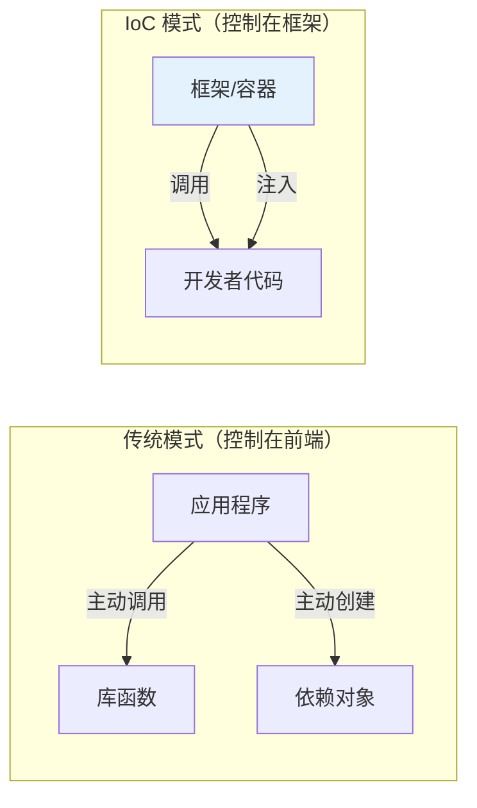

## 概念：控制反转

> 控制反转（IoC）是软件工程的核心设计原则——将程序流的控制权从应用程序代码转移到框架或容器，由框架来调用开发者编写的代码，而非反过来。

**解决的核心痛点**：应用程序代码直接控制所有流程导致高度耦合、难以扩展。IoC 通过"让框架来调用你"的机制，使开发者专注于业务逻辑，框架负责通用流程。

**Hollywood 原则**："Don't call us, we'll call you."

---

### 核心命题

- [[控制反转的本质是让框架来决定调用时机]]
	- **原理**：开发者编写回调/插件，框架在适当时候调用，而非开发者主动调用框架 API
- [[依赖注入是控制反转在对象创建上的具体实践]]
	- **原理**：DI 将"创建依赖"的控制权从类内部转移到外部注入器，是 IoC 最著名的实现

---

### 运行机制

**IoC 的四种实现方式**：

| 方式 | 说明 | 示例 |
|:---|:---|:---|
| **依赖注入（DI）** | 依赖由外部注入，而非内部创建 | Angular Injector、Spring Container |
| **模板方法模式** | 父类定义骨架，子类实现具体步骤 | Angular 生命周期钩子（`ngOnInit`） |
| **策略模式** | 算法可替换，客户端选择策略 | 支付方式选择、排序策略 |
| **事件/回调** | 注册回调，框架在事件发生时调用 | 浏览器事件监听、RxJS subscribe |

---

### 关键区别

| 维度 | 控制反转（IoC） | 依赖注入（DI） |
|:---|:---|:---|
| **范围** | 广义设计原则 | IoC 在对象创建上的具体实现 |
| **关注点** | 谁控制程序流 | 谁创建依赖 |
| **实现方式** | 多种（DI/模板方法/事件/策略） | 构造函数/Setter/接口注入 |
| **可感知性** | 框架使用者能感受到 | 开发者直接编写 |

---

### 应用场景

- ✅ **适用场景**
	- **框架开发**：框架作者定义骨架，使用者在钩子/回调中填充业务逻辑
	- **插件系统**：主程序提供扩展点，插件注册后由主程序调用
	- **UI 框架**：Angular/React 接管渲染流程，开发者只提供组件模板和逻辑
- ⛔ **误用**
	- **过度抽象**：为"将来可能扩展"引入 IoC，导致代码间接性增加、调试困难
	- **误解 IoC 与 DI**：认为 IoC 等于 DI——DI 只是 IoC 的一种实现

---

### 知识图谱

- **父级概念**：[[设计模式]] — IoC 是软件设计的核心原则之一
- **子级概念**：
	- [[依赖注入]] — IoC 在对象创建上的实现，有独立的术语笔记
	- [[Angular依赖注入]] — IoC 在 Angular 中的具体实践
- **相关概念**：
	- [[Hollywood 原则]] — IoC 的口诀式表述
	- [[回调函数]] — IoC 在事件驱动中的体现
- **相关对比**：[[Angular vs React]] — 两者对 IoC 的依赖程度不同

### 参考延伸

- **源头**：Robert C. Martin 在 1990 年代的系统性阐述
- **相关模式**：DI / 模板方法 / 策略 / 观察者
