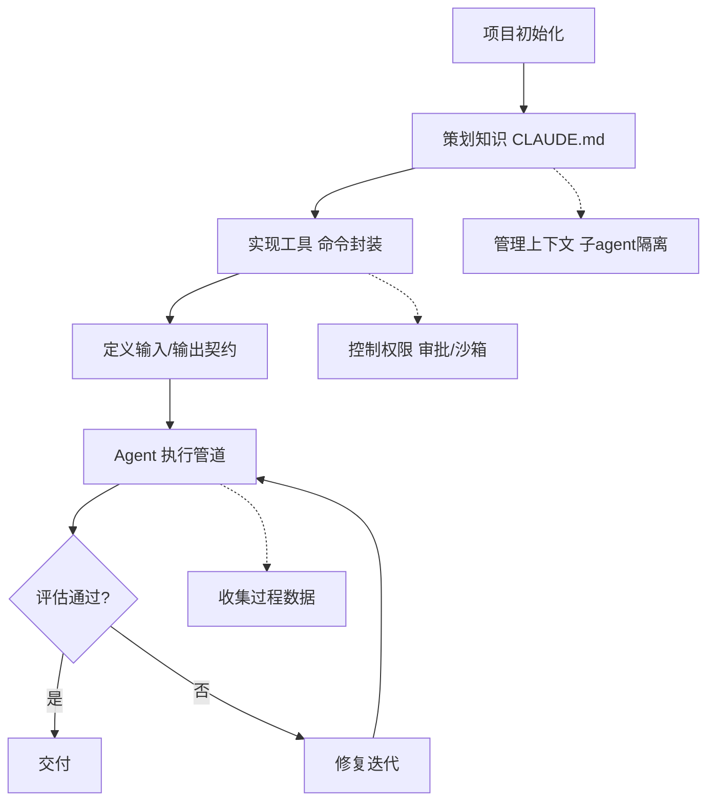

## SOP：搭建 Vue 工程的 Claude Code Harness

> 为 Vue 3 + TypeScript 项目搭建围绕 Claude Code 的 Agent Harness，让 AI 驱动的开发输出可预测、可复用、可测试。

目标：将 Claude Code 从「能写代码的对话」升级为「受工程约束的 Agent 体系」。
实现：以 Vue 3 + Vite + TypeScript 项目为例，按 Harness 五要素（输入契约 / 输出契约 / 执行管道 / 错误处理 / 评估标准）落地知识、工具、上下文、权限四层工程化。

> **问题溯源**：本 SOP 是 [[Harness]] 概念的收敛成果——将「围绕 AI Agent 构建工程化体系」的框架，落实到 Vue/TS 项目可执行的标准化流程。

---

### 适用场景

- ✅ **Vue 3 + TypeScript 项目**：需要让 Claude Code 稳定产出符合项目规范的代码
- ✅ **多成员协作**：统一 AI 编码行为，避免每人一套 Prompt 风格
- ✅ **生产级前端**：组件/页面需要可测试、可维护、通过 CI 校验
- ✅ **Agent 能力规模化**：从单次 Prompt 升级为可复用的任务管道
- ⛔ **一次性脚本**：简单单次任务直接 Prompt 即可，无需 Harness

---

### 流程图解



---

### 核心步骤

#### 阶段 1：策划知识（CLAUDE.md 即 Harness 的记忆层）

1. **建立项目 CLAUDE.md**
	- 项目结构：（`src/components`、`views`、`composables`、`types` 划分）
	- 常用命令（dev / build / type-check / lint / test）
	- 技术约定：Vue 3 + TS 严格模式 + Vite
2. **写入代码规范（正面 + 反面规则）**
	- ✅ `<script setup>` + 组合式 API；`defineProps` / `defineEmits`；`computed` / `watch` 派生状态；模板控制流 `v-if` / `v-for`
	- ⛔ 不滥用 `any`；⛔ 复杂逻辑不塞进模板；⛔ 不复制粘贴重复样式/逻辑
3. **按需加载知识，不全前置**
	- 设计规范、架构 ADR 放子文档，Agent 需要时再 `Read` 拉取，避免污染上下文

#### 阶段 2：实现工具（给 Agent 一双手）

1. **盘点 Claude Code 内置工具**：Read / Edit / Write / Glob / Grep / Bash——即 Harness 的基础行动集
2. **封装项目命令**：在 CLAUDE.md 里给出可直接执行的脚本

	```bash
	pnpm dev         # 本地开发
	pnpm type-check  # 类型校验（输出契约必过）
	pnpm lint        # 代码规范
	pnpm build       # 构建验证
	```

3. **工具原子化**：每个命令单一职责、可组合，Agent 按需串起

#### 阶段 3：定义输入/输出契约

1. **输入契约：任务描述模板**

	```text
	任务：新建一个 {{组件名}} 组件
	功能：{{功能 1}}、{{功能 2}}
	输入：{{Props 接口，TypeScript 类型}}
	输出：{{事件 emit 列表}}
	约束：Vue 3 + TS 严格模式；遵循 {{规范文档}}
	```

2. **输出契约：交付标准**
	- [ ] Props / Emits 有完整 TS 类型导出
	- [ ] `pnpm type-check` 通过
	- [ ] `pnpm lint` 通过
	- [ ] 单测覆盖核心交互（Vitest）

#### 阶段 4：执行管道（以「新建 Vue 组件」为例）

1. **需求分析** → 复杂度判断（简单直接做；复杂拆子任务）
2. **生成组件**（Claude Code 依契约产出）

```vue
<!-- src/components/UserCard.vue -->
<script setup lang="ts">
defineProps<{ name: string; avatar?: string }>()
</script>

<template>
  <div class="user-card">
    
    <span>{{ name }}</span>
  </div>
</template>
```

3. **评估**：type-check → lint → 单测 → 人工 code review
4. **失败回退**：错误信息回填 → 修复迭代，超过 N 轮后转人工介入

#### 阶段 5：上下文管理 + 权限控制

1. **子 Agent 隔离**：长任务拆子任务，隔离上下文，防噪声泄露
2. **上下文压缩**：会话过长时压缩历史，保留目标
3. **权限边界**：
	- 读放开：Agent 自由读取项目文件
	- 写列清单：修改前先列出将改动的文件
	- 破坏性操作（git push --force、删除文件、改 CI）必须人工审批
	- 外部 API 调用走受控通道

#### 阶段 6：评估与数据收集

1. **量化评估**：以 type-check / lint / build / 测试通过率作为 Agent 输出质量的硬指标
2. **收集过程数据**：Agent 的行动轨迹（感知 → 推理 → 行动）沉淀为微调/优化 Harness 的信号
3. **迭代**：按失败模式反哺 CLAUDE.md 规则与契约模板

---

### 实践/示例

完整落地后，一次「新建组件」任务的执行流：

```text
用户 → 填任务模板（输入契约）
  → Claude Code 读 CLAUDE.md 了解约定（知识层）
  → 生成 UserCard.vue（工具+管道）
  → pnpm type-check && pnpm lint（评估）
  → 通过 → 交付；失败 → 修复迭代
```

---

### 常见坑点

- ⛔ **CLAUDE.md 写得太长**：上下文塞满反而不聚焦
	- **排查**：核心规则 ≤ 一屏，长知识拆子文档按需加载
- ⛔ **契约缺失**：没定义 Props/输出就开工，导致返工
	- **排查**：先填任务模板，再让 Agent 生成
- ⛔ **把「能跑」当「合格」**：不跑 type-check / lint 就交付
	- **排查**：把校验命令写进输出契约，Agent 必须执行
- ⛔ **权限一刀切**：要么全放开（危险）要么全禁止（Agent 失效）
	- **排查**：分级——读放开、写列清单、破坏性审批
- 🔧 **Agent 幻觉 API**：用了不存在的 Vue/TS API
	- **排查**：CLAUDE.md 提供版本约束与文档链接

---

### 知识图谱

- **父级概念**：[[Harness]] — Harness 概念的具体落地流程
- **关联概念**：
	- [[Claude Code]] — Harness 的 Agent 实现载体
	- [[Agent]] — 能力基础
	- [[Vue]] — 示例技术栈
	- [[SOP-使用Claude-Code开发React组件]] — React 版本对照示例
	- [[提示词工程]] — 与 Harness 互补：Prompt 优化能力，Harness 优化可靠性
