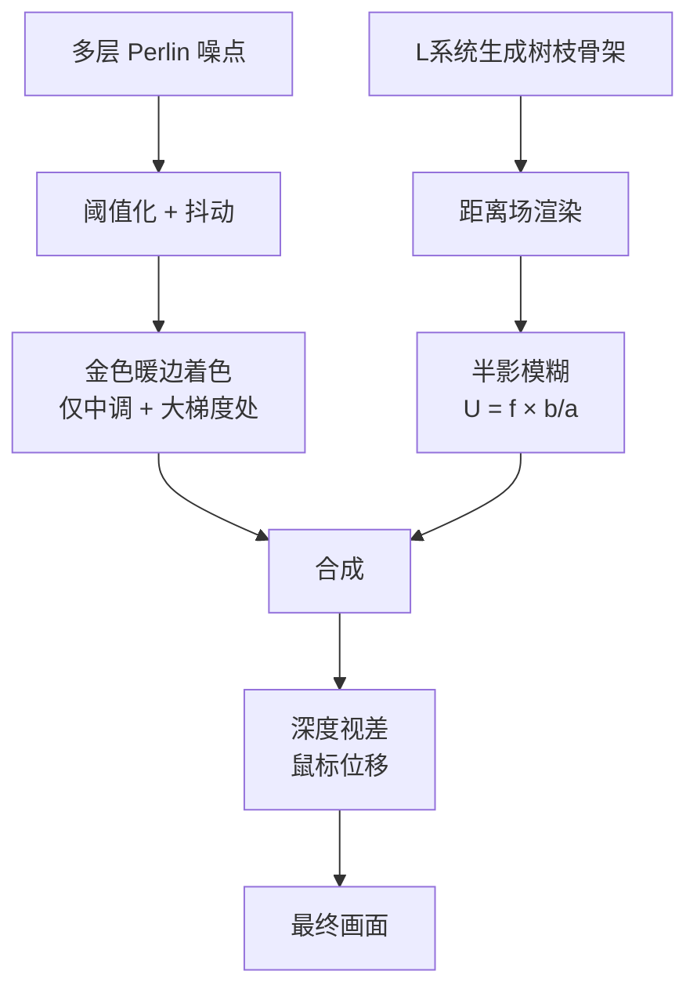

## 概念：斑驳光（Dappled Light）

> 斑驳光是使用程序化着色器（fragment shader）在网页背景中模拟阳光透过树叶缝隙洒落的光影效果——日语中称为**木漏れ日（komorebi）**。它通过噪点、L系统树生成、半影模糊和视差深度等多层技术，让网页拥有"数字家园"的氛围感。

**解决的核心痛点**：纯静态网页缺乏自然光的温度和生命力，斑驳光通过程序化生成让页面背景"活起来"——有风吹树叶的摇曳、有阳光边缘的金色光晕、有近实远虚的深度感。

---

### 核心命题

> 核心命题引用 atomic 笔记（陈述句观点），每个命题是一句话洞见

- 斑驳光的真实感来自半影模糊而非纯噪点阈值
	- **原理**：真实树叶阴影的边缘会因光的衍射和光源大小产生渐变过渡（penumbra），纯二值阈值（亮/暗）看起来像噪点而非光影。通过计算物体到投影面的距离 _b_，让远离墙面的枝条产生更宽的模糊带：U = f × b/a（f=焦点大小，a=相机到物体距离，b=物体到墙面距离）
- 黄金比例的无理性是叶序螺旋排列不重叠的数学基础
	- **原理**：植物叶片按约 137.5°（黄金角）螺旋排列（phyllotaxis），因为黄金比例 φ 是无理数，任何两个叶片永远不会落在同一条从中心出发的径线上——这保证了每片叶子都能最大化获取阳光。在 2D 着色器中可近似为：维护每个分枝的运行角度，每次分叉时增加黄金角，用 cos(角度) 选择左右侧

---

### 运行机制

斑驳光效果的生成分为 **5 层流水线**，每层对应不同的视觉维度：

#### 第一层：噪点与抖动（Noise & Dithering）

- 使用多倍频（octave）的 Perlin 噪点模拟树叶冠层
- 故意以低分辨率渲染 + `image-rendering: pixelated` + 颜色空间抖动，产生像素艺术的"位压缩"美学
- 添加按倍频变化的平移（"风"效果），鼠标移动时树叶摇曳，静止时渐渐平息

#### 第二层：金色暖边（Golden Warm Fringe）

真实斑驳光的特征：阴影边缘有一圈温暖的金色光晕（阳光在阴影边缘的"绽放"）。

- **关键洞察**：金色不是固定的第三色，而是一种**着色属性**
- **触发条件**：仅在色调为中调（mid-range）**且**亮暗梯度较大的位置着色金色——即只给边缘（fringe）上色，不给内部上色

#### 第三层：L系统树枝（L-System Branches）

纯噪点缺乏树干、分枝、叶片的树形结构。使用 **L系统（Lindenmayer 系统）** 程序化生成树枝骨架。

- 使用概率语法（probabilistic grammar）产生自然的分枝模式
- **达·芬奇分枝法则**：任意高度处所有分枝截面积之和约等于树干截面积（截面积守恒），让分枝看起来自然
- **黄金角叶序**：用 137.5° 的黄金角控制分枝左右交替，产生不重复的螺旋排列

参见 [[L系统]]。

#### 第四层：半影模糊与深度（Penumbral Blurring & Depth）

树是体积，不是平面。树干居中，枝条向前后左右伸展。

- **半影模糊公式**：U = f × b / a
	- f = 焦点大小，a = 相机到物体距离，b = 物体到墙面距离
	- 远离墙面的枝条（b 大）→ 模糊带宽 → 朦胧；贴近墙面的枝条（b 小）→ 清晰锐利
- **冠层深度梯度**：将噪点阈值从固定值改为按深度倾斜的渐变——"近处稀疏、远处密集"，让冠层密度有自然变化
- **深度跟随参数**：叶片深度轻微跟随附近树枝的深度，增强一体感

#### 第五层：视差与构图（Parallax & Composition）

- **视差**：鼠标移动时，每一层按其到墙面的距离比例水平滑动（越近越慢，越远越快），增强空间纵深感
- **构图原则**：
	- 树枝/树干沿三分线排列
	- 通过纹理、颜色、光线变化引导视线焦点
	- 保留有意的空白区域（negative space）

---

### 关键区别

| 维度 | 斑驳光 | [[ThreeJS]] 3D场景 | 纯 CSS 渐变/阴影 |
|:--- |:--- |:--- |:--- |
| **生成方式** | 2D fragment shader + L系统 | 3D 顶点/片段着色器 | CSS 属性声明 |
| **光照模型** | 半影模糊模拟自然光 | 真实物理光照（PBR） | 无光照模型 |
| **深度** | 2.5D 视差 + 模糊 | 真实 3D 深度缓冲 | 纯平面 |
| **性能开销** | 中等（Canvas/WebGL） | 高（GPU 密集型） | 低（浏览器优化） |
| **适用场景** | 网站背景氛围 | 交互式 3D 应用 | 简单装饰 |

---

### 适用范围

- ✅ **适用场景**
	- **个人网站/数字花园**：营造"家"的氛围感（如 [jzhao.xyz](https://jzhao.xyz)、[kayserifserif.place](https://kayserifserif.place)）
	- **品牌页面**：用独特的光影质感建立视觉识别
	- **创意作品集**：展示技术能力与设计品味的结合
- ⛔ **误用**
	- **信息密集型页面**：背景动态效果会分散注意力，降低可读性
	- **性能受限设备**：多层 shader 渲染对低端 GPU 有压力
- **失效边界**
	- 无法替代真实的 3D 光照（无全局光照、无阴影投射）
	- 程序化生成的结果具有随机性，难以精确控制构图

---

### 批判

- **外部批判**
	- 极简主义设计派：任何装饰性背景效果都会增加认知负荷，违背"少即是多"原则
	- 性能主义者：持续运行的 shader 消耗 GPU 资源，增加移动端耗电
- **内在张力**
	- 程序化生成的艺术性 vs 可控性：越"自然"的随机生成越难以精确预测结果；每次刷新页面看到的光影构图都不同，这既是魅力也是不可控之处

---

### FAQ

> 与本概念相关的开放性问题

- 如何在 Quartz/静态站点中集成斑驳光效果？
- 斑驳光与无障碍设计（ARIA/reduced-motion）如何协调？

---

### SOP

> 与本概念相关的标准操作流程

- [[实现网页斑驳光背景效果]] — 在静态站点/Quartz 中集成斑驳光效果的完整实现指南
- [[ThreeJS实现光影滤镜]] — ThreeJS 光影效果的另一种实现路径
- [[Canvas实现无限滑动效果]] — Canvas 渲染技术的前置参考

---

### 知识图谱

> 知识图谱链接 term（术语定义）和相关 concept，建立概念关系网络

- **父级概念**：[[CSS]] — 斑驳光的核心实现依赖 CSS 自定义属性和 Canvas/Shader 集成
- **子级概念**：
	- [[L系统]] — 用于生成树枝结构的递归形式语法
- **并列概念**：
	- [[ThreeJS]] — 3D 图形库，另一种在网页中实现光照/深度效果的技术路径
	- [[Canvas动画]] — Canvas 动画技术，与 shader 渲染共享底层原理
- **相关概念**：
	- [[数字花园]] — 斑驳光是"数字家园"哲学在视觉层的具体体现
	- [[前端交互]] — 鼠标视差交互属于前端交互范畴
	- [[Gestalt视觉法则]] — 构图中的三分法、焦点引导属于视觉设计原则
- **参考文章**
	- [[Experiments in procedural dappled light shaders]] — Jacky Zhao，2024
