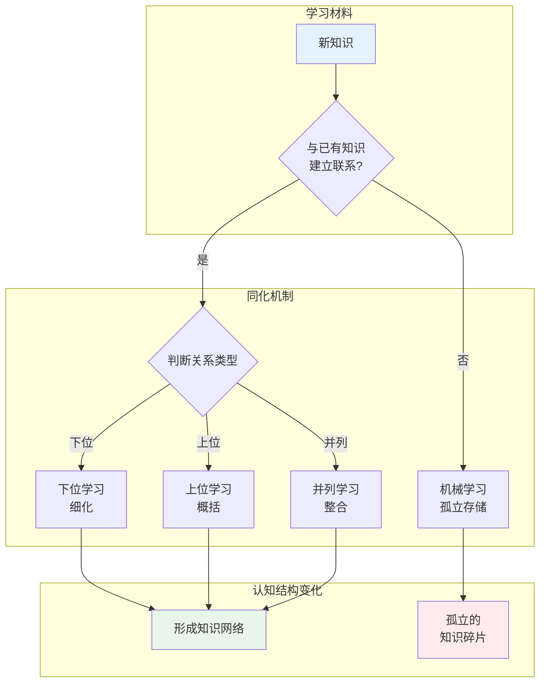

## 概念：有意学习

> 有意义学习是指新知识与学习者认知结构中已有知识建立非人为的、实质性联系的过程。

**解决的核心痛点**：解决机械学习（死记硬背）导致的低效记忆和迁移困难问题

---

### 核心命题

- [[有意义学习的本质是新旧知识的同化过程]]
	- **同化**：新知识被原有知识吸收，成为其一部分
- [[有意义学习分为下位、上位、并列三种类型]]
	- **上位**：新知识是已有知识的概括（如学会各种水果后形成 " 水果 " 概念）
	- **下位**：新知识是已有知识的细化（如学会 " 水果 " 后再学 " 苹果 "）
	- **并列**：新知识与已有知识同级别并列（如学会 " 质量 " 后学 " 能量 "）

---

### 运行机制

---

### 关键区别

| 维度 | 有意义学习 | 机械学习 |
|:--- |:--- |:--- |
| **本质** | 建立实质性联系 | 人为的、表面的联系 |
| **记忆方式** | 理解意义 | 重复记忆 |
| **迁移能力** | 强，易迁移到新情境 | 弱，难以迁移 |
| **持久性** | 长期记忆 | 容易遗忘 |
| **学习方式** | 发现学习、接受学习 | 死记硬背 |

---

### 应用场景

- ✅ **适用场景**
	- **概念学习**：学习新术语时建立与已有概念的联系
	- **原理理解**：理解科学原理时联系实际现象
	- **知识整合**：将零散知识整合为系统框架
- ⛔ **误用**
	- **孤立记忆**：不建立联系地背诵定义
	- **过度概括**：强行将不相关的知识牵强联系

---

### 知识图谱

- **父级概念**：[[认知心理学]]
- **子集概念**：
	- [[下位学习]]
	- [[上位学习]]
	- [[并列学习]]
- **并列概念**：
	- [[机械学习]]
	- [[接受学习]]
	- [[发现学习]]
- **相关概念**：
	- [[认知结构]]
	- [[先备知识]]
	- [[组织者策略]]

---

### 参考延伸

- **理论来源**：奥苏贝尔《教育心理学》
- **核心概念**：同化理论、认知结构、先行组织者
- **相关理论**：建构主义学习理论、联通主义
