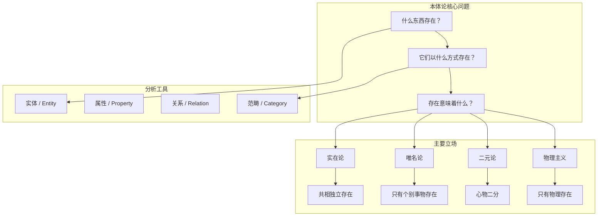

## 概念：本体论

> 本体论（Ontology）是形而上学的一个核心分支，研究存在的本质、实体及其分类体系，回答「什么东西真正存在？」以及「存在意味着什么？」。

**解决的核心痛点**：为所有知识提供一个基础性的「存在清单」，明确我们讨论的事物是否真实存在，以及它们以何种方式存在。

---

### 核心命题

- [[存在是最普遍的概念，不能被定义，只能被描述]]
	- 存在是所有范畴之上的最高概念，无法归结为更一般的东西
- [[本体论承诺决定了理论的解释力]]
	- 任何理论都需要承诺某些实体存在，这些承诺决定了理论能解释什么、不能解释什么

---

### 运行机制

### 关键区别

| 维度 | **本体论** | [[知识论]] | [[宇宙论]] |
|:--- |:--- |:--- |:--- |
| **核心问题** | 什么是真实存在的？ | 我们如何知道？ | 世界如何生成和变化？ |
| **研究对象** | 存在本身 | 知识及其限度 | 宇宙的起源与秩序 |
| **方法** | 范畴分析、思辨 | 论证、怀疑与批判 | 推理、类比 |
| **典型问题** | 共相存在吗？ | 我们能获得确定知识吗？ | 世界的本原是什么？ |

### 适用范围

- ✅ **适用场景**
	- **哲学基础研究**：为认识论、伦理学等提供存在前提
	- **科学基础**：自然科学的本体论预设，如物理实体、数学对象是否真实存在
	- **知识工程**：人工智能知识表示需要明确的本体论设计（实体、关系、分类）
	- **概念分析**：澄清讨论中承诺的实体类型，避免伪争议
- ⛔ **误用**
	- **过度实在化**：将分析工具（如范畴、分类）误认为独立存在的实体
	- **脱离经验**：纯粹思辨而不与经验科学对话
- **失效边界**
	- 无法回答认识论问题（我如何知道存在？）
	- 对极端怀疑论（如唯我论）无内在反驳力量

### 批判

- **外部批判**
	- **康德**：本体论必须与[[知识论|认识论]]结合，我们不能脱离认识条件谈论存在本身
	- **海德格尔**：传统本体论忽略了"存在"本身（Sein）与"存在者"（Seiendes）的根本区别
	- **逻辑实证主义**：本体论问题是伪问题，不可经验验证便无认知意义
- **内在张力**
	- 范畴划分的任意性问题：不同本体论体系给出不同的终极范畴清单，缺乏公认标准
	- 抽象实体的地位：数、命题、共相等抽象实体的存在方式难以一致解释

---

### 知识图谱

- **父级概念**：[[形而上学]] — 本体论是形而上学的核心子领域
- **子集概念**：
	- [[存在]] — 本体论的核心研究对象
- **并列概念**：
	- [[知识论]] — 与本体论互补的认识论维度
	- [[宇宙论]] — 形而上学的另一子领域
- **相关概念**：
	- [[共相]] — 本体论中的经典问题
	- [[实体]] — 本体论的基本分析单位
	- [[虚无]] — 存在概念的对立面
- **参考文章**
	- 亚里士多德《范畴篇》— 西方本体论的奠基
	- 康德《纯粹理性批判》— 先验哲学对本体论的改造
	- Willard Quine《论何物存在》— 本体论承诺的当代分析
