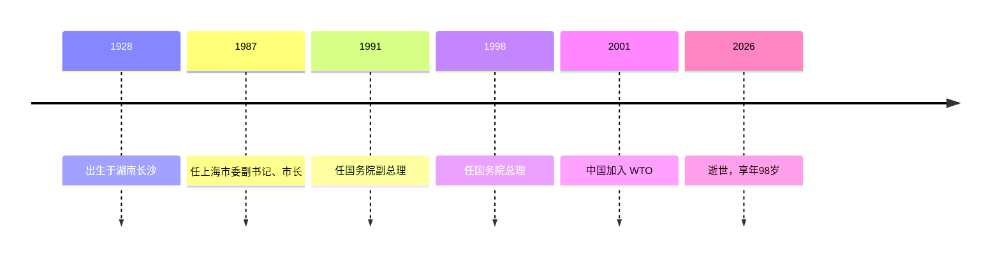

> 第九届国务院总理，主导国企改革、金融体制改革与加入 WTO 的经济改革者，2026 年 8 月逝世。

## 人物卡片

| 项目 | 信息 |
|------|------|
| **姓名** | 朱镕基（Zhu Rongji） |
| **生卒** | 1928年10月 — 2026年8月12日（享年98岁） |
| **国籍** | 中国 |
| **职业** | 国务院总理（1998–2003）/ 党和国家领导人 |
| **代表领域** | 中国经济改革、金融体制改革、对外开放 |

---

### 生平简介

朱镕基，湖南长沙人，1928年10月生。1947 至 1951 年在清华大学电机系电机制造专业学习，1948 年 12 月参加革命工作，1949 年 10 月加入中国共产党。此后长期在国家计委、国家经委任职；1987 年任上海市委副书记、市长（后任市委书记），推动浦东开发开放进入实质性启动；1991 年任国务院副总理，1993 年兼任中国人民银行行长；1998 年 3 月在九届全国人大一次会议上被任命为国务院总理。任内面对亚洲金融危机与特大洪涝灾害，实行积极的财政政策与稳健的货币政策，深化国企、金融等重点领域改革，促成中国 2001 年加入 WTO。2026 年 8 月 12 日在北京逝世。讣告称其为「中国共产党的优秀党员，久经考验的忠诚的共产主义战士，杰出的无产阶级革命家、政治家，党和国家的卓越领导人」。

> ⚠️ 生平细节以官方讣告为准，部分改革成效与代价的评价属学术讨论范畴。

---

### 人生时间线

| 时间 | 事件 | 影响 |
|------|------|------|
| 1928-10 | 出生于湖南长沙 | 出身背景 |
| 1947-1951 | 清华大学电机系学习 | 教育背景 |
| 1987-1991 | 上海市委副书记、市长、市委书记 | 推动浦东开发开放 |
| 1991 | 任国务院副总理 | 主管经济工作 |
| 1993 | 兼任中国人民银行行长 | 金融体制改革 |
| 1998-03 | 任国务院总理 | 第九届政府，主导经济改革 |
| 2001 | 中国加入 WTO | 经济融入全球化 |
| 2026-08-12 | 在北京逝世 | 享年 98 岁 |

---

### 主要成就

- **国有企业改革**：推进「抓大放小」、国企改制，建立现代企业制度
- **金融体制改革**：改革人民银行职能，设立四大资产管理公司剥离银行不良贷款
- **加入 WTO**（2001）：推动中国深度融入全球经济体系
- **应对亚洲金融危机**：实施积极财政政策 + 稳健货币政策，保持经济稳定增长
- **[[分税制改革]]**（1994，副总理时期）：重构中央与地方财政关系
- **反腐败**：以强硬姿态推动反腐，留下「一百口棺材」名言

---

### 思想与观点

> 提炼人物的核心思想，链接到相关 atomic/concept 笔记

- **市场化改革**：让市场在资源配置中发挥基础性作用，通过国企改制和对外开放释放经济活力（[[市场 (Market)]]）
- **制度性改革**：以金融体制、财政体制等制度建设奠定市场经济的规则基础（[[制度 (Institutions)]]）
- **务实主义**：以结果为导向的改革姿态——「不管前面是地雷阵还是万丈深渊，我将一往无前」

---

### 代表作品

- **《朱镕基答记者问》**（2009）：收录任国务院总理及副总理期间答记者问与讲话
- **《朱镕基讲话实录》**（2011，4 卷）：收录 1991 至 2003 年讲话、谈话、信件等

---

### 关系网络

- **教育**：清华大学电机系（1947–1951）
- **继任者**：温家宝（第十届国务院总理，暂无独立笔记）
- **同代领导人**：与江泽民、胡锦涛等同代共事（暂无独立笔记）

---

### 名言

> 不管前面是地雷阵还是万丈深渊，我将一往无前，义无反顾，鞠躬尽瘁，死而后已。—— 1998 年就任国务院总理记者会

> 准备一百口棺材，九十九口给贪官，一口留给我自己。—— 反腐败谈话

---

### 评价与争议

- **正面评价**：被视为中国经济体制改革的重要推动者，国企改革、金融改革、加入 WTO 深刻塑造了中国市场经济体制
- **争议/讨论**：国企改革伴随大规模职工下岗（「下岗潮」），产生阶段性社会成本；部分观点认为某些改革节奏过急，配套保障不足
- **历史定位**：讣告评价其为「杰出的无产阶级革命家、政治家，党和国家的卓越领导人」

---

### 知识图谱

- **父级领域**：[[时政]]（时政人物）
- **相关概念**：
	- [[市场 (Market)]] — 市场化改革的核心理念
	- [[制度 (Institutions)]] — 制度性改革的框架
	- [[政治经济]] — 所属领域（政治与经济互动）
- **相关人物**：
	- 温家宝（继任总理）、江泽民（同代领导人）—— 暂无独立笔记
- **参考来源**
	- 中共中央、全国人大常委会、国务院、全国政协讣告（2026-08-12）
	- 人民网、政府网等官方讣告报道
	- 网络检索（2026-08）
