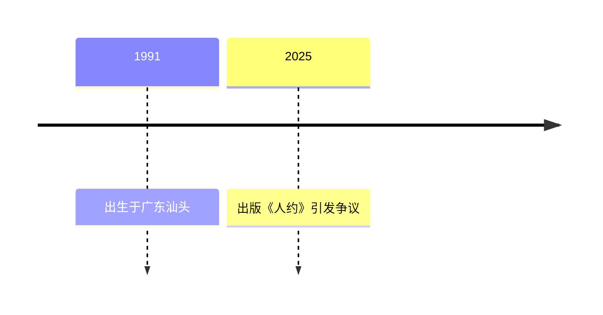

> 清华姚班出身，曾任职于中美多家科技与量化机构，后转型 AI 量化交易创业；因撰写《人约》一书成为舆论争议人物。

## 人物卡片

| 项目 | 信息 |
|------|------|
| **姓名** | 李新野 |
| **生卒** | 1991 — 在世 |
| **国籍** | 中国 |
| **职业** | AI 量化交易公司「阿尔法星研究」创始人/CEO |
| **代表领域** | 量化金融、人工智能 |

---

### 生平简介

李新野，1991 年生于广东省汕头市。毕业于清华大学计算机科学实验班（姚班），后赴美国麻省理工学院（MIT）与布朗大学深造。职业生涯横跨中美：曾在亚马逊、脸书等科技公司任职，后进入城堡证券等量化机构。据其自述，他变卖北京房产投身量化交易，后在美国从事 AI 量化交易程序开发并创立「阿尔法星研究」，自称「日入百万」。

> ⚠️ 以上履历多为作者自述或网络转述，未经独立核实。

---

### 人生时间线

| 时间 | 事件 | 影响 |
|------|------|------|
| 1991 | 出生于广东省汕头市 | 出身背景 |
| 待核实 | 清华姚班毕业 | 技术起点 |
| 待核实 | 赴 MIT、布朗大学深造 | 海外学术经历 |
| 待核实 | 任职亚马逊、脸书、城堡证券 | 技术/量化从业 |
| 待核实 | 创立「阿尔法星研究」 | 转型 AI 量化创业 |
| 2025-10 | 出版《人约》（《人妻约会指南》） | 引发广泛舆论争议 |

---

### 主要成就

- **AI 量化交易创业**：创立「阿尔法星研究」，从事 AI 量化交易（据其自述）
- **技术/量化从业经历**：亚马逊、脸书、城堡证券等任职经历

---

### 思想与观点

> 提炼人物的核心思想，链接到相关 atomic/concept 笔记

- 其观点集中于两性关系与婚姻制度的批判性论述，见于《人约》与《关于清华男生找清华女朋友》一文
- 思想引发两极评价：被部分读者视为「揭示人性的镜子」「社会实验笔记」，被另一部分批评为极端、攻击性的文本
- 待补充：进一步提炼核心思想并链接到 atomic 笔记

---

### 代表作品

- **《人约》**（2025）：全名《人妻约会指南》，围绕婚外情与两性关系的争议性著作，版权页标注「纯属虚构」
- **《我的父亲李松坚》**（又名《三脸》）：揭露其地产商父亲的家族史长文
- **《关于清华男生找清华女朋友》**（2025-12）：论述清华男生婚恋市场逻辑的争议文章

---

### 关系网络

- **父亲**：李松坚（上海明园集团董事长）—— 家族矛盾是理解《人约》的重要背景
- **初恋**：郭菊阳（高中初恋）—— 出现在其多篇作品中

---

### 名言

> 住明园楼盘，享绿帽人生。—— 《人约》献词（讽刺其父）

> 更多名言待补充（需核对可靠原文）

---

### 评价与争议

- **正面评价**：有读者认为《人约》是「揭示人性的镜子」「关于欲望、关系与理性的社会实验笔记」
- **争议**：因书中对婚外情的系统性操作指南、对前女友与父亲等人物的负面描写引发批评，被视为「讨伐檄文」式的极端文本
- **可信度提示**：个人履历、财富状况等多为自述，引用时需谨慎核实

---

### 知识图谱

- **父级领域**：[[时政]]（键政主题）
- **相关概念**：
	- [[人工智能]] — AI 量化交易技术背景
- **相关人物**：
	- 李松坚（父亲）— 地产商，见其《我的父亲李松坚》
- **参考来源**
	- 知乎、小红书、微信公众号等平台网络讨论（2026-07 检索）
