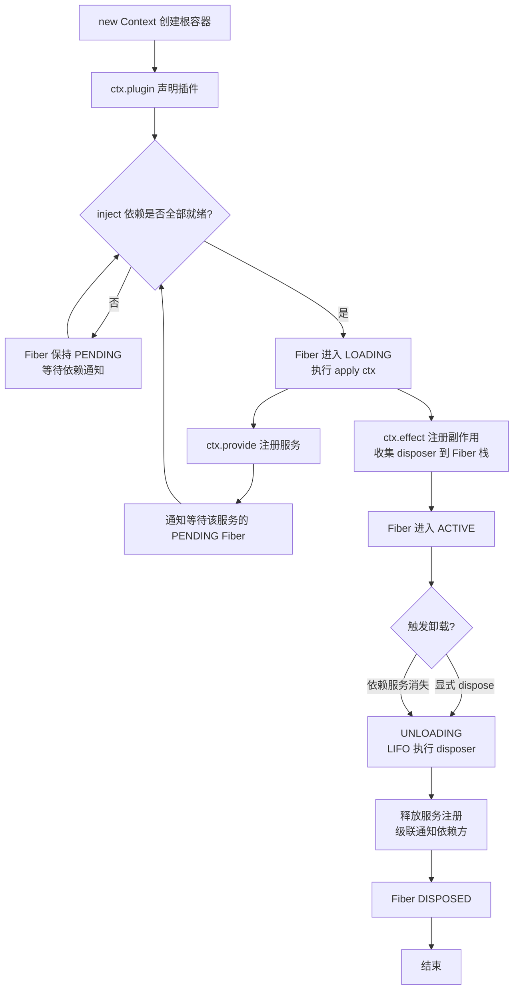

## SOP：构建一个无特权内核架构的MVP实现

> 用一个极简的 TypeScript 运行时（Context 容器 + 插件生命周期 + 依赖分发 + 可回退 Effect），让所有功能以插件形式挂载，核心内核不包含任何业务特权。
> **问题溯源**：本 SOP 是 [[DSH的的一切皆插件架构是如何实现的？|Q-DSH的一切皆插件架构是如何实现的]] 的收敛成果——经过对 Cordis 生命周期、Effect 回退、inject 依赖收敛三套机制的理解，固化为一个可运行的最小实现。

### 目标与边界

**目标**：实现一个可运行的 MVP，包含三类核心能力：
1. **Context 容器**：持有服务注册表与当前 Fiber，提供 `ctx.get` / `ctx.provide`。
2. **插件生命周期**：`ctx.plugin()` 创建 Fiber，声明 `inject` 依赖，依赖就绪后执行 `apply`。
3. **可回退 Effect**：通过 `ctx.effect()` 注册资源，插件卸载时 LIFO 逆序回滚。

**边界**：不做 loader、不做 HMR、不做事件分发（emit/waterfall/parallel）。只保留"依赖收敛 + 生命周期 + 资源回退"这条最小主线，其余能力全部以插件形式挂载在这个内核之上。

---

### 流程图解



---

### 核心步骤

1. **实现 Context 与服务注册表**
	 - 维护 `services: Map<string, any>` 和 `waiters: Map<string, Set<Fiber>>`。
	 - `ctx.provide(name, impl)` 写入服务后，遍历 `waiters.get(name)` 并逐个调用 `fiber.tryActivate()`。
	 - `ctx.get(name)` 直接返回 `services.get(name)`（可选依赖用）。
	 - 注意：服务名就是 Cordis 中的"key"，依赖收敛完全靠这个字符串集合做成员检查。

2. **实现 Fiber 状态机与依赖收敛**
	 - Fiber 持有 `state`、`inject: string[]`、`effectStack: (()=>void)[]`。
	 - `tryActivate()` 检查 `inject.every(s => services.has(s))`；不满足则保持 `PENDING` 并把自己加入每个未就绪服务的 `waiters`。
	 - 满足时状态转为 `LOADING`，执行 `plugin.apply(fiberCtx)`，完成后转为 `ACTIVE`。
	 - 关键：**"注册服务"本身也是一个 Effect**——服务被卸载时要级联通知所有依赖它的 Fiber 进入 UNLOADING。

3. **实现 ctx.effect 与 LIFO 回退**
	 - `ctx.effect(execute)` 立即调用 `execute()`，把返回的 disposer 推入 `fiber.effectStack`。
	 - `fiber.dispose()` 时从栈顶向下调用所有 disposer（LIFO），保证注册与回滚严格逆序。
	 - 注意：`ctx.on`、`ctx.plugin(child)`、`ctx.provide` 等内置 API 都应该内部走 `ctx.effect`，这样卸载时才不会遗漏。

---

### 实践/示例

以下是一个可直接运行的最小实现（约 80 行）：

```typescript
type Disposer = () => void;

interface Plugin {
  name?: string;
  inject?: string[];
  apply(ctx: Context): void;
}

class Fiber {
  state: "PENDING" | "LOADING" | "ACTIVE" | "UNLOADING" | "DISPOSED" = "PENDING";
  effectStack: Disposer[] = [];
  constructor(public ctx: Context, public plugin: Plugin) {}
}

class Context {
  private services = new Map<string, any>();
  private waiters = new Map<string, Set<Fiber>>();
  private children = new Set<Fiber>();

  constructor(public fiber?: Fiber) {}

  /** 提供一个服务（本身就是一个 effect） */
  provide(name: string, impl: any) {
    this.services.set(name, impl);
    this.effect(() => {
      this.services.delete(name);
      // 级联通知：所有等待该服务的 Fiber 重新检查依赖
      this.waiters.get(name)?.forEach(f => f.tryActivate());
    });
    // 通知已在等待的 Fiber
    this.waiters.get(name)?.forEach(f => f.tryActivate());
  }

  get(name: string) {
    return this.services.get(name);
  }

  /** 注册可回退 effect */
  effect(execute: () => Disposer | void): Disposer {
    const disposer = execute() ?? (() => {});
    this.fiber?.effectStack.push(disposer);
    return disposer;
  }

  /** 挂载一个插件，返回其 Fiber */
  plugin(p: Plugin): Fiber {
    const child = new Fiber(new Context(undefined as any), p);
    child.ctx.fiber = child;
    this.children.add(child);
    child.tryActivate();
    return child;
  }
}

// Fiber 上挂 tryActivate
Fiber.prototype.tryActivate = function (this: Fiber) {
  if (this.state !== "PENDING") return;
  const inject = this.plugin.inject ?? [];
  // 检查依赖
  const missing = inject.filter(s => !this.ctx.services.has(s));
  if (missing.length > 0) {
    missing.forEach(s => {
      const set = this.ctx.waiters.get(s) ?? new Set();
      set.add(this);
      this.ctx.waiters.set(s, set);
    });
    return;
  }
  // 依赖就绪，启动
  this.state = "LOADING";
  this.plugin.apply(this.ctx);
  this.state = "ACTIVE";
};

// 卸载
Fiber.prototype.dispose = async function (this: Fiber) {
  if (this.state === "DISPOSED") return;
  this.state = "UNLOADING";
  // LIFO 回退
  while (this.effectStack.length) {
    this.effectStack.pop()!();
  }
  // 级联卸载子插件
  for (const child of this.ctx.children) await child.dispose();
  this.state = "DISPOSED";
};

// ===== 使用示例 =====
const root = new Context();
root.fiber = new Fiber(root, { name: "root" });

// 先挂载一个消费方（依赖 db，此时 db 不存在，应保持 PENDING）
root.plugin({
  name: "user-service",
  inject: ["db"],
  apply(ctx) {
    console.log("[user-service] 启动，db 已就绪:", !!ctx.get("db"));
  },
});

// 再挂载一个提供方，提供 db 服务
root.plugin({
  name: "db-provider",
  apply(ctx) {
    console.log("[db-provider] 注册 db 服务");
    ctx.provide("db", { query: () => [] });
  },
});
```

预期输出：

```bash
[db-provider] 注册 db 服务
[user-service] 启动，db 已就绪: true
```

如果把 `db-provider` 的 `ctx.provide` 用 `effect` 包一层，并在若干帧后手动 dispose 该 provider 的 Fiber，就能看到 `user-service` 被级联卸载——这就是"依赖消失时自动失活"的最小验证。


---

### 常见坑点

- ⛔ **反模式**：在 `apply` 里直接 `ctx.services.set(…)` 绕过 `ctx.provide`——这样服务注册没有对应的 effect，provider 卸载时不会清理，也不会级联通知依赖方。
- ⛔ **反模式**：`ctx.effect(() => { setInterval(…); })` 忘记返回 disposer——定时器永远不会被清理，插件卸载后继续运行，造成资源泄漏。
- 🔧 **排查**：如果某个插件一直不启动（PENDING），检查它的 `inject` 声明的服务名是否**恰好**有某个 provider 提供了同名服务；Cordis 的依赖收敛是纯字符串 key 匹配，拼写错误会导致永远等待。
- 🔧 **排查**：如果卸载后仍有副作用残留，检查该副作用是否**没有**通过 `ctx.effect` 或内置 API（`ctx.on`、`ctx.provide`）注册——只有通过这些入口注册的东西才会被 Fiber 的 effectStack 追踪。

---

### 知识图谱

- **相关概念**：
	- [[Cordis]] — DSH 底层的插件元框架，本 SOP 是它的最小抽象
	- [[Fiber]] — 插件实例的运行时句柄，承载状态机与 effect 栈
	- [[Capability Seam]] — 服务作为能力接口，Definition/Provider/Consumer 三角色解耦
	- [[Revertible Effect]] — 可回退的注册副作用，保证插件干净卸载
- **问题来源**：
	- [[DSH的的一切皆插件架构是如何实现的？|Q-DSH的一切皆插件架构是如何实现的]] — 此 SOP 解决的问题来源
