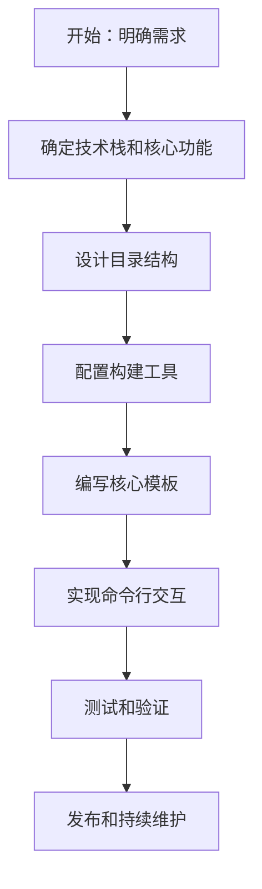

## SOP：构建前端脚手架

> 从零构建团队通用脚手架工具，统一项目初始化和开发体验

目标：构建可复用的脚手架，实现项目初始化、构建、开发的标准化
实现：新项目通过脚手架创建，配置时间从 1 天缩短到 5 分钟

---

### 适用场景

- 场景 1：从零构建团队前端脚手架工具
- 场景 2：现有脚手架功能扩展或版本升级
- 场景 3：脚手架模板维护和发布

---

### 流程图解



---

### 核心步骤

1. **明确需求**：确定脚手架的目标用户、核心功能、约束条件
	 - 注意：脚手架应解决高频痛点，不要试图做一个万能工具
2. **确定技术栈和核心功能**：选择构建工具（Vite/Webpack）、包管理器、框架
	 - 核心功能通常包括：项目创建、开发服务器、构建打包、代码检查
3. **设计目录结构**：遵循社区最佳实践，保持与其他项目的兼容性
	 - 注意：目录结构应简洁明了，方便团队理解和扩展
4. **配置构建工具**：配置 Vite/Rollup、Webpack 等构建工具
	 - 注意：将常用配置抽离为模板变量，通过参数传入
5. **编写核心模板**：创建项目初始化模板（React/Vue/Node 等）
	 - 注意：模板应包含足够的注释说明，方便后续维护
6. **实现命令行交互**：使用 Commander/oclif 等工具解析用户输入
	 - 功能包括：参数解析、模板选择、文件生成
7. **测试和验证**：确保脚手架在不同环境下正常运行
	 - 注意：测试场景应覆盖主要功能路径
8. **发布和持续维护**：发布到 npm，制定维护计划

---

### 实践/示例

#### 目录结构

```bash
my-scaffold/
├── bin/                  # 可执行脚本
│   └── cli.js            # 命令行入口
├── templates/            # 项目模板
│   ├── react/            # React 模板
│   └── vue/              # Vue 模板
├── lib/                  # 核心逻辑
│   ├── init.js          # 初始化逻辑
│   └── generator.js     # 文件生成
├── package.json
└── README.md
```

#### CLI 入口示例

```javascript
#!/usr/bin/env node
const { program } = require('commander');
const init = require('./lib/init');

program
  .command('create <project-name>')
  .description('创建新项目')
  .option('-t, --template <type>', '项目模板', 'react')
  .action((name, options) => {
    init(name, options);
  });

program.parse(process.argv);
```

#### package.json 配置

```json
{
  "name": "my-scaffold",
  "bin": {
    "my-scaffold": "./bin/cli.js"
  },
  "dependencies": {
    "commander": "^12.0.0",
    "inquirer": "^9.0.0",
    "ejs": "^3.1.9"
  }
}
```

---

### 常见坑点

- ⛔ **反模式**：一次性设计过多模板 → 维护成本高，核心功能反而做不深
- ⛔ **反模式**：硬编码配置值 → 缺乏灵活性，用户无法自定义
- ⛔ **反模式**：忽略跨平台兼容性 → Windows/macOS/Linux 行为不一致
- 🔧 **排查**：模板文件生成后路径错误 → 检查模板引擎的路径解析逻辑
- 🔧 **排查**：脚手架执行缓慢 → 检查网络请求、减少不必要的依赖

---

### 知识图谱

- **相关概念**：
	- [[建立前端工程规范]]
	- [[Vite 是如何实现原生 ESM 加载的？开发时不打包是怎么做到的？]]
	- [[Rollup 概述]]
