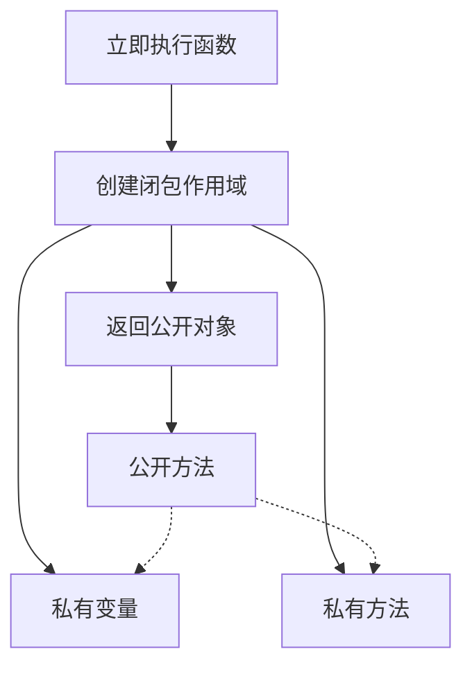

## 概念：模块模式

> JavaScript 中通过闭包实现私有成员的设计模式

**解决的核心痛点**：在 JavaScript 缺乏 class 私有成员关键字的时代，提供一种创建私有状态和方法的机制。

---

### 核心命题

- [[模块模式通过闭包实现数据隐藏]]
	- **原理**：外部无法访问函数内部定义的变量
- [[模块模式返回公开 API 同时保留私有实现]]
	- **原理**：返回一个对象暴露方法，内部状态被闭包保护
- [[模块模式是现代模块系统的前身]]
	- **原理**：ES6 Module 借鉴了其设计思想

---

### 运行机制



```javascript
const Counter = (function() {
  let count = 0; // 私有变量

  return {
    increment() { count++; return count; },
    getCount() { return count; }
  };
})();
```

---

### 关键区别

| 维度      | 模块模式  | ESModule      |
|:------ |:---- |:------------ |
| **语法**  | 函数表达式 | import/export |
| **私有化** | 约定俗成  | 官方支持 private  |
| **加载**  | 同步    | 异步            |

---

### 应用场景

- ✅ **适用场景**
	- **需要私有状态**：如计数器、缓存
	- **库封装**：创建不暴露内部实现的 API
- ⛔ **误用**
	- **过度使用**：现代项目优先用 ES6 Module

---

### 知识图谱

- **父级概念**：[[JavaScript]]
- **关联概念**：[[闭包]]、[[IIFE]]

---

### 参考延伸

- [[JavaScript模块化系统解析]]
- [Module Pattern - Addy Osmani](https://addyosmani.com/resources/essentialjsdesignpatterns/book/#modulepattern)
