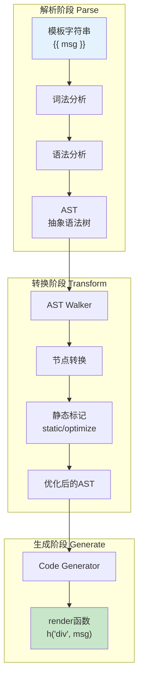

## 概念：模板编译

> 模板编译（Template Compilation）是 Vue 将 HTML 模板字符串转换为 JavaScript 渲染函数的技术，是 Vue 实现响应式更新的核心环节。

**解决的核心痛点**：开发者编写声明式模板，框架自动转换为高效的 render 函数

---

### 核心命题

- **模板编译的三个阶段**
	- **解析（Parse）**：模板字符串 → AST（抽象语法树）
	- **转换（Transform）**：AST → 优化后的 AST（生成渲染代码）
	- **生成（Generate）**：优化后的 AST → JavaScript 代码（render 函数）
- **模板 vs render 函数**
	- 模板：声明式，更直观
	- render 函数：更灵活，优先级更高

---

### 运行机制



#### 1. 解析（Parse）

使用 `html-parseerr2` 解析 HTML：
- 识别开始标签、结束标签、属性、文本、注释
- 生成 AST 节点树

```javascript
// 模板
<div class="app">
  <h1>{{ title }}</h1>
</div>

// 生成的AST
{
  type: 'Element',
  tag: 'div',
  props: [{ type: 'Attribute', name: 'class', value: 'app' }],
  children: [
    {
      type: 'Element',
      tag: 'h1',
      children: [{ type: 'Interpolation', value: 'title' }]
    }
  ]
}
```

#### 2. 转换（Transform）

**关键优化**：
- **静态提升**：不变的部分提取到 render 函数外
- **预标记**：标记动态节点（diff 优化）
- **Block 管理**：Vue3 的 Block 机制

```javascript
// 静态提升示例
// 模板
<div>
  <span>静态内容</span>
  <span>{{ dynamic }}</span>
</div>

// 编译后（静态内容只创建一次）
const _hoisted_1 = /*#__PURE__*/_createElementVNode("span", null, "静态内容", -1 /* HOISTED */)

function render(_ctx, _cache) {
  return (_openBlock(), _createElementBlock("div", null, [
    _hoisted_1,
    _createElementVNode("span", null, _ctx.dynamic, 1 /* TEXT */)
  ]))
}
```

#### 3. 生成（Generate）

将 AST 转换为 JavaScript 代码：
- 生成 `_createElementVNode` 调用
- 生成组件化 render 代码

---

### Vue2 vs Vue3 编译差异

| 维度 | Vue2 | Vue3 |
|:---|:---|:---|
| **AST** | 基础 AST | 带更多信息的 AST |
| **静态提升** | 不支持 | 支持 |
| **Block** | 不支持 | 支持 |
| **组织方式** | 树形 | 平铺 +Block |
| **性能** | 中等 | 显著提升 |

---

### 应用场景

- **适用场景**
	- 模板语法使用（v-if, v-for, 插值等）
	- 组件开发
	- 自定义指令编译
- **误用**
	- 完全使用 render 函数时不需要编译

---

### 知识图谱

- **父级概念**：[[前端开发]]
- **子级概念**：
	- [[静态提升]]
	- [[预标记]]
	- [[Block管理]]
- **关联概念**：
	- [[Virtual DOM]] — 编译输出的 render 函数创建 VNode
	- [[响应式原理(Vue3)]] — render 函数执行触发依赖收集
- **相关问题**：
	- Vue 编译器如何优化

---

### 参考延伸

- Vue 官方文档：Template Compilation
- Vue3 源码：`packages/compiler-core`, `packages/compiler-dom`
