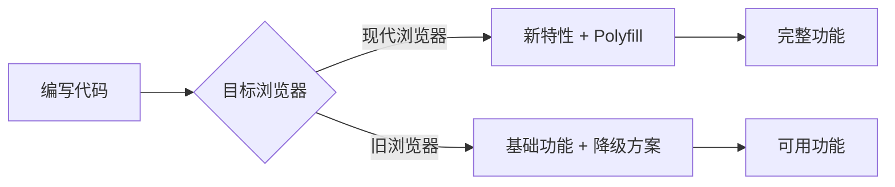

> 浏览器兼容性是指 Web 应用在不同的浏览器（如 Chrome、Firefox、Safari、Edge）和浏览器版本上能够正常运行的能力。

**解决的核心痛点**：不同浏览器使用不同的渲染引擎（内核），对 Web 标准的支持程度不一，开发者需要确保代码在目标用户的浏览器环境下正常工作。

---

## 核心命题

- [[浏览器兼容性问题的根源是渲染引擎差异]]
	- **原理**：主流浏览器使用 Blink、WebKit、Gecko 等不同内核，对 CSS 规范和 JS API 的支持程度不同，导致相同代码在不同浏览器表现不一致
- [[渐进增强与优雅降级是解决兼容性问题的两种策略]]
	- **渐进增强**：先为低版本浏览器提供基础功能，再为高版本浏览器增强体验
	- **优雅降级**：先为现代浏览器开发完整功能，再为低版本浏览器提供兼容方案

---

## 运行机制

1. **识别目标浏览器**：确定需要支持的浏览器范围
2. **检测兼容性**：使用 Can I Use 查询 API/CSS 支持情况
3. **选择策略**：渐进增强或优雅降级
4. **实施兼容**：Polyfill、Prefix、CSS Reset 等

---

## 关键区别

| 维度 | 渐进增强 | 优雅降级 |
|:--- |:--- |:--- |
| **方向** | 向上兼容 | 向下兼容 |
| **策略** | 先基础，后增强 | 先完整，后降级 |
| **适用场景** | 新技术 + 低版本 | 成熟技术 + 旧浏览器 |

---

## 应用场景

- ✅ **适用场景**
	- **多浏览器支持**：确保 Web 应用在各主流浏览器正常运行
	- **用户体验优化**：为现代浏览器提供更好体验
	- **遗留浏览器**：支持 IE11 等旧版浏览器
- ⛔ **误用**
	- **过度兼容**：为 1% 用户付出不成比例的开发成本
	- **忽视测试**：未在目标浏览器实际测试

---

## 常见兼容性处理

### CSS 兼容性

| 问题 | 解决方案 |
|:--- |:--- |
| 新属性支持 | [[Autoprefixer]] 自动添加前缀 |
| 默认样式差异 | [[CSS Reset]] / Normalize.css |
| Flex 旧版 bug | 单独处理 IE |
| position: sticky | 降级为 relative |

### JS 兼容性

| 问题 | 解决方案 |
|:--- |:--- |
| ES6+ 语法 | [[Babel]] 转译 |
| 缺失 API | [[Polyfill]]（core-js） |
| IE 事件模型 | 事件兼容库 |

### HTML 兼容性

| 问题            | 解决方案      |
|:------------ |:-------- |
| input type 差异 | 类型检测 + 回退 |
| placeholder   | JS 模拟     |

---

## 知识图谱

- **父级概念**：[[前端开发]] — 浏览器兼容性是前端开发的重要议题
- **子级概念**：
	- [[Polyfill]] — 为旧浏览器提供新 API
	- [[Autoprefixer]] — 自动添加 CSS 前缀
- **并列概念**：
	- [[Web标准]]
- **相关概念**：
	- [[Babel]]
	- [[CSS Reset]]
	- [[Can I use]]

## F AQ

- [[MOC-浏览器兼容性问题]]
---

## 参考延伸

- [Can I Use](https://caniuse.com/)
- [MDN Browser Compatibility](https://developer.mozilla.org/en-US/docs/Web/Compatibility_FAQs)
- BrowserStack（跨浏览器测试工具）
