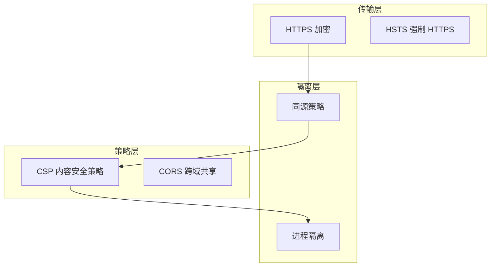

> 浏览器运行在不可信环境中，通过沙箱和隔离机制限制代码对系统资源、用户数据和其他网站的访问权限。

**解决的核心痛点**：如何在允许执行任意 Web 代码的同时，保护用户隐私和系统安全？

---

## 核心命题

- [[浏览器通过同源策略隔离不同源的访问]]
	- **原理**：限制不同源（协议 + 域名 + 端口）的文档或脚本读取或修改当前文档的数据
- [[浏览器通过 CSP 限制资源加载防止 XSS]]
	- **原理**：CSP 是白名单机制，明确告诉浏览器哪些外部资源可以加载和执行
- [[浏览器通过 SameSite Cookie 防止 CSRF 攻击]]
	- **原理**：Cookie 的 SameSite 属性限制 Cookie 在跨站请求中的发送

---

## 运行机制

---

## 关键区别

| 机制 | 作用 | 面试考点 |
|:--- |:--- |:--- |
| **同源策略** | 隔离 DOM/Cookie/网络请求 | SOP 限制了什么？ |
| **CORS** | 受控开放跨域访问 | 简单请求 vs 预检请求 |
| **CSP** | 白名单资源加载 | 如何防御 XSS？ |
| **SameSite** | 限制 Cookie 跨站发送 | 如何防御 CSRF？ |

---

## 应用场景

- ✅ **适用场景**
	- **前端安全开发**：理解并应用各安全机制
	- **接口安全**：正确配置 CORS、CSP
	- **用户数据保护**：使用 HttpOnly/Secure Cookie
- ⛔ **误用**
	- **忽略 HTTPS**：传输层未加密
	- **宽松 CORS**：Access-Control-Allow-Origin: *

---

## 知识图谱

- **父级概念**：[[浏览器]] — 浏览器安全机制是浏览器的重要组成部分
- **子级概念**：
	- [[同源策略]] — 浏览器安全的基石
	- [[CORS]] — 跨域资源共享机制
	- [[CSP]] — 内容安全策略
- **相关概念**：
	- [[XSS]] — 跨站脚本攻击
	- [[CSRF]] — 跨站请求伪造
	- [[HTTPS]] — 安全传输协议

---

## 参考延伸

- [MDN Web Security](https://developer.mozilla.org/en-US/docs/Web/Security)
- [Site Isolation (Google)](https://developer.chrome.com/blog/site-isolation/)
