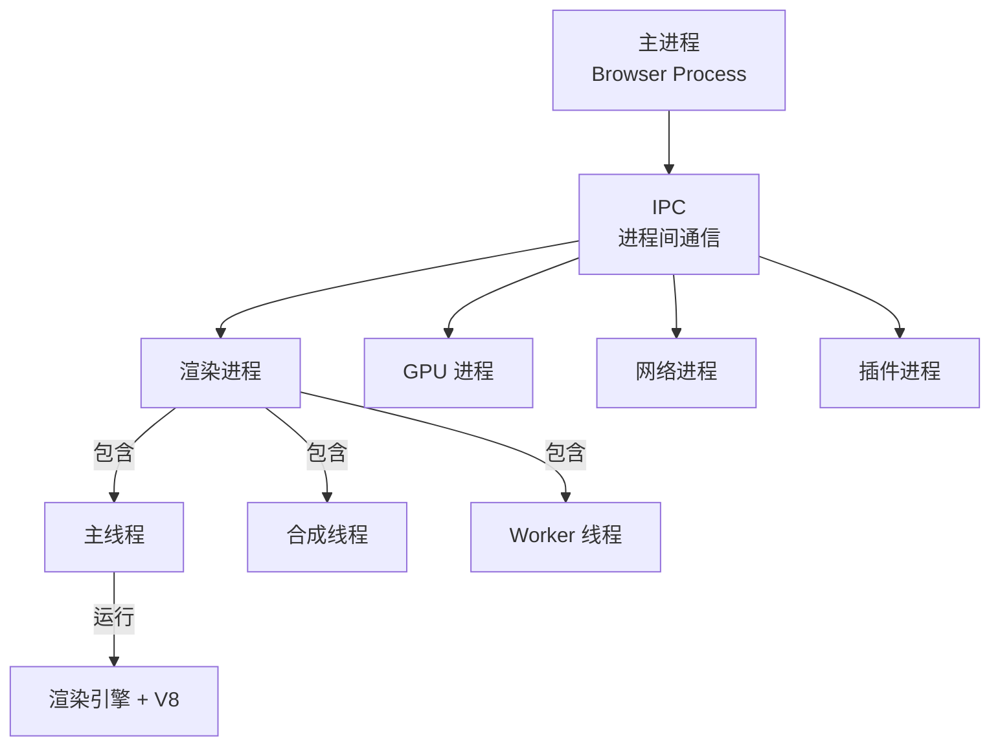

> 浏览器核心架构是指浏览器采用的多进程协作模式，将不同功能模块拆分到独立进程中运行，以提高稳定性、安全性和性能。

**解决的核心痛点**：如何在保证稳定性和安全性的同时，提供流畅的 Web 浏览体验？

---

## 核心命题

- [[浏览器采用多进程架构保证稳定性和流畅性]]
	- **原理**：渲染进程、GPU 进程、网络进程独立运行，一个页面崩溃不影响其他页面
- [[浏览器通过IPC机制实现进程间通信]]
	- **原理**：主进程作为协调者，通过 IPC 与各子进程交换数据
- [[浏览器通过渲染引擎和JS引擎分工处理页面]]
	- **原理**：渲染引擎（如 Blink）负责 HTML/CSS 解析和布局，JS 引擎（如 V8）负责执行 JavaScript，两者通过任务分片协作

---

## 运行机制



---

## 关键区别

| 维度 | 单进程浏览器 | 多进程浏览器 |
|:--- |:--- |:--- |
| **架构** | 所有模块在同一进程 | 模块分散在独立进程 |
| **稳定性** | 一个模块崩溃导致全局崩溃 | 单个进程崩溃不影响其他 |
| **资源占用** | 低 | 高 |
| **代表** | 早期 IE | Chrome、Firefox |

---

## 应用场景

- ✅ **适用场景**
	- **现代 Web 应用**：需要高稳定性和安全性的场景
	- **复杂页面**：多标签页同时运行
- ⛔ **误用**
	- **资源受限设备**：低内存设备不适合多进程

---

### 进程协作场景

> 多进程架构在实际场景中的协作方式

**1. 标签页崩溃恢复**

```bash
用户访问页面 → 渲染进程崩溃
    → 浏览器进程检测到崩溃
    → 向用户显示「标签页崩溃」提示
    → 保留其他标签页正常运行
    → 可重新加载崩溃的页面
```

**2. 资源加载流程**

```bash
渲染进程 → (IPC) → 网络进程：发起 fetch 请求
    → 网络进程从互联网获取资源
    → 通过共享内存将数据传回渲染进程
    → 渲染进程更新页面
```

**3. GPU 加速渲染**

```bash
渲染进程 → (IPC) → GPU 进程：提交合成帧
    → GPU 进程执行硬件合成
    → 直接送入显示器输出
```

---

### FAQ

- [[Q-浏览器为什么采用多进程架构]]
- [[Q-浏览器多进程和单进程各有什么优劣]]

---

### SOP

---

## 知识图谱

- **父级概念**：[[浏览器]] — 浏览器核心架构是浏览器的重要组成部分
- **子级概念**：
	- [[IPC]] — 处理线程间通信
	- [[网络进程]] — 处理网络间通信
	- [[GPU进程]] — GPU 处理图像任务，例如 WebGL 绘制
	- [[渲染进程]] — 主线程、合成线程、工作线程
	- [[浏览器渲染流程]] — 渲染进程的工作内容
	- [[V8引擎工作原理]] — 渲染进程中的 JS 引擎
- **相关概念**：
	- [[事件循环]] — 渲染进程内部的异步任务处理
	- [[进程隔离]] — 浏览器的安全机制

---

## 参考延伸

- [Inside Browser (Google)](https://developer.chrome.com/blog/inside-browser-part1/)
- [HTML5 Rocks - 多进程架构](https://www.html5rocks.com/zh/tutorials/internals/howbrowserswork/)
