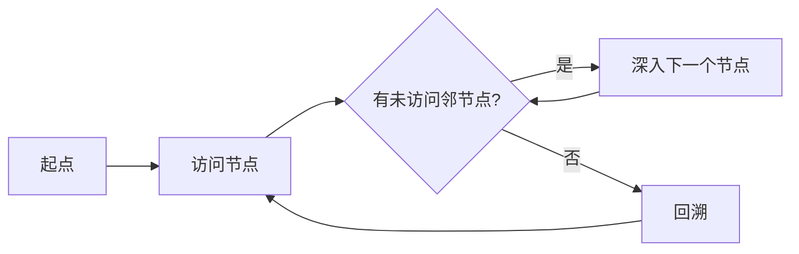

## 概念：深度优先搜索

> 深度优先搜索（DFS）是一种图的遍历算法，从起始节点出发，沿着一条路径不断深入直到无法继续，然后回溯搜索其他路径。

**解决的问题**：遍历树/图结构、寻找路径、检测环路

---

### 核心命题

- **搜索策略**：深度优先，越深越好
- **实现方式**：递归 或 栈
- **时间复杂度**：O(V + E)，V=顶点数，E=边数

---

### 运行机制



---

### 具体实现

#### 1. 递归实现（推荐）

```javascript
function dfs(graph, start, visited = new Set()) {
  // 访问当前节点
  visited.add(start);
  console.log(start);

  // 递归访问所有邻节点
  for (const neighbor of graph[start]) {
    if (!visited.has(neighbor)) {
      dfs(graph, neighbor, visited);
    }
  }
}

// 使用
const graph = {
  A: ['B', 'C'],
  B: ['D', 'E'],
  C: ['F'],
  D: [],
  E: ['F'],
  F: []
};
dfs(graph, 'A'); // A B D E F C
```

#### 2. 栈实现（非递归）

```javascript
function dfsIterative(graph, start) {
  const visited = new Set();
  const stack = [start];

  while (stack.length > 0) {
    const node = stack.pop();

    if (!visited.has(node)) {
      visited.add(node);
      console.log(node);

      // 入栈（逆序保证先左后右）
      graph[node].reverse().forEach(neighbor => {
        if (!visited.has(neighbor)) {
          stack.push(neighbor);
        }
      });
    }
  }
}
```

---

### 应用场景

| 场景 | 说明 |
|:---|:---|
| 树/图遍历 | 前序、中序、后序遍历 |
| 路径寻找 | 找到从起点到终点的路径 |
| 检测环路 | 通过回溯检测环 |
| 拓扑排序 | DFS 的变体 |
| 岛屿数量 | LeetCode 200 |

---

### 与广度优先搜索对比

| 维度 | DFS | BFS |
|:---|:---|:---|
| 数据结构 | 栈 | 队列 |
| 搜索顺序 | 深度优先 | 层级优先 |
| 空间复杂度 | O(H)，H=树高 | O(W)，W=最大层宽 |
| 找到最短路径 | 否 | 是 |
| 适用场景 | 深层搜索、路径检测 | 最短路径、层级遍历 |

---

### 知识图谱

- **父级概念**：[[算法与数据结构]]
- **关联概念**：
	- [[广度优先搜索]] — 对比学习
	- [[递归]] — DFS 的实现基础

---

### 参考延伸

- LeetCode 100. Same Tree（DFS 应用）
- LeetCode 200. Number of Islands（DFS 应用）
